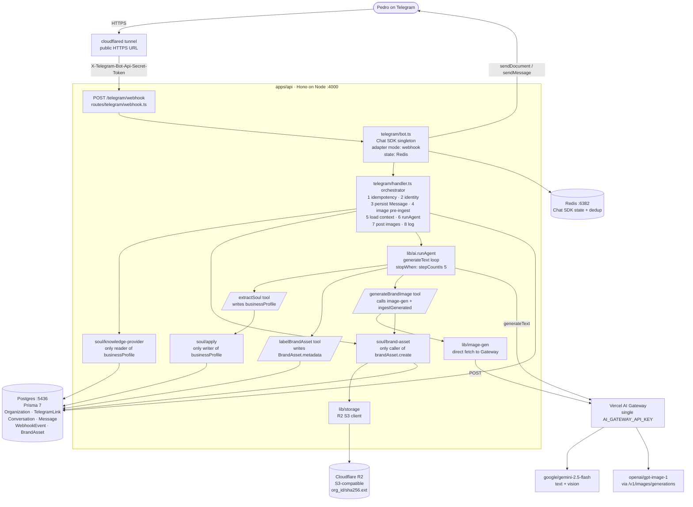

# Qolmeia — Architecture Overview

> What's shipped on `main` (HEAD `20b1042`) and how every piece fits together. Read top-to-bottom for the full picture; jump to a section if you know what you're looking for.

---

## 1. What Qolmeia is (one paragraph)

Qolmeia is an AI workforce platform for Brazilian local businesses. The MVP currently ships **one channel** (a Telegram bot, `@qolmeia_mvp_v0_bot`) and **one workflow**: a business owner has a conversation with the bot in pt-BR; over multiple messages the bot extracts five "soul" fields about the business, ingests brand assets (logo images) the owner sends, and on request generates branded images (Black Friday posters, posts, etc.). Everything works through a single agent loop with tool calling — the model decides what to do based on the message, not the handler. The repo is a pnpm + Turborepo monorepo with one app (`apps/api`, Hono on Node) and three packages (`@repo/db`, `@repo/config-vitest`, `@repo/typescript-config`).

---

## 2. The system at a glance

```
                                      ┌─────────────────────────┐
                                      │   Telegram (Pedro's     │
                                      │      phone/desktop)     │
                                      └────────┬────────────────┘
                                               │ HTTPS
                                               ▼
                                  ┌──────────────────────────┐
                                  │  cloudflared tunnel       │   (local dev)
                                  │  → public HTTPS URL       │
                                  └────────┬─────────────────┘
                                           │ POST /telegram/webhook
                                           │ X-Telegram-Bot-Api-Secret-Token: <secret>
                                           ▼
       ┌────────────────────────────────────────────────────────────────┐
       │  apps/api (Hono on Node, port 4000)                            │
       │                                                                │
       │  routes/telegram/webhook.ts                                    │
       │     │                                                          │
       │     ▼                                                          │
       │  telegram/bot.ts                                               │
       │     · Chat SDK `Chat` singleton                                │
       │     · adapters: { telegram: createTelegramAdapter({mode:webhook}) } │
       │     · state: createRedisState()    (auto-reads REDIS_URL)      │
       │     · concurrency: "queue"         (per-chat serialization)    │
       │     · validates X-Telegram-Bot-Api-Secret-Token internally     │
       │     │                                                          │
       │     ▼                                                          │
       │  telegram/handler.ts  (the orchestrator)                       │
       │     1. WebhookEvent idempotency (provider+externalId unique)   │
       │     2. resolve Organization / TelegramLink / Conversation      │
       │     3. persist Message (TEXT|AUDIO|IMAGE)                      │
       │     4. pre-process image attachments:                          │
       │           download → 20 MB cap → soul/brand-asset.ingest...    │
       │           (SHA-256 dedup → R2 upload → BrandAsset row)         │
       │     5. read currentContext + existing BrandAssets              │
       │     6. lib/ai.runAgent(...)  ◄── agent loop, see §5            │
       │     7. for each generatedAssetIds → fetch R2 bytes →           │
       │           thread.post({ files:[{data,filename,mimeType}],      │
       │                         markdown:<caption> })                  │
       │     8. log structured success or apologise on errors           │
       └────────────────┬────────────────┬───────────────┬──────────────┘
                        │                │               │
                        │                │               │
                        ▼                ▼               ▼
         ┌──────────────────┐  ┌──────────────┐  ┌──────────────────────┐
         │  Postgres (5436) │  │  Redis (6382)│  │ Cloudflare R2        │
         │  Prisma 7        │  │  Chat SDK    │  │ (S3-compatible)       │
         │  + adapter-pg    │  │  state +     │  │ AWS SDK v3            │
         │                  │  │  dedup       │  │ Bucket "qolmeia"      │
         │  Organization    │  │              │  │ keys: org_<id>/       │
         │  TelegramLink    │  │              │  │       <sha256>.<ext>  │
         │  Customer        │  │              │  │                       │
         │  Conversation    │  │              │  │ Stores: uploaded logos│
         │  Message         │  │              │  │  + generated images   │
         │  WebhookEvent    │  │              │  │                       │
         │  BrandAsset      │  │              │  │                       │
         └──────────────────┘  └──────────────┘  └──────────────────────┘

                        │                                ▲
                        │                                │
                        ▼                                │
         ┌─────────────────────────────────────────────────────────────┐
         │  Vercel AI Gateway   (single key: AI_GATEWAY_API_KEY)        │
         │                                                              │
         │  · text agent loop  → google/gemini-2.5-flash                │
         │     ▸ via AI SDK generateText({ tools, stopWhen })            │
         │     ▸ tools: extractSoul, labelBrandAsset, generateBrandImage │
         │  · vision (labelBrandAsset) → same Gemini model, image-input  │
         │  · image generation → openai/gpt-image-1                      │
         │     ▸ via direct fetch to                                     │
         │       https://ai-gateway.vercel.sh/v1/images/generations      │
         │     ▸ returns base64 PNG; decoded → Uint8Array → R2 upload    │
         └─────────────────────────────────────────────────────────────┘
```

### Same picture as a Mermaid diagram

(Renders inline on GitHub; collapse if reading in a plain terminal.)



---

## 3. Where the code lives (skimmer's guide)

If you want to read the code, this is the order that gives you the whole picture fastest.

### Apps

- **`apps/api/`** — the only application. Hono server on Node 24, bundled by tsdown. Boots on `http://localhost:4000`. Single entry point: `src/index.ts`.

### Packages

- **`@repo/db`** (`packages/db/`) — Prisma 7 schema (`prisma/schema.prisma`) + the singleton `prisma` client (`src/client.ts`). Uses `@prisma/adapter-pg` for native Postgres. Exports type `PrismaClient` (re-exported from the generated client).
- **`@repo/config-vitest`** (`packages/config-vitest/`) — shared Vitest config (`node.ts`, `react.ts`). Used by `apps/api/vitest.config.ts`.
- **`@repo/typescript-config`** (`packages/typescript-config/`) — shared `tsconfig` bases.

### Inside `apps/api/src/`

Read in this order to understand the system:

| Path                          | What it does                                                                                                                                                                                                                                                                                                                                                                                                                   |
| ----------------------------- | ------------------------------------------------------------------------------------------------------------------------------------------------------------------------------------------------------------------------------------------------------------------------------------------------------------------------------------------------------------------------------------------------------------------------------ |
| `index.ts`                    | Boots the Hono server. Wires middleware (request-id, compress, security headers, CORS, rate limiting), health probes (`/healthz`, `/readyz`), OpenAPI / `/llms.txt`, and the `/telegram/webhook` route. Graceful shutdown on SIGTERM/SIGINT.                                                                                                                                                                                   |
| `lib/env.ts`                  | Zod-validated env loader. Throws at module load if any required var is missing. Required: `DATABASE_URL`, `REDIS_URL`, `TELEGRAM_BOT_TOKEN`, `TELEGRAM_BOT_USERNAME`, `TELEGRAM_WEBHOOK_SECRET_TOKEN`, `AI_GATEWAY_API_KEY`, and the six `R2_*` keys.                                                                                                                                                                          |
| `lib/logger.ts`               | Pino logger with redacted auth headers. Used everywhere for structured logs.                                                                                                                                                                                                                                                                                                                                                   |
| `lib/storage.ts`              | Cloudflare R2 client. Three functions: `assetKey(orgId, sha256, ext)` (deterministic key), `uploadAsset({key,bytes,mimeType})`, `fetchAsset(key) → Uint8Array`. Uses `@aws-sdk/client-s3` with the `R2_*` env vars.                                                                                                                                                                                                            |
| `lib/image-gen.ts`            | Image generation seam. Single function `generateBrandImageBytes({aspectRatio, prompt}) → Uint8Array`. POSTs directly to the Vercel AI Gateway's OpenAI-compatible endpoint (`/v1/images/generations`) with model `openai/gpt-image-1`. Maps aspect ratio to gpt-image-1's allowed sizes (`1024x1024`, `1536x1024`, `1024x1536`). Returns decoded PNG bytes.                                                                    |
| `lib/ai.ts`                   | **The AI seam.** Exports `runAgent({orgId, prisma, input, currentContext, newAssets, existingAssets, oversizeCount})`. Internally calls Vercel AI SDK `generateText({ tools, stopWhen: stepCountIs(5), model: gateway("google/gemini-2.5-flash") })`. Defines three tools (see §5). Aggregates tool calls/results from `step.content[]` across all agent steps. Returns `{ text, toolCallSummary, generatedAssetIds, usage }`. |
| `soul/soul.ts`                | The 5 soul field types. `SoulProfile = { whatYouDo?, targetAudience?, differentiator?, brandVoice?, location?: string }`. `SOUL_FIELDS` array of keys. Used by `apply.ts`.                                                                                                                                                                                                                                                     |
| `soul/apply.ts`               | **The only writer** of `Organization.businessProfile`. `applySoulUpdate(orgId, partial, prisma): {capturedFields, newProfile}`. Scalar patch-merge in a Prisma transaction: model-returned values overwrite, `null`/`undefined` preserve existing.                                                                                                                                                                             |
| `soul/knowledge-provider.ts`  | **Seam #1.** `getBusinessContext(orgId): Promise<string>`. The only reader of `Organization.businessProfile` — serializes the JSON to a markdown block for the system prompt. Returns `""` if empty. Future phases can swap the storage backend without touching callers.                                                                                                                                                      |
| `soul/brand-asset.ts`         | Two functions. `ingestBrandAsset({orgId, bytes, mimeType, prisma})` for owner-uploaded images (SHA-256 dedup → R2 → row with empty metadata). `ingestGeneratedAsset({orgId, bytes, mimeType, prisma, prompt})` for model-generated images (same flow but `metadata.source = "generated"` + `prompt` + `generatedAt`).                                                                                                          |
| `telegram/bot.ts`             | Chat SDK `Chat` singleton. Wires the Telegram adapter (`mode: "webhook"`) + Redis state. Registers `onNewMention` + `onSubscribedMessage` to call `handleIncomingMessage({ prisma }, thread, message)`.                                                                                                                                                                                                                        |
| `telegram/handler.ts`         | **The orchestrator.** Pre-processes attachments, loads context, calls `runAgent`, posts results to Telegram. DI-friendly (`prisma`, `runAgent`, `ingestBrandAsset`, `getBusinessContext`, `fetchAsset` are all overridable). Includes top-level try/catch — every error logs structured + posts a user-visible pt-BR apology.                                                                                                  |
| `routes/telegram/webhook.ts`  | Thin Hono route at `POST /telegram/webhook`. Just delegates to `bot.webhooks.telegram(c.req.raw)` — the Chat SDK adapter handles secret-token validation + payload parsing + dedup + dispatches into the handler registrations from `bot.ts`.                                                                                                                                                                                  |
| `middleware/security.ts`      | CORS, security headers, rate limiting, body size limit. IP-based rate limiting via `hono-rate-limiter`.                                                                                                                                                                                                                                                                                                                        |
| `middleware/error-handler.ts` | Top-level Hono error handler + 404. Maps `AppError` → response, others to 500 with a generic message. Always logs the underlying error.                                                                                                                                                                                                                                                                                        |

---

## 4. Data model (Prisma schema)

`packages/db/prisma/schema.prisma`. Provider: `postgresql`. Generator: `prisma-client` with native `@prisma/adapter-pg`.

### Models

```
Organization        ◄────┐     (the tenant — one per Telegram chat being onboarded)
  id, name, slug @unique  │
  timezone, currency      │     "America/Sao_Paulo", "BRL" defaults
  businessProfile Json?   │     ★ THE SOUL — accessed only via KnowledgeProvider
  createdAt, updatedAt    │
                          │
  telegramLink ───────────┼──► TelegramLink
                          │     id, telegramChatId @unique, orgId @unique
                          │     ★ maps one Telegram chat ↔ one Organization
                          │
  customers ──────────────┼──► Customer  (orgId, phone?, email?, name?, meta?)
                          │     @@unique([orgId, phone]) / ([orgId, email])
                          │     defined now; not heavily used until Phase 5
                          │
  conversations ──────────┼──► Conversation
                          │     channel (enum: TELEGRAM | WEB_CHAT)
                          │     externalId?, status, orgId, customerId?
                          │     │
                          │     └──► Message
                          │           conversationId, externalId?
                          │           sender (CUSTOMER|AGENT|SYSTEM)
                          │           content, contentType (TEXT|AUDIO|IMAGE|DOCUMENT)
                          │           metadata Json? (raw Telegram payload — sanitized)
                          │           @@unique([conversationId, externalId])
                          │
  brandAssets ────────────┴──► BrandAsset
                                id, orgId, r2Key, sha256, mimeType, size
                                metadata Json @default("{}")
                                  · uploaded:  { palette, styleDescriptors, typography }
                                  · generated: { source:"generated", prompt, generatedAt }
                                createdAt, updatedAt
                                @@unique([orgId, sha256])  ← dedup
                                @@index([orgId, createdAt])

WebhookEvent     (no FK — pure idempotency record)
  id, provider, externalId, payload Json, status
  @@unique([provider, externalId])
```

### What's not here yet (intentional)

- No `User`/`Session`/`Account`/`Verification` (Better Auth) — there's no frontend in the MVP, so Telegram identity is enough. v1 web app can add Better Auth from the canonical schema in one PR.
- No `Agent`/`Mission`/`AgentAction`/`Skill`/`BudgetPolicy`/`QualityIncident` — those are v2+ from the briefing's `implementation-prompt.md`.

---

## 5. The agent loop (this is where the "AI" lives)

`lib/ai.ts` → `runAgent(...)` is the single place AI happens. It uses Vercel AI SDK's agentic primitives.

### Inputs

```ts
runAgent({
  orgId,                  // tenant
  prisma,                 // for tool side effects
  input: {                // what the user sent
    audioBytes?, audioMime?,
    text?,
    imageBytes: [{ assetId, bytes, mimeType }]  // already R2-uploaded
  },
  currentContext,         // serialized businessProfile (from KnowledgeProvider)
  newAssets,              // [{ assetId, mimeType, deduped }] for the system prompt
  existingAssets,         // [{ assetId, mimeType, metadata }] for Q&A
  oversizeCount,          // count of >20MB images skipped
})
```

### The call

```ts
generateText({
  model: gateway("google/gemini-2.5-flash"),
  stopWhen: stepCountIs(5),          // cap the agentic loop
  temperature: 0.2,                  // deterministic enough
  system: <pt-BR system prompt with currentContext / newAssetsBlock /
           existingAssetsBlock / oversizeCount interpolated>,
  messages: [{ role: "user", content: [
      // audio file part (if voice note),
      // image file parts (one per new non-deduped image),
      // text part
  ] }],
  tools: { extractSoul, generateBrandImage, labelBrandAsset },
})
```

### The three tools

All tools' `execute` functions are **closures** over `orgId` and `prisma`, so they perform real side effects when the model decides to call them.

```
┌─────────────────────────────────────────────────────────────┐
│  extractSoul                                                │
│  ─────────────────────────────────────                      │
│  input:  { whatYouDo?, targetAudience?, differentiator?,    │
│            brandVoice?, location? } — each string|null      │
│  execute: applySoulUpdate(orgId, partial, prisma)           │
│             → patch-merges into Organization.businessProfile│
│  returns: { capturedFields: [...] }                         │
└─────────────────────────────────────────────────────────────┘

┌─────────────────────────────────────────────────────────────┐
│  labelBrandAsset                                            │
│  ─────────────────────────────────────                      │
│  input:  { assetId, palette[1..8 hex], styleDescriptors[1..6],
│            typography (serif|sans|script|handwritten|       │
│                        decorative|unknown) }                │
│  execute: prisma.brandAsset.update({                        │
│             where: { id: assetId },                         │
│             data:  { metadata: { palette, styleDescriptors, │
│                                  typography } }             │
│           })                                                │
│  returns: { ok: true }                                      │
└─────────────────────────────────────────────────────────────┘

┌─────────────────────────────────────────────────────────────┐
│  generateBrandImage                                         │
│  ─────────────────────────────────────                      │
│  input:  { aspectRatio (1:1|16:9|9:16|4:3, default 1:1),   │
│            prompt (1..2000 chars) }                         │
│  execute:                                                   │
│    1. Load up to 3 most-recent uploaded BrandAssets for org │
│    2. Aggregate their metadata into a brand-context string  │
│       (palette hex, styleDescriptors, typography)           │
│    3. Compose enriched prompt =                             │
│       `${userPrompt}\n\nAspect ratio: ${ar}.\n${brand}`    │
│    4. lib/image-gen.generateBrandImageBytes(prompt)         │
│       → POST to gateway /v1/images/generations              │
│       → model "openai/gpt-image-1"                          │
│       → returns base64 PNG → Uint8Array                     │
│    5. soul/brand-asset.ingestGeneratedAsset(...)            │
│       → SHA-256 → R2 upload → BrandAsset row                │
│         with metadata.source="generated"                    │
│  returns: { assetId, ok: true } | { error, ok: false }      │
│                                                             │
│  (Errors are caught + logged via logger.error               │
│   "generateBrandImage.failed" — model sees the error and    │
│   produces an apology text reply.)                          │
└─────────────────────────────────────────────────────────────┘
```

### Aggregation across agent steps

AI SDK v6 surfaces tool calls / results inside `step.content[]` — a discriminated array of `{ type: "tool-call", toolName, input }` and `{ type: "tool-result", toolName, output }` items. The top-level `result.toolCalls` / `result.toolResults` are derived views that only show the **last** step.

`runAgent` walks `result.steps[*].content[]` to compute:

- `toolCallSummary` — counts per tool name across all steps.
- `generatedAssetIds` — collects `output.assetId` for every `generateBrandImage` tool-result with `output.ok === true`.

This is the fix that landed in `5915ade` + `20b1042`. Without it, the model could fire `generateBrandImage` in step 1, write text in step 2, and the handler would silently never know an image was generated.

### Return shape

```ts
{
  text: string,                            // final agent reply (pt-BR)
  toolCallSummary: {
    extractSoul: number,
    generateBrandImage: number,
    labelBrandAsset: number,
  },
  generatedAssetIds: Array<string>,         // for handler to post the images
  usage: { inputTokens, outputTokens },
}
```

---

## 6. End-to-end request flow (the full life of a message)

Walking through what happens when Pedro sends _"gera uma imagem promocional para minha promo de Black Friday"_ in Telegram.

### Step 0 — Telegram → tunnel → API

1. Pedro sends the message in Telegram.
2. Telegram POSTs to the webhook URL Pedro registered with `setWebhook` (the cloudflared tunnel).
3. cloudflared forwards to `http://localhost:4000/telegram/webhook` on Pedro's machine.
4. Telegram includes the header `X-Telegram-Bot-Api-Secret-Token: <our secret>` so we know it's really Telegram.

### Step 1 — Hono route → Chat SDK adapter

5. `routes/telegram/webhook.ts` receives the POST.
6. The thin handler delegates: `return bot.webhooks.telegram(c.req.raw)`.
7. The `@chat-adapter/telegram` adapter validates the secret-token header (rejects with 401 if wrong).
8. The adapter parses the Telegram update payload into a normalised `(thread, message)` pair.
9. The adapter performs in-memory dedup (`dedupeTtlMs`, 5 min default).
10. The adapter invokes either `onNewMention` or `onSubscribedMessage` — both registered in `telegram/bot.ts` to call `handleIncomingMessage({ prisma }, thread, message)`.

### Step 2 — Handler: idempotency + identity

11. `prisma.webhookEvent.findUnique({ provider:"telegram", externalId: message.id })` — durable dedup.
    - If found: return immediately (no double-processing).
    - Else: create the `WebhookEvent` row with a JSON-safe payload (`toJsonSafe` strips the AsyncFunction `fetchData` references that the SDK puts on attachments).
12. `prisma.telegramLink.findUnique({ telegramChatId: thread.id })`.
    - If found: use its `orgId`.
    - Else (first contact): create `Organization` (name `"Negócio <chatId>"`, slug `org-tg-<chatId>`) + nested `TelegramLink` + a `Conversation` with `channel: "TELEGRAM"`.
13. Find or create the `TELEGRAM` `Conversation` for this org.
14. Persist the inbound `Message` row with `contentType` set to `AUDIO` / `IMAGE` / `TEXT` based on attachments + `metadata: { attachments: ... }` (JSON-safe).

### Step 3 — Handler: pre-process attachments

15. For each `image/*` attachment on the message:
    - Download via `attachment.fetchData()`.
    - Size check (skip if > 20 MB; increment `oversizeCount`).
    - `ingestBrandAsset({orgId, bytes, mimeType, prisma})`:
      - Compute SHA-256.
      - `findUnique({ orgId_sha256 })` — if exists, return `{assetId, deduped: true}` (no R2 PUT, no row create).
      - Else: `lib/storage.uploadAsset({ key: org_<orgId>/<sha256>.<ext>, bytes, mimeType })` → PUT to R2.
      - Create `BrandAsset` row with `metadata: {}` (the model will fill it via `labelBrandAsset` later).
      - Return `{assetId, deduped: false}`.
    - Push into `newAssets[]` and (if non-deduped) `input.imageBytes[]`.
16. For the audio attachment (if any): `attachment.fetchData()` → store in `input.audioBytes`. On error: log + post `DOWNLOAD_FAILED_REPLY` and return.
17. If the message is whitespace + no audio + no new assets + no oversize → post `EMPTY_TEXT_REPLY` and return.

### Step 4 — Handler: load context

18. `currentContext = getBusinessContext(orgId)` → markdown serialization of the current `businessProfile` (Seam #1).
19. `existingAssets = prisma.brandAsset.findMany({ where:{orgId}, orderBy:{createdAt:"desc"}, take:20, select:{id,mimeType,metadata} })` → for the model's "assets já anotados" block.

### Step 5 — Handler: invoke the agent

20. `runAgent({orgId, prisma, input, currentContext, newAssets, existingAssets, oversizeCount})`.
21. Inside `runAgent`:
    a. The system prompt is built by interpolating the four placeholders (`currentContext`, `existingAssetsBlock`, `newAssetsBlock`, `oversizeCount`).
    b. The three tools are constructed as closures over `orgId` and `prisma`.
    c. `generateText({ model: gateway("google/gemini-2.5-flash"), tools, stopWhen: stepCountIs(5), system, messages, temperature: 0.2 })` is called.
    d. The model decides:
    - "Gera uma imagem promocional…" → call `generateBrandImage` tool with `{prompt, aspectRatio}`.
    - Tool's `execute`:
      _ Load up to 3 uploaded BrandAssets, extract palette / styleDescriptors / typography from metadata, build a brand-context string.
      _ `lib/image-gen.generateBrandImageBytes({prompt: <enriched>, aspectRatio})` → POST to `https://ai-gateway.vercel.sh/v1/images/generations` with model `openai/gpt-image-1` → receive base64 PNG → return `Uint8Array`.
      _ `ingestGeneratedAsset({orgId, bytes, mimeType:"image/png", prisma, prompt})` → SHA-256 → R2 upload → `BrandAsset` row with `metadata.source = "generated"`.
      _ Return `{ assetId, ok: true }`.
      e. The model receives the tool result and runs a second step: produces a pt-BR text reply ("Pronto! Gerei uma imagem para sua Black Friday…").
22. `runAgent` walks `result.steps[*].content[]` and returns `{ text, toolCallSummary: {generateBrandImage:1, ...}, generatedAssetIds: ["cmpd..."], usage }`.

### Step 6 — Handler: post results to Telegram

23. If `generatedAssetIds.length > 0`:
    - For each id (cap is 1 per message per system prompt):
      - `row = prisma.brandAsset.findUnique({where:{id}, select:{r2Key, mimeType}})`.
      - `bytes = fetchAsset(row.r2Key)` (R2 GET).
      - Compose `filename = qolmeia-<assetId>.<ext>`.
      - For the LAST image, `markdown = result.text` (caption with the agent reply).
      - `thread.post({ files: [{ data: Buffer.from(bytes), filename, mimeType: row.mimeType }], markdown })`.
    - Chat SDK Telegram adapter translates `thread.post({ files, markdown })` into a `sendDocument` (or `sendPhoto`) call against `https://api.telegram.org/bot<TOKEN>/<method>`.
24. If `generatedAssetIds` is empty: `thread.post(result.text)` (string overload → `sendMessage`).
25. Structured Pino log line: `{ chatId, messageId, toolCallSummary, generatedAssetIds, newAssetIds, oversizeCount, replyLength, tokensIn, tokensOut, msg: "telegram message handled" }`.

### Step 7 — Pedro sees the image

26. Telegram delivers the image (with caption) to Pedro's chat with the bot.

### What happens if anything fails?

- Audio download fails → log `audio.download_failed` + post _"Não consegui baixar seu áudio, pode reenviar?"_.
- Extract / agent throws → log `extract.failed` + post _"Tive um problema processando sua mensagem, pode tentar de novo?"_.
- Image generation fails (Gateway error etc.) → caught inside the tool's execute, returns `{ok:false, error}`, model sees it and produces a pt-BR apology, handler posts that. Also logged as `generateBrandImage.failed`.
- Any unhandled throw → top-level catch logs `handler.failed` + posts the same generic apology.
- Image post to Telegram fails → log `generated_image.post_failed`; if it was the last image, fall back to posting `result.text` as a plain text message.

**Spec §6 "never silent-fail" holds at every layer.**

---

## 7. External services (env var → service map)

| Env var                                                                                              | Used by                                                               | What it does                                                                                                                  |
| ---------------------------------------------------------------------------------------------------- | --------------------------------------------------------------------- | ----------------------------------------------------------------------------------------------------------------------------- |
| `DATABASE_URL`                                                                                       | Prisma                                                                | Postgres connection. Local dev: docker-compose Postgres on `localhost:5436`. Prod: Railway.                                   |
| `REDIS_URL`                                                                                          | Chat SDK                                                              | Conversation state + update-dedup. Local: docker-compose Redis on `localhost:6382`. Prod: Railway.                            |
| `TELEGRAM_BOT_TOKEN`                                                                                 | `@chat-adapter/telegram`                                              | Bot authentication for both inbound (verify) and outbound (`sendMessage`/`sendDocument`).                                     |
| `TELEGRAM_BOT_USERNAME`                                                                              | `@chat-adapter/telegram`                                              | Bot username (for mention detection).                                                                                         |
| `TELEGRAM_WEBHOOK_SECRET_TOKEN`                                                                      | `@chat-adapter/telegram`                                              | Validates `X-Telegram-Bot-Api-Secret-Token` on every inbound webhook.                                                         |
| `AI_GATEWAY_API_KEY`                                                                                 | `lib/ai.ts` (via `gateway()`) + `lib/image-gen.ts` (via direct fetch) | **Single AI key.** Routes both the text agent loop (Gemini) and image generation (gpt-image-1) through the Vercel AI Gateway. |
| `R2_ACCOUNT_ID`, `R2_BUCKET`, `R2_ENDPOINT`, `R2_ACCESS_KEY_ID`, `R2_SECRET_ACCESS_KEY`, `R2_REGION` | `lib/storage.ts`                                                      | Cloudflare R2 (S3-compatible) — brand assets (uploaded + generated).                                                          |

Local dev infra runs entirely on docker-compose:

```
docker-compose.yml:
  postgres  →  qolmeia/qolmeia123@localhost:5436/qolmeia    (Postgres 18 alpine)
  redis     →  localhost:6382                                (Redis 7 alpine)
```

Production URLs (Railway etc.) are kept **commented out** in git-ignored `apps/api/.env` and `packages/db/.env` to prevent accidental `db:push` against production.

---

## 8. The seams (and why they exist)

Each seam isolates a layer so we can swap its internals without rewriting callers.

| Seam                                                    | What's behind it now                                                         | What it enables later                                                                                                   |
| ------------------------------------------------------- | ---------------------------------------------------------------------------- | ----------------------------------------------------------------------------------------------------------------------- |
| `KnowledgeProvider.getBusinessContext(orgId)`           | Reads `Organization.businessProfile` JSON, serializes to markdown.           | v1: read from a wiki markdown file. v2: composite filesystem (`/wiki/`, `/scratch/`, `/skills/`). Callers don't change. |
| `applySoulUpdate(orgId, partial, prisma)`               | Patch-merge into `businessProfile` JSON.                                     | Same v1/v2 evolution; the only writer.                                                                                  |
| `lib/ai.runAgent({...})`                                | `generateText({ tools: extractSoul, labelBrandAsset, generateBrandImage })`. | Add tools (publish-to-instagram, send-whatsapp, schedule-routine) without changing the handler.                         |
| `lib/image-gen.generateBrandImageBytes(prompt, ar)`     | POST to Vercel Gateway → gpt-image-1.                                        | Swap to NanoBanana Pro (if Vercel un-restricts), Imagen, DALL-E, flux, etc. The tool wrapper above is unaffected.       |
| `lib/storage` (`uploadAsset`, `fetchAsset`, `assetKey`) | Cloudflare R2 via S3 SDK.                                                    | Drop in any S3-compatible store (Backblaze B2, AWS S3, MinIO).                                                          |
| `soul/brand-asset.ingest*`                              | SHA-256 dedup + R2 + Prisma row.                                             | Add virus scanning, image transforms (resize/thumbnails), watermark.                                                    |
| `telegram/bot.ts` (Chat SDK adapter)                    | Telegram only.                                                               | Slack/Discord/iMessage adapters drop in via Chat SDK without handler changes.                                           |
| `Handler.deps` (DI overrides)                           | Default to real implementations.                                             | Tests inject mocks; future workflows can fork the handler with different combinations.                                  |

### Single-writer / single-reader audit (production code only)

Run anytime to verify the boundaries hold:

```bash
grep -rn "businessProfile" apps/api/src      # ⇒ only soul/apply.ts (writer) + soul/knowledge-provider.ts (reader)
grep -rn "brandAsset.create" apps/api/src    # ⇒ only soul/brand-asset.ts (both ingest functions)
grep -rn "brandAsset.update" apps/api/src    # ⇒ only lib/ai.ts (labelBrandAsset tool)
grep -rn "brandAsset.findMany" apps/api/src  # ⇒ telegram/handler.ts + lib/ai.ts
grep -rn "brandAsset.findUnique" apps/api/src# ⇒ soul/brand-asset.ts (dedup) + telegram/handler.ts (post-gen lookup)
```

---

## 9. How the phases stacked (chronology = which decision unlocked what)

Each phase has its own spec + plan committed under `docs/superpowers/{specs,plans}/`.

| Phase             | Spec date   | What it shipped                                                                                                                                                                                                                                                                                                                                           | Why it was discrete                                                                                                                 |
| ----------------- | ----------- | --------------------------------------------------------------------------------------------------------------------------------------------------------------------------------------------------------------------------------------------------------------------------------------------------------------------------------------------------------- | ----------------------------------------------------------------------------------------------------------------------------------- | ------------------------------------------------------ |
| **0**             | 2026-05-19  | Pruned an `acme` Turborepo template down to a Telegram-only API; renamed everything to `qolmeia`. Deleted `apps/web`, `apps/landing`, `@repo/{ui,tailwind-config,auth,transactional}`, Playwright e2e, the seed file.                                                                                                                                     | Mechanical; isolated from feature work. One commit.                                                                                 |
| **1**             | 2026-05-19  | Foundation: Telegram webhook (Chat SDK), Prisma schema with `Organization`/`TelegramLink`/`Customer`/`Conversation`/`Message`/`WebhookEvent`, `KnowledgeProvider` seam, handler with idempotency + identity resolution + a fixed pt-BR ack reply. No AI yet.                                                                                              | Proves the pipe end-to-end without coupling to AI.                                                                                  |
| **2**             | 2026-05-19  | Audio → soul: `generateObject({ schema: {partial, reply}, ... })` fused call. Single AI key (`AI_GATEWAY_API_KEY`). Soul JSON populated via patch-merge.                                                                                                                                                                                                  | Adds the AI seam but keeps it constrained (single call).                                                                            |
| **Phase-2 fix**   | mid-session | `toJsonSafe` walks attachment objects to strip the Chat SDK's `fetchData` AsyncFunction before Prisma JSON serialization. Top-level handler try/catch posts a user-visible apology on any unhandled throw.                                                                                                                                                | Found during live testing — Prisma rejected the function refs.                                                                      |
| **2.5**           | 2026-05-19  | Conversational replies: LLM writes every reply (no more deterministic templates for the happy path); soul fields sharpened to 5 (`whatYouDo`, `targetAudience`, `differentiator`, `brandVoice`, `location`). Brand-voice mirroring rule in the system prompt.                                                                                             | Felt the limit of deterministic templates live; pivoted before going further.                                                       |
| **3**             | 2026-05-20  | R2 brand assets + **tool calling**. Switched from `generateObject` → `generateText({ tools, stopWhen })`. Two tools: `extractSoul`, `labelBrandAsset`. New `BrandAsset` Prisma model, `lib/storage` (R2), `soul/brand-asset.ingestBrandAsset` (SHA-256 dedup + R2 + row). Handler pre-processes image attachments before the agent loop.                  | Tool calling was overkill until there were two actions to choose between.                                                           |
| **4**             | 2026-05-20  | Image generation. Added a third tool `generateBrandImage`. `lib/image-gen` initially used `gemini-2.5-flash-image` (via Gateway+generateText with `responseModalities: ["IMAGE","TEXT"]`). Handler queries the row + posts via `thread.post({ files, markdown })`.                                                                                        | Closes the MVP loop: voice → soul → image → image generation.                                                                       |
| **Phase-4 fix 1** | mid-session | Live testing revealed Vercel restricts free credits on Gemini's image model. Probed alternatives and found `openai/gpt-image-1` is unrestricted. Rewrote `lib/image-gen` to POST directly to the Gateway's OpenAI-compatible images endpoint. Brand context (palette etc.) now folds into the prompt as text — gpt-image-1 doesn't take reference images. | Environmental block; same code shape, different provider.                                                                           |
| **Phase-4 fix 2** | mid-session | AI SDK v6 step aggregation. `result.toolCalls`/`result.toolResults` only show the LAST step; per-step data is in `step.content[]` as discriminated `{ type: "tool-call"                                                                                                                                                                                   | "tool-result", toolName, output }`. Without this fix `generatedAssetIds` would silently drop images even when generation succeeded. | Discovered via debug logging during live verification. |

---

## 10. Roadmap (what's deferred and where the seams already support it)

Documented in the Phase 2.5 spec §9. Each future phase has its hook ready.

| Phase      | Adds                                                                                                                                                            | Existing seam that supports it                                                                                                                                                                      |
| ---------- | --------------------------------------------------------------------------------------------------------------------------------------------------------------- | --------------------------------------------------------------------------------------------------------------------------------------------------------------------------------------------------- |
| **5**      | Customer-facing chat — bot replies on the salon's behalf to the salon's actual customers (not just the owner). Multi-turn transcript memory feeding the prompt. | `Conversation` + `Message` tables already model customer↔business chats. Add a `MessageProvider` seam alongside `KnowledgeProvider` that returns the last-N messages for the agent's system prompt. |
| **6+**     | Web UI / canvas — owner dashboard, approval queue (the briefing's "Modo Co-piloto"), streaming token-by-token rendering.                                        | The data is already there (`Organization`, `BrandAsset`, `Message`). Add Next.js app under `apps/web`. Streaming is a per-call option in `generateText`.                                            |
| (whenever) | Channel expansion — Slack/Discord/iMessage/etc.                                                                                                                 | Chat SDK adapters drop in next to `@chat-adapter/telegram` in `bot.ts`. The handler is channel-agnostic.                                                                                            |
| (whenever) | More tools — schedule routines, publish to Instagram, send WhatsApp, etc.                                                                                       | Add to `runAgent`'s `tools` object. `stopWhen: stepCountIs(N)` already caps the loop.                                                                                                               |

---

## 11. How to read a log line

`telegram message handled` is the success line. Example:

```json
{
  "level": 30,
  "time": 1779249880917,
  "env": "development",
  "chatId": "telegram:2037927176",
  "messageId": "2037927176:839200000",
  "newAssetIds": [], // ingested in this message
  "generatedAssetIds": ["cmpdjfrpq0002i..."], // generated by generateBrandImage
  "oversizeCount": 0,
  "toolCallSummary": {
    // aggregated from step.content[]
    "extractSoul": 0,
    "generateBrandImage": 1,
    "labelBrandAsset": 0
  },
  "replyLength": 168,
  "tokensIn": 1252,
  "tokensOut": 44,
  "msg": "telegram message handled"
}
```

Failure lines you might see:

- `audio.download_failed` — `attachment.fetchData()` threw.
- `image.download_failed` / `image.ingest_failed` — per-image, isolated.
- `extract.failed` — the agent loop threw (network/AI Gateway/transient).
- `generateBrandImage.failed` — the image-gen tool's execute threw (Gateway 4xx/5xx, R2 PUT error, etc.).
- `generated_image.post_failed` — Telegram outbound failed for a specific generated image.
- `handler.failed` — top-level catch; everything else fell through.
- `handler.reply_failed` — even the apology post failed (extremely rare; log only).

---

## 12. Where the spec/plan history lives

Every phase has both a design spec and an implementation plan, committed under:

```
docs/superpowers/specs/  ← what to build (decisions, schema, prompts, error modes)
docs/superpowers/plans/  ← how to build it (per-task with full code + commit checklists)
```

Filenames pattern: `YYYY-MM-DD-<phase>-<topic>-design.md` / `…-implementation.md`. These document the brainstorm → spec → plan → execution path used to build each phase via subagent-driven development.

---

## 13. Testing & quality bar

- `apps/api`: Vitest unit + integration tests. 56 tests across 11 files at HEAD `20b1042`.
- Tests mock the AI SDK (`vi.mock("ai")`), R2 SDK (`vi.mock("@aws-sdk/client-s3")`), and Prisma. No live calls in CI.
- Lint: oxlint (NOT ESLint), `oxlint-config-awesomeness`. 0 warnings, 0 errors.
- Format: oxfmt (NOT Prettier). Imports + Tailwind classes sorted.
- Type-check: `tsc --noEmit` across all packages via turbo.
- Dead-code check: `pnpm fallow:dead` exits 0.

Run everything:

```bash
pnpm install
pnpm build && pnpm lint && pnpm typecheck && pnpm test && pnpm fallow:dead
```

---

## 14. To run the bot locally

(Mirrors the README's "Telegram bot (local dev)" section.)

```bash
# 1. Local infra
docker compose up -d

# 2. Dev server (tsdown watch + auto-restart on rebuild)
pnpm dev --filter=api

# 3. Tunnel (cloudflared rotates URL per session)
cloudflared tunnel --url http://localhost:4000

# 4. Register webhook (token + secret in apps/api/.env)
set -a; source apps/api/.env; set +a
TUNNEL="https://<paste-from-step-3>"
curl -s "https://api.telegram.org/bot${TELEGRAM_BOT_TOKEN}/setWebhook" \
  -d "url=${TUNNEL}/telegram/webhook" \
  -d "secret_token=${TELEGRAM_WEBHOOK_SECRET_TOKEN}"

# 5. Message @qolmeia_mvp_v0_bot on Telegram.
```

---

## 15. One-line summary for the next engineer

> "Hono webhook → Chat SDK Telegram adapter → handler pre-processes attachments → `runAgent` is a Vercel AI SDK `generateText` loop with three tools (`extractSoul` writes `businessProfile`, `labelBrandAsset` writes `BrandAsset.metadata`, `generateBrandImage` generates via `openai/gpt-image-1` + writes a new BrandAsset) → handler posts the agent's text + any generated images back to Telegram. Prisma+Postgres for data, R2 for binary assets, Redis for Chat SDK state. Single AI key via Vercel AI Gateway. Never silent-fails: every error logs structured and posts a pt-BR apology."
