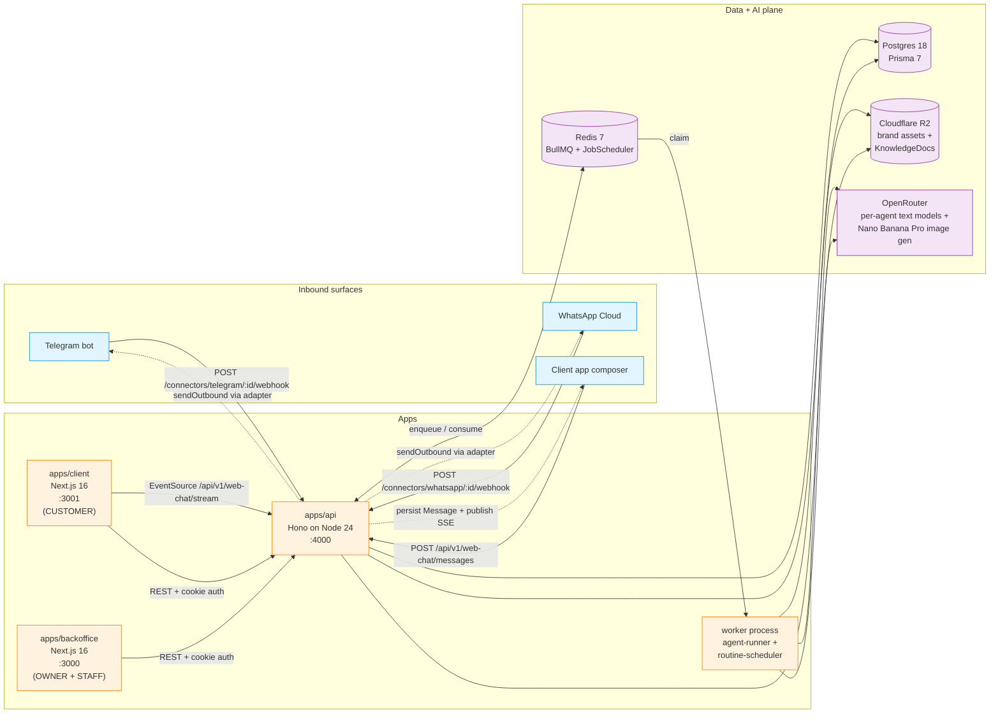
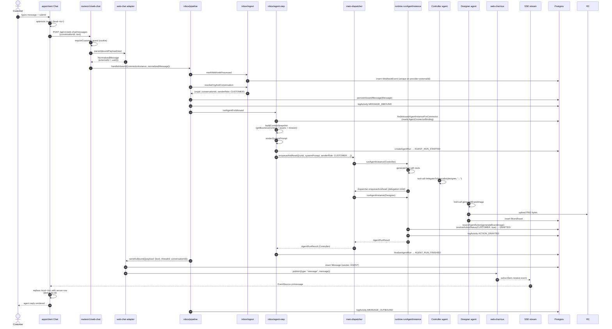

# Qolmeia — Architecture Overview

The single review document for the post-restructure system. Covers the 3 apps, 6 packages, full data model, the unified inbound pipeline, the agent loop, approval gating, the activity log, routines, and the seams that hold it together.

Companion visual reference: [`docs/architecture/current-state-2026-05-21.md`](./architecture/current-state-2026-05-21.md).

---

## §1. What Qolmeia is

Qolmeia is an AI agency platform for Brazilian local businesses. It ships three user-facing surfaces — a **Telegram bot** for the owner (legacy + ops channel), a **backoffice web app** for operators (OWNER + STAFF roles), and a **client web app** for the business's own customers (CUSTOMER role) — all backed by a single multi-agent runtime. The runtime is a 3-template delegation DAG (Controller → Marketing Strategist → Designer), each agent running on a per-template OpenRouter model, talking to a unified inbound pipeline that normalises Telegram, WhatsApp, and in-app web chat into the same `NormalizedMessage` shape via the `ConnectorAdapter` interface. Owner-side actions auto-execute; customer-side actions on approval-gated skills land as `DRAFTED` rows in an approval queue rendered by the backoffice with a schema-driven editor. Every business event flows into an append-only `ActivityLog` timeline. Proactive work runs through paused-by-default cron `Routine`s on BullMQ JobSchedulers. Authentication is Better Auth (email+password for staff, magic-link for customers); authorization is `OrgMembership` (one row per `(userId, orgId, role)`).

---

## §2. The system at a glance



Three apps share one API surface. The backoffice and client are both Next.js 16; they never duplicate Better Auth's HTTP routes — those live exclusively in the API at `/api/auth/*`. The two Next apps just validate cookies the API issued via the shared `@repo/auth` factory.

Two processes share the same code: the **API** runs the inbound pipeline inline in `DISPATCH_MODE=serial` (default); the **worker** runs the agent loop + the routine scheduler in `DISPATCH_MODE=queue`. Both processes import the same `runAgentInstance`.

---

## §3. Repo layout

### Apps

| App               | Framework      | Dev port | Audience         | Auth method          |
| ----------------- | -------------- | -------- | ---------------- | -------------------- |
| `apps/api`        | Hono / Node 24 | `:4000`  | All HTTP traffic | Better Auth (server) |
| `apps/backoffice` | Next.js 16     | `:3000`  | OWNER + STAFF    | Email + password     |
| `apps/client`     | Next.js 16     | `:3001`  | CUSTOMER         | Magic link           |

### Packages

| Package                   | Purpose                                                                                      |
| ------------------------- | -------------------------------------------------------------------------------------------- |
| `@repo/auth`              | `createAuth` factory wrapping Better Auth — magic-link + email/password. Used by all 3 apps. |
| `@repo/db`                | Prisma 7 client singleton + `schema.prisma` + integration tests.                             |
| `@repo/transactional`     | React Email templates + Resend sender (welcome, magic-link, reset, verify).                  |
| `@repo/ui`                | shadcn-style component library + shared Tailwind config (used by both Next apps).            |
| `@repo/config-vitest`     | Shared Vitest config (Node + React).                                                         |
| `@repo/typescript-config` | Shared tsconfig bases.                                                                       |

### `apps/api/src/`

| Path                         | Responsibility                                                                                                                                                                                                                                                                        |
| ---------------------------- | ------------------------------------------------------------------------------------------------------------------------------------------------------------------------------------------------------------------------------------------------------------------------------------- |
| `index.ts`                   | Hono bootstrap, middleware, sync registries, mount routes, health + readyz, OpenAPI + llms.txt.                                                                                                                                                                                       |
| `activity/`                  | `log.ts` single writer + `query.ts` clamped reader for the timeline. + tests                                                                                                                                                                                                          |
| `agents/`                    | The agent runtime — runs, actions, approvals, cost, dispatcher, runtime, step-aggregator, agent-instance lookup, connector-binding seed, context snapshot. + tests                                                                                                                    |
| `agents/skills/`             | The 7 skills + `registry.ts` (`ALL_SKILLS` + `syncSkills`) + `types.ts` (`defineSkill<T>`). + tests                                                                                                                                                                                   |
| `agents/templates/`          | The 3 templates (controller, marketing-strategist, designer) + `registry.ts` (`syncTemplates`, acyclic validation) + `renderer.ts` (placeholder substitution). + tests                                                                                                                |
| `connectors/`                | `types.ts` (`ConnectorAdapter` interface + `NormalizedMessage`), `registry.ts` (total over `ConnectorType`), and one folder per adapter: `telegram/`, `whatsapp/`, `web-chat/`, `fresha/`. + tests                                                                                    |
| `inbox/`                     | The unified pipeline: `pipeline.ts` (orchestrator), `ingest.ts` (dedup + conversation upsert), `attachments.ts`, `agent-step.ts`, `owner-commands.ts`, `json-safe.ts`. + tests                                                                                                        |
| `knowledge/`                 | `provider.ts` (read seam composing businessIdea + agentInstructions + businessProfile), `apply.ts` (soul writer), `soul.ts`, `brand-asset.ts`, `brand-context.ts`, `knowledge-doc.ts`. + tests                                                                                        |
| `lib/`                       | `ai.ts` (OpenRouter provider + `resolveModelForAgent`), `image-gen.ts` (Nano Banana Pro), `auth.ts` (configured Better Auth instance), `web-chat-bus.ts` (in-process SSE pub/sub), `api-response.ts` (helpers), `env.ts` (Zod), `logger.ts`, `storage.ts` (R2), `openapi.ts`. + tests |
| `middleware/`                | `require-staff.ts` (OWNER/STAFF guard + `buildRoleGuard` factory), `require-customer.ts` (CUSTOMER + any-member guards), `security.ts`, `error-handler.ts`. + tests                                                                                                                   |
| `routes/auth.ts`             | Mounts Better Auth's handler at `/api/auth/*`.                                                                                                                                                                                                                                        |
| `routes/connectors/index.ts` | The single generic inbound webhook: `POST /connectors/:type/:connectorInstanceId/webhook`. + tests                                                                                                                                                                                    |
| `routes/v1/`                 | REST surface: `me`, `agents`, `approvals`, `activity`, `soul`, `runs`, `team`, `web-chat`, plus `index.ts` that mounts each under its role guard. + tests                                                                                                                             |
| `routines/`                  | `types.ts`, `registry.ts` (`ALL_ROUTINES` + `syncRoutines`), `queue.ts`, `reconcile.ts`, `scheduler-control.ts`, `executor.ts`, `nightly-knowledge-summary.ts`. + tests                                                                                                               |
| `scripts/`                   | One-shot ops scripts: `sync-routines`, `seed-knowledge-sample`, `seed-owner-user-and-membership`, `seed-whatsapp-connector`, `migrate-enabled-skills-to-enablements`, `backfill-controller-inbound-bindings`.                                                                         |
| `workers/`                   | `index.ts` boots both `agent-runner.ts` (BullMQ Worker, concurrency 4) and `routine-scheduler.ts` (Worker + reconciler, concurrency 2).                                                                                                                                               |
| `types/`                     | Local TS types not tied to a single module.                                                                                                                                                                                                                                           |

### `apps/backoffice/src/`

| Path                              | Responsibility                                                                                                                                                                                                   |
| --------------------------------- | ---------------------------------------------------------------------------------------------------------------------------------------------------------------------------------------------------------------- |
| `app/(auth)/`                     | Login, register, recover, reset-password pages.                                                                                                                                                                  |
| `app/(dashboard)/`                | Home, `agents` (+ `[id]`), `approvals` (+ `[id]`), `activity`, `soul`, `runs`, `team` pages.                                                                                                                     |
| `app/layout.tsx`, `not-found.tsx` | Root layout + 404.                                                                                                                                                                                               |
| `components/`                     | Sidebar, sign-out, activity rows, invite form, soul form, team page client, approval form + schema renderer registry. + tests                                                                                    |
| `lib/`                            | `api-client.ts` (browser fetch), `api-server.ts` (server fetch with cookies), `api-types.ts`, `auth-client.ts`, `auth-helpers.ts` (RSC guard `requireStaff`), `auth.ts`, `form-schemas.ts`, `format.ts`. + tests |
| `proxy.ts`                        | Next 16 middleware: cookie check + redirect to /login (preserves `?from=`).                                                                                                                                      |
| `styles/`, `types/`               | Tailwind globals + local types.                                                                                                                                                                                  |

### `apps/client/src/`

| Path                                               | Responsibility                                                                                                                                                               |
| -------------------------------------------------- | ---------------------------------------------------------------------------------------------------------------------------------------------------------------------------- |
| `app/(client)/`                                    | Home (chat), `assets`, `activity` pages.                                                                                                                                     |
| `app/auth/verify/`, `app/login/`, `app/no-access/` | Magic-link trampoline, login page, staff-detected redirect.                                                                                                                  |
| `app/layout.tsx`, `not-found.tsx`                  | Root layout + 404.                                                                                                                                                           |
| `components/`                                      | `chat.tsx` (TanStack Query host), `composer.tsx`, `message-list.tsx`, `message-bubble.tsx`, `sse-subscriber.tsx`, `nav.tsx`, `sign-out-button.tsx`, `providers.tsx`. + tests |
| `lib/`                                             | Same shape as backoffice's `lib/` (api-client/server, auth, form-schemas) with `requireCustomer` RSC guard.                                                                  |
| `proxy.ts`                                         | Same role as backoffice — redirect unauth → /login, bounce authed users away from /login + /auth/verify.                                                                     |
| `styles/`, `types/`                                | Tailwind globals + local types.                                                                                                                                              |

### `packages/*/src/`

| Path                          | Responsibility                                                                                                                                                                                            |
| ----------------------------- | --------------------------------------------------------------------------------------------------------------------------------------------------------------------------------------------------------- |
| `auth/src/server.ts`          | `createAuth(deps)` — Better Auth factory: Prisma adapter, magic-link plugin, `sendMagicLink`/`sendResetPassword`/`sendVerificationEmail`/`sendWelcomeEmail` hooks wired to `@repo/transactional`. + tests |
| `auth/src/client.ts`          | `createAuthClient(deps)` for the two Next apps.                                                                                                                                                           |
| `db/prisma/schema.prisma`     | Single source of truth for the data model.                                                                                                                                                                |
| `db/src/`                     | `prisma` client singleton + integration tests (12) hitting docker Postgres.                                                                                                                               |
| `transactional/src/emails/`   | React Email templates: magic-link, welcome, reset-password, verify-email.                                                                                                                                 |
| `transactional/src/client.ts` | Resend wrapper + named senders. + tests                                                                                                                                                                   |
| `ui/src/components/`          | shadcn-style components shared by both Next apps. + tests                                                                                                                                                 |
| `ui/src/{hooks,lib,styles}/`  | Hooks + utils + Tailwind preset.                                                                                                                                                                          |

---

## §4. Data model

Schema at [`packages/db/prisma/schema.prisma`](../packages/db/prisma/schema.prisma). Provider: `postgresql`. Generator: `prisma-client` with `@prisma/adapter-pg`.

### Auth + tenancy

| Model           | Purpose / key fields                                                                                                                                                                | Invariants                                                                                                                                           |
| --------------- | ----------------------------------------------------------------------------------------------------------------------------------------------------------------------------------- | ---------------------------------------------------------------------------------------------------------------------------------------------------- |
| `User`          | Better Auth user. `email @unique`, `name`, `username?`, `displayName?`.                                                                                                             | Find-or-create on invite; one row per email.                                                                                                         |
| `Session`       | Better Auth session. `userId`, `token @unique`, `expiresAt`, `impersonatedBy?`.                                                                                                     | Cascade on user delete.                                                                                                                              |
| `Account`       | Better Auth credential/oauth account. `userId`, `providerId`, `password?`, `accessToken?` etc.                                                                                      | One row per provider per user.                                                                                                                       |
| `Verification`  | Better Auth one-time verification tokens (magic links, email verify).                                                                                                               | TTL-bound.                                                                                                                                           |
| `RateLimit`     | Better Auth DB-backed rate limit store. `key @unique`, `count`, `lastRequest BigInt`.                                                                                               | Append-then-update.                                                                                                                                  |
| `Organization`  | The tenant. `slug @unique`, `timezone "America/Sao_Paulo"`, `currency "BRL"`, `businessProfile Json?` (the AI-extracted soul), `agentInstructions String?`, `businessIdea String?`. | `businessProfile` writable only via `knowledge/apply.ts`. `agentInstructions` + `businessIdea` writable only via owner commands or backoffice /soul. |
| `OrgMembership` | `(userId, orgId)` unique, `role: OWNER \| STAFF \| CUSTOMER`. The authorization seam.                                                                                               | A user can belong to many orgs; one role per org.                                                                                                    |

### Conversation surface

| Model          | Purpose / key fields                                                                                                | Invariants                                                                     |
| -------------- | ------------------------------------------------------------------------------------------------------------------- | ------------------------------------------------------------------------------ |
| `Customer`     | End-user of the org's business. `(orgId, phone) @unique`, `(orgId, email) @unique`.                                 | Org-scoped.                                                                    |
| `Conversation` | Thread per channel. `channel`, `externalId?`, `orgId`, `customerId?`, `connectorInstanceId?`.                       | New rows always set `connectorInstanceId`.                                     |
| `Message`      | `conversationId`, `externalId?`, `sender: CUSTOMER \| AGENT \| SYSTEM`, `content`, `contentType`, `metadata Json?`. | `(conversationId, externalId)` unique for dedup.                               |
| `WebhookEvent` | Idempotency. `(provider, externalId) @unique`, `payload`, `status`.                                                 | First write wins; duplicates short-circuit the pipeline.                       |
| `BrandAsset`   | Org-scoped binary assets in R2. `r2Key`, `sha256`, `mimeType`, `size`, `metadata Json`.                             | `(orgId, sha256)` unique for dedup. Single writer: `knowledge/brand-asset.ts`. |
| `KnowledgeDoc` | Org-scoped docs in R2. `title`, `summary`, `tags`, `contentType: MARKDOWN \| PLAIN_TEXT \| JSON`.                   | Single CRUD: `knowledge/knowledge-doc.ts`.                                     |

### Multi-agent core

| Model                   | Purpose / key fields                                                                                                                                                                                                        | Invariants                                                                                   |
| ----------------------- | --------------------------------------------------------------------------------------------------------------------------------------------------------------------------------------------------------------------------- | -------------------------------------------------------------------------------------------- |
| `AgentTemplate`         | System-defined, seeded from code. `slug @id`, `defaultSystemPrompt`, `defaultMission`, `defaultModel`, `canDelegateTo String[]`, `compatibleInbound/OutboundConnectorTypes`, `defaultBudgetCents`, M:N with `Skill`.        | `canDelegateTo` validated acyclic at boot. `defaultModel` is OpenRouter id.                  |
| `AgentInstance`         | Per-org hired agent. `(orgId, templateSlug) @unique`, `mission`, `budgetCents`, `modelOverride?`, `status: ACTIVE \| PAUSED`.                                                                                               | Lazy-created via `ensureAgentInstance`. `modelOverride` wins over template's `defaultModel`. |
| `Skill`                 | System-defined, seeded from code. `id @id`, `parametersJsonSchema Json` (Zod → JSON Schema), `requiresApprovalDefault`, `requiredConnectorTypes`.                                                                           | `parametersJsonSchema` is what the backoffice schema-driven editor renders.                  |
| `AgentSkillEnablement`  | Join table replacing the legacy `enabledSkillIds Json?`. `(agentInstanceId, skillId) @unique`, `configOverride Json?`.                                                                                                      | Zero rows ⇒ template defaults. ≥1 row ⇒ explicit override.                                   |
| `ConnectorInstance`     | Per-org channel/tool config. `type`, `config Json`, `capabilities Json`, `senderRole: OWNER \| CUSTOMER`.                                                                                                                   | `senderRole` drives the approval rule. WEB_CHAT auto-provisioned per org.                    |
| `AgentConnectorBinding` | Which agents act on which channels. `(agentInstanceId, connectorInstanceId, direction)` unique. Direction: `INBOUND \| OUTBOUND \| BOTH`.                                                                                   | `findInboundAgentInstanceForConnector` reads this — no hardcoded routing.                    |
| `AgentRun`              | The unit of replayability. `agentInstanceId`, `triggerMessageId?`, `parentRunId?`, `contextSnapshot Json`, `systemPrompt`, `status: RUNNING \| SUCCEEDED \| FAILED`, cost rollup.                                           | Frozen at dispatch; runtime never re-reads context.                                          |
| `AgentAction`           | Per tool call. `runId?`, `agentInstanceId`, `skillId`, `proposedInput Json`, `proposedSummary`, `status: DRAFTED \| AUTO_APPROVED \| APPROVED \| REJECTED \| EDITED \| EXPIRED \| FAILED \| EXECUTED`, `resultJson?`, cost. | Single writer: `agents/actions.ts` (runtime) + `agents/approvals.ts` (post-approval).        |
| `ActivityLog`           | Append-only timeline. `orgId`, `type` (one of 20), `refType` (one of 6), `refId?`, `summary` (pt-BR), `payload Json?`, `actorId?`.                                                                                          | Best-effort writes via `activity/log.ts`. Immutable.                                         |
| `Routine`               | Paused-by-default scheduled invocation. `(orgId, name) @unique`, `agentInstanceId`, `schedule` (cron), `timezone`, `enabled` (always starts false), `config Json`, `lastRunAt?`, `lastRunStatus?`, `nextRunAt?`.            | Owner flips `enabled` via `/ligar`; scheduler reconciles BullMQ.                             |

### Enums (current values)

```
Channel               WEB_CHAT | TELEGRAM
OrgRole               OWNER | STAFF | CUSTOMER
ConversationStatus    ACTIVE | RESOLVED | ARCHIVED
MessageSender         CUSTOMER | AGENT | SYSTEM
ContentType           TEXT | AUDIO | IMAGE | DOCUMENT
ConnectorType         TELEGRAM | WHATSAPP | FRESHA | GOOGLE_MY_BUSINESS | INSTAGRAM | WEB_CHAT
SenderRole            OWNER | CUSTOMER
BindingDirection      INBOUND | OUTBOUND | BOTH
AgentInstanceStatus   ACTIVE | PAUSED
AgentActionStatus     DRAFTED | AUTO_APPROVED | APPROVED | REJECTED | EDITED | EXPIRED | FAILED | EXECUTED
AgentRunStatus        RUNNING | SUCCEEDED | FAILED
KnowledgeDocContentType  MARKDOWN | PLAIN_TEXT | JSON
ActivityLogType       MESSAGE_INBOUND | MESSAGE_OUTBOUND | AGENT_RUN_STARTED | AGENT_RUN_FINISHED |
                      AGENT_RUN_FAILED | ACTION_EXECUTED | ACTION_FAILED | ACTION_DRAFTED |
                      ACTION_APPROVED | ACTION_REJECTED | BUDGET_WARN_80 | BUDGET_WARN_100 |
                      INSTRUCTIONS_UPDATED | BUSINESS_IDEA_UPDATED | OWNER_COMMAND |
                      ROUTINE_TRIGGERED | ROUTINE_ENABLED | ROUTINE_DISABLED |
                      MEMBER_INVITED | MEMBER_JOINED
ActivityLogRefType    MESSAGE | AGENT_RUN | AGENT_ACTION | ORGANIZATION | ROUTINE | NONE
```

---

## §5. The agent loop

[`agents/runtime.ts → runAgentInstance(args: AgentDispatchArgs)`](../apps/api/src/agents/runtime.ts). Single function for every template; behaviour comes from the template + enabled skills.

### Inputs

```ts
type AgentDispatchArgs = {
  agentInstance,          // the row to run
  prisma,
  dispatcher,             // self-reference so delegation can re-enter
  input: { audioBytes?, audioMime?, imageBytes[], text? },
  newAssets,              // ingested this turn
  existingAssets,         // recent BrandAsset window (20)
  oversizeCount,
  runId,                  // AgentRun.id — frozen at dispatch
  systemPrompt,           // already rendered, duplicates AgentRun.systemPrompt
  senderRole,             // OWNER | CUSTOMER | null — drives the approval rule
  dispatchOrigin?,        // used by BullMQ to derive a coalesce jobId
}
```

### Steps inside `runAgentInstance`

1. `findTemplateBySlug` — throws if unknown (the registry is canonical; boot would have caught it).
2. `resolveEnabledSkills(prisma, agentInstance.id, template.defaultEnabledSkillIds)`. Zero `AgentSkillEnablement` rows ⇒ template defaults; ≥1 row ⇒ explicit set.
3. Build `SkillContext` (`agentInstanceId`, `dispatcher`, `orgId`, `parentRunArgs`, `parentRunId: runId`, `prisma`).
4. Wrap each skill in an AI SDK `tool({ description, inputSchema, execute })`.
5. `modelId = resolveModelForAgent({ instance: { modelOverride }, template: { defaultModel } })`.
6. `generateText({ model: openrouter.chat(modelId), stopWhen: stepCountIs(5), system: systemPrompt, messages, tools, temperature: 0.2 })`.
7. `aggregateSteps(result.steps, ALL_SKILLS.map(s => s.id))` returns `{ generatedAssetIds, toolCallSummary }`.
8. For each tool call: `recordAgentAction({ ..., senderRole, runId })` — status from `resolveActionStatus(senderRole, skill.requiresApprovalDefault)`. Emit one `ActivityLog` row per action (`ACTION_EXECUTED` | `ACTION_FAILED` | `ACTION_DRAFTED`).
9. If `agentInstance.budgetCents > 0`: `checkBudgetThresholds` aggregates month-to-date cost; emits `BUDGET_WARN_80` / `BUDGET_WARN_100` at thresholds.
10. Return `{ text, generatedAssetIds, toolCallSummary, usage }`.

The runtime **does not load context**. `buildContextSnapshot` runs at dispatch time in `inbox/agent-step.ts` (for inbound) or in the `delegateToSpecialist` skill (for child runs). The snapshot is persisted on the `AgentRun` row and passed through `systemPrompt`.

### The 3 seeded templates

| Slug                   | displayName          | `defaultModel`        | `canDelegateTo`                       | Default enabled skills                                                                        |
| ---------------------- | -------------------- | --------------------- | ------------------------------------- | --------------------------------------------------------------------------------------------- |
| `controller`           | Controller           | `openai/gpt-5.3-chat` | `["designer","marketing-strategist"]` | `delegateToSpecialist`, `extractSoul`, `searchKnowledge`, `readKnowledgeDoc`                  |
| `marketing-strategist` | Marketing Strategist | `openai/gpt-5.4-mini` | `["designer"]`                        | `delegateToSpecialist`, `draftMarketingStrategy`                                              |
| `designer`             | Designer             | `openai/gpt-5.4-nano` | `[]`                                  | `extractSoul`, `generateBrandImage`, `labelBrandAsset`, `searchKnowledge`, `readKnowledgeDoc` |

### Delegation

`delegateToSpecialist` validates `targetTemplateSlug ∈ parent.canDelegateTo`, `ensureAgentInstance` lazy-creates the child, `buildContextSnapshot` builds a fresh snapshot for the child's mission, `createAgentRun` persists with `parentRunId = ctx.parentRunId`, and `dispatcher.enqueueAndAwait` re-enters with `dispatchOrigin: { kind: "delegation", parentRunId, childTemplateSlug, subtaskHash }`.

---

## §6. The skills catalog

All 7 skills ship from [`apps/api/src/agents/skills/`](../apps/api/src/agents/skills/). `requiresApprovalDefault: true` means CUSTOMER-side triggers land as DRAFTED (the tool still runs; the row records it for owner review). Inputs are Zod schemas; the JSON Schema rendering lands on `Skill.parametersJsonSchema` and is what the backoffice approval editor renders.

| Skill ID                 | Owner template(s)                | `requiresApprovalDefault` | Input shape (summary)                                | Purpose                                                                                                      |
| ------------------------ | -------------------------------- | ------------------------- | ---------------------------------------------------- | ------------------------------------------------------------------------------------------------------------ |
| `delegateToSpecialist`   | Controller, Marketing Strategist | `false`                   | `{ targetTemplateSlug, subtask }`                    | DAG hop. Validates `canDelegateTo`, builds child snapshot, creates child `AgentRun`, dispatches.             |
| `extractSoul`            | Controller, Designer             | `false`                   | `{ patch: SoulPatch }`                               | Single-writer wrapper around `knowledge/apply.ts → applySoulUpdate`. Updates `Organization.businessProfile`. |
| `labelBrandAsset`        | Designer                         | `false`                   | `{ assetId, labels[], colors[], style?, summary? }`  | Updates `BrandAsset.metadata`.                                                                               |
| `generateBrandImage`     | Designer                         | **`true`**                | `{ prompt, aspectRatio: "1:1" \| "16:9" \| "9:16" }` | Nano Banana Pro (`env.IMAGE_GEN_MODEL`) via OpenRouter. Enriched with brand context. Persisted to R2.        |
| `draftMarketingStrategy` | Marketing Strategist             | **`true`**                | `{ campaignBrief, channels[], targetAudience? }`     | Stub v0. CUSTOMER triggers ⇒ DRAFTED.                                                                        |
| `searchKnowledge`        | Controller, Designer             | `false`                   | `{ query, limit? }`                                  | Prisma `contains` keyword search over `KnowledgeDoc`. Swap point for pgvector later.                         |
| `readKnowledgeDoc`       | Controller, Designer             | `false`                   | `{ docId }`                                          | Reads `KnowledgeDoc` body from R2.                                                                           |

---

## §7. The connector adapter pattern

[`apps/api/src/connectors/types.ts`](../apps/api/src/connectors/types.ts) defines the canonical inbound contract. Every channel — Telegram, WhatsApp, in-app web chat — implements this interface; the pipeline never sees provider payloads.

```ts
type ConnectorAdapter = {
  capabilities: { inbound: boolean; outbound: boolean };
  type: ConnectorType;
  validateConfig: (config: unknown) => { valid: true } | { errors: string[]; valid: false };
  parseInboundPayload: (raw: unknown, connectorConfig: unknown) => Promise<NormalizedMessage>;
  sendOutbound: (args: {
    connectorConfig;
    payload: { text?; files? };
    threadId;
  }) => Promise<{ externalMessageId }>;
  verifySignature?: (args: {
    connectorConfig;
    headers: Headers;
    rawBody: string;
  }) => Promise<boolean>;
  verifyChallenge?: (args: {
    connectorConfig;
    query: URLSearchParams;
  }) => Promise<{ valid; challenge? }>;
};

type NormalizedMessage = {
  attachments: ReadonlyArray<NormalizedAttachment>;
  authorDisplayName: string | null;
  externalId: string; // provider-native message id — drives dedup
  externalThreadId: string; // provider-native thread/chat id
  rawTimestamp: number; // ms (adapters normalise from seconds)
  text: string | null;
};
```

### Registry state

[`apps/api/src/connectors/registry.ts`](../apps/api/src/connectors/registry.ts) is **total** over `ConnectorType` — `getAdapter(type)` always returns an adapter. Placeholders throw `NotImplementedError`.

| ConnectorType        | Adapter file                     | Inbound                                                                                                    | Outbound                                                                | Live? |
| -------------------- | -------------------------------- | ---------------------------------------------------------------------------------------------------------- | ----------------------------------------------------------------------- | ----- |
| `TELEGRAM`           | `connectors/telegram/adapter.ts` | Full — text + photo + voice + document; `verifySignature` checks Telegram secret.                          | Full — `sendMessage` + `sendDocument` via native `fetch`.               | Yes   |
| `WHATSAPP`           | `connectors/whatsapp/adapter.ts` | Parses Meta Cloud API webhooks; `verifyChallenge` + `verifySignature` (HMAC).                              | Text only via Graph API; file outbound is stub.                         | Yes   |
| `WEB_CHAT`           | `connectors/web-chat/adapter.ts` | No provider — adapter accepts `{conversationId, text, attachments}` from `POST /api/v1/web-chat/messages`. | Persists `Message` rows directly + publishes on `web-chat-bus` for SSE. | Yes   |
| `FRESHA`             | `connectors/fresha/adapter.ts`   | `NotImplementedError`                                                                                      | `NotImplementedError`                                                   | No    |
| `GOOGLE_MY_BUSINESS` | placeholder in `registry.ts`     | `NotImplementedError`                                                                                      | `NotImplementedError`                                                   | No    |
| `INSTAGRAM`          | placeholder in `registry.ts`     | `NotImplementedError`                                                                                      | `NotImplementedError`                                                   | No    |

### The generic route

[`apps/api/src/routes/connectors/index.ts`](../apps/api/src/routes/connectors/index.ts) serves `GET /connectors/:type/:connectorInstanceId/webhook` (verification handshake) and `POST /connectors/:type/:connectorInstanceId/webhook` (inbound payloads). The handler:

1. Maps the lowercase URL slug to `ConnectorType` via `KNOWN_CONNECTOR_TYPES`.
2. Resolves `ConnectorInstance` (404s if missing or wrong type).
3. Calls `adapter.verifySignature` (401s on failure).
4. Parses the JSON body and calls `adapter.parseInboundPayload`. Parse failure ⇒ 200 OK (delivery receipts, status updates).
5. Hands the resulting `NormalizedMessage` + `ConnectorInstance` to `handleInbound`.

### Adding a new connector

1. Add the enum value to `ConnectorType` in `schema.prisma` + `pnpm db:push`.
2. Create `apps/api/src/connectors/<name>/adapter.ts` implementing `ConnectorAdapter`.
3. Register it in `ADAPTERS` in `connectors/registry.ts`.
4. Add the lowercase slug to `KNOWN_CONNECTOR_TYPES` in `routes/connectors/index.ts`.
5. Provision a `ConnectorInstance` row (per-org config + senderRole) + a seeded `AgentConnectorBinding` so the pipeline can route inbound.

---

## §8. The inbound request lifecycle

Customer types in the client app composer. End-to-end through the WEB_CHAT path (the most illustrative — it exercises SSE).



The Telegram + WhatsApp path is identical except the route is `/connectors/:type/:id/webhook` (signature-verified by the adapter, not cookie-guarded), and `sendOutbound` hits the provider's HTTP API instead of `web-chat-bus`.

### Approval branch

When `senderRole === "CUSTOMER"` and the skill has `requiresApprovalDefault: true`, step 8 of the runtime persists `AgentAction.status = DRAFTED` instead of `AUTO_APPROVED`. The tool **still executes** (the image lands in R2; the strategy is generated); the DRAFTED row records the proposed input + result for owner review. The approval editor in the backoffice (`/approvals/[id]`) renders the row, lets the operator edit/approve/reject, and calls the programmatic helpers in `agents/approvals.ts`.

---

## §9. Authentication + authorization

### Better Auth

Single source: [`packages/auth/src/server.ts → createAuth({prisma, …})`](../packages/auth/src/server.ts). Plugins: magic-link, username, admin (impersonation). Email + password for STAFF; magic link for CUSTOMER. All HTTP routes live exclusively on the API at `/api/auth/*` (mounted in `apps/api/src/routes/auth.ts`); the two Next apps just validate cookies the API issued.

### OrgMembership = the authorization seam

```
User --(1:N)--> OrgMembership --(N:1)--> Organization
                  role: OWNER | STAFF | CUSTOMER
```

A user can belong to many orgs and holds one role per org. Routes don't read `User.role` (no such field) — they read `OrgMembership.role` via the role guards.

### The three role guards

| Middleware           | Lives at                         | Accepts                  | Used by                                                   |
| -------------------- | -------------------------------- | ------------------------ | --------------------------------------------------------- |
| `requireStaff()`     | `middleware/require-staff.ts`    | OWNER + STAFF            | `/api/v1/{agents, approvals, activity, soul, runs, team}` |
| `requireCustomer()`  | `middleware/require-customer.ts` | CUSTOMER                 | `/api/v1/web-chat/*`                                      |
| `requireAnyMember()` | `middleware/require-customer.ts` | OWNER + STAFF + CUSTOMER | `/api/v1/me`                                              |

All three are built on the same `buildRoleGuard(roles, deps)` factory. The matched membership's `orgId` + `role` land on the Hono context (`c.get("orgId")`, `c.get("role")`).

### App-level guards

- **Backoffice** (`apps/backoffice/src/lib/auth-helpers.ts`): `requireStaff()` RSC guard hits `/api/v1/me` and redirects CUSTOMER sessions to `/no-access`.
- **Client** (`apps/client/src/lib/auth-helpers.ts`): `requireCustomer()` mirrors the above for STAFF.
- **Both** use a Next 16 `proxy.ts` middleware to redirect unauthenticated visitors to `/login` (preserving `?from=`).

---

## §10. The 3 apps

### `apps/api` — Hono on Node 24, `:4000`

Entry: [`src/index.ts`](../apps/api/src/index.ts). On boot: `syncSkills` + `syncTemplates` run before the server starts; cyclic `canDelegateTo` aborts boot. Health: `/healthz` (liveness, no DB), `/readyz` (DB ping). Docs: `/openapi.json`, `/llms.txt`. Auth: `/api/auth/*` (Better Auth handler). REST: `/api/v1/*` (see route mount below). Webhooks: `/connectors/:type/:id/webhook`. The worker entry [`src/workers/index.ts`](../apps/api/src/workers/index.ts) is a separate Node process that mounts both `agent-runner` (BullMQ Worker, concurrency 4) and `routine-scheduler` (Worker + reconciler, concurrency 2).

#### `/api/v1` mount topology

```
/api/v1/
├── me              requireAnyMember  (OWNER + STAFF + CUSTOMER)
├── agents          requireStaff      (OWNER + STAFF)
├── approvals       requireStaff      (GET list, GET :id, POST :id/approve|reject|edit)
├── activity        requireStaff      (GET — clamped list)
├── soul            requireStaff      (GET, PATCH for businessIdea/agentInstructions)
├── runs            requireStaff      (GET list, GET :id)
├── team            requireStaff      (GET members, POST invite — gated to OWNER inside the handler)
└── web-chat        requireCustomer   (POST messages, GET messages, GET conversations, GET stream SSE, GET assets, GET assets/:id)
```

### `apps/backoffice` — Next.js 16, `:3000`

Operator UI. Auth: email + password. Pages:

| Route                                                | Purpose                                                                                                               |
| ---------------------------------------------------- | --------------------------------------------------------------------------------------------------------------------- |
| `/login`, `/register`, `/recover`, `/reset-password` | Better Auth flows via `authClient`.                                                                                   |
| `/`                                                  | Dashboard home with org overview.                                                                                     |
| `/agents`, `/agents/[id]`                            | List of `AgentInstance`s + per-agent detail (mission, enabled skills, recent runs, budget).                           |
| `/approvals`, `/approvals/[id]`                      | DRAFTED queue + schema-driven editor (reads `Skill.parametersJsonSchema`, renders inputs, posts approve/edit/reject). |
| `/activity`                                          | Org timeline from `ActivityLog`.                                                                                      |
| `/soul`                                              | Read + edit `Organization.businessIdea` + `agentInstructions`.                                                        |
| `/runs`                                              | Recent `AgentRun`s with cost + status.                                                                                |
| `/team`                                              | Members list + invite form (OWNER only).                                                                              |

The approval editor uses a renderer registry (`components/approval/skill-renderers/`) so per-skill augmentations can plug in. Today the registry is empty — the generic schema renderer handles every skill.

### `apps/client` — Next.js 16, `:3001`

Customer UI. Auth: magic-link only. Pages:

| Route          | Purpose                                                                                                          |
| -------------- | ---------------------------------------------------------------------------------------------------------------- |
| `/login`       | Magic-link request form (POSTs to Better Auth via `authClient.signIn.magicLink`).                                |
| `/auth/verify` | Trampoline after magic-link click. Bounces to `/` on success, surfaces `?error=` on failure.                     |
| `/no-access`   | Shown when a staff session lands on the client app.                                                              |
| `/`            | Chat home — RSC fetches latest `Conversation` + last 50 `Message`s; client `<Chat>` mounts TanStack Query + SSE. |
| `/assets`      | Read-only gallery of `BrandAsset` rows (from `GET /api/v1/web-chat/assets`).                                     |
| `/activity`    | Customer-visible slice of `ActivityLog` (the API filters to an allowlist so operator-only events never leak).    |

Real-time updates flow through [`components/sse-subscriber.tsx`](../apps/client/src/components/sse-subscriber.tsx) — an `EventSource` on `/api/v1/web-chat/stream` with `withCredentials: true`. Optimistic writes in the composer insert a `local-<ts>` row; the SSE `message` event replaces it with the server row (dedup by id). `IMAGE` messages render via `` — the API streams R2 bytes with `Cache-Control: private, max-age=300`.

---

## §11. The approval flow

### The rule

[`agents/actions.ts → resolveActionStatus`](../apps/api/src/agents/actions.ts):

```
ownerSide = senderRole !== "CUSTOMER"
status = (ownerSide || !skill.requiresApprovalDefault) ? AUTO_APPROVED : DRAFTED
```

Internal triggers (`senderRole === null`) are always owner-side. CUSTOMER-side runs auto-approve **only** when the skill opts out of approval.

### Current matrix

| Skill                    | `requiresApprovalDefault` | Owner-side outcome | CUSTOMER-side outcome |
| ------------------------ | ------------------------- | ------------------ | --------------------- |
| `delegateToSpecialist`   | `false`                   | AUTO_APPROVED      | AUTO_APPROVED         |
| `extractSoul`            | `false`                   | AUTO_APPROVED      | AUTO_APPROVED         |
| `labelBrandAsset`        | `false`                   | AUTO_APPROVED      | AUTO_APPROVED         |
| `searchKnowledge`        | `false`                   | AUTO_APPROVED      | AUTO_APPROVED         |
| `readKnowledgeDoc`       | `false`                   | AUTO_APPROVED      | AUTO_APPROVED         |
| `generateBrandImage`     | **`true`**                | AUTO_APPROVED      | **DRAFTED**           |
| `draftMarketingStrategy` | **`true`**                | AUTO_APPROVED      | **DRAFTED**           |

The tool call **executes** regardless. The DRAFTED status records the proposed input + result for owner review; it does not prevent the underlying side-effect.

### The backoffice editor

`/approvals/[id]` renders the row using a schema-driven form. The form reads `Skill.parametersJsonSchema`, generates inputs per field, prefills with `AgentAction.proposedInput`, and POSTs to `/api/v1/approvals/:id/{approve|reject|edit}`. A renderer registry at `components/approval/skill-renderers/` lets future skills register richer inputs (live previews, multi-step wizards). Today the registry is empty; the generic form covers every shipped skill.

### Programmatic helpers

[`agents/approvals.ts`](../apps/api/src/agents/approvals.ts):

```ts
approveAction({ actionId, decidedByUserId })   // DRAFTED → APPROVED + ACTION_APPROVED log
rejectAction({ actionId, decidedByUserId, reason? }) // DRAFTED → REJECTED + ACTION_REJECTED log
editAction({ actionId, decidedByUserId, newInput }) // DRAFTED → EDITED + ACTION_APPROVED (edited=true)
executeApprovedAction({ actionId })            // APPROVED | EDITED → calls skill.execute → EXECUTED
```

The `SkillContext` injected by `executeApprovedAction` leaves `dispatcher` + `parentRunArgs` as undefined stubs — no current approval-gated skill reaches for them. First skill that does will need a real dispatcher path (queued post-approval runs).

---

## §12. The activity log

Append-only, per-org timeline. Single writer: [`activity/log.ts → logActivity`](../apps/api/src/activity/log.ts) — best-effort (errors swallowed; Pino keeps a record). Single reader: [`activity/query.ts → getRecentActivity({ orgId, limit })`](../apps/api/src/activity/query.ts) — clamped to 500.

### The 20 event types

| Type                    | refType      | Emitted from                                     | Summary (pt-BR sample)                            |
| ----------------------- | ------------ | ------------------------------------------------ | ------------------------------------------------- |
| `MESSAGE_INBOUND`       | MESSAGE      | `inbox/pipeline.ts`                              | "Mensagem recebida via Telegram"                  |
| `MESSAGE_OUTBOUND`      | AGENT_RUN    | `inbox/pipeline.ts`                              | "Resposta enviada ao dono via Telegram"           |
| `AGENT_RUN_STARTED`     | AGENT_RUN    | `agents/runs.ts → createAgentRun`                | "Agente Controller iniciou"                       |
| `AGENT_RUN_FINISHED`    | AGENT_RUN    | `agents/runs.ts → finalizeAgentRun`              | "Agente Controller concluiu em 4280ms"            |
| `AGENT_RUN_FAILED`      | AGENT_RUN    | `agents/runs.ts → finalizeAgentRun` (error path) | "Agente Controller falhou"                        |
| `ACTION_EXECUTED`       | AGENT_ACTION | `agents/runtime.ts`                              | "Skill Generate Brand Image executada"            |
| `ACTION_FAILED`         | AGENT_ACTION | `agents/runtime.ts`                              | "Skill Generate Brand Image falhou"               |
| `ACTION_DRAFTED`        | AGENT_ACTION | `agents/runtime.ts` (CUSTOMER + approval-gated)  | "Skill Generate Brand Image aguardando aprovação" |
| `ACTION_APPROVED`       | AGENT_ACTION | `agents/approvals.ts`                            | "Ação aprovada pelo dono"                         |
| `ACTION_REJECTED`       | AGENT_ACTION | `agents/approvals.ts`                            | "Ação rejeitada pelo dono"                        |
| `BUDGET_WARN_80`        | AGENT_ACTION | `agents/cost.ts → checkBudgetThresholds`         | "Orçamento atingiu 80%"                           |
| `BUDGET_WARN_100`       | AGENT_ACTION | `agents/cost.ts → checkBudgetThresholds`         | "Orçamento estourou"                              |
| `INSTRUCTIONS_UPDATED`  | ORGANIZATION | `inbox/owner-commands.ts`                        | "Instruções da equipe atualizadas"                |
| `BUSINESS_IDEA_UPDATED` | ORGANIZATION | `inbox/owner-commands.ts`                        | "Ideia do negócio atualizada"                     |
| `OWNER_COMMAND`         | MESSAGE      | `inbox/pipeline.ts` (owner-command branch)       | "Comando do dono recebido: /ideia"                |
| `ROUTINE_TRIGGERED`     | ROUTINE      | `routines/executor.ts`                           | "Rotina nightly-knowledge-summary executou"       |
| `ROUTINE_ENABLED`       | ROUTINE      | `inbox/owner-commands.ts → /ligar`               | "Rotina ativada"                                  |
| `ROUTINE_DISABLED`      | ROUTINE      | `inbox/owner-commands.ts → /desligar`            | "Rotina desativada"                               |
| `MEMBER_INVITED`        | ORGANIZATION | `routes/v1/team.ts`                              | "Membro convidado: …"                             |
| `MEMBER_JOINED`         | ORGANIZATION | (reserved — wired when a user accepts an invite) | "Membro aceitou o convite"                        |

### The 6 refType values

`MESSAGE`, `AGENT_RUN`, `AGENT_ACTION`, `ORGANIZATION`, `ROUTINE`, `NONE`.

---

## §13. Routines

Paused-by-default cron `Routine`s on BullMQ JobSchedulers. The owner opts in via `/ligar <name>` in Telegram. The DB row owns `schedule` + `enabled` + `config` (owner-mutable); the code definition owns `buildPrompt` + `defaultAgentTemplate` (immutable across deploys).

### `RoutineDefinition` shape

```ts
type RoutineDefinition = {
  name: string; // unique per org; the key for /ligar /desligar /correr
  description: string; // refreshed on every sync
  defaultSchedule: string; // cron expression in the org's timezone
  defaultAgentTemplate: string; // templateSlug — the agent this routine invokes
  defaultConfig: RoutineConfig; // initial shape for Routine.config
  buildPrompt: (config, ctx) => Promise<string>;
};
```

### The seed routine: `nightly-knowledge-summary`

| Field                  | Value                                                                                                      |
| ---------------------- | ---------------------------------------------------------------------------------------------------------- |
| `name`                 | `nightly-knowledge-summary`                                                                                |
| `defaultSchedule`      | `0 3 * * *` (03:00 daily in `America/Sao_Paulo`)                                                           |
| `defaultAgentTemplate` | `controller`                                                                                               |
| `defaultConfig`        | `{ maxDocs: 5 }`                                                                                           |
| `buildPrompt`          | Queries last 24h of `KnowledgeDoc` rows, formats a pt-BR digest. Empty-doc case yields a neutral check-in. |

### Owner commands

| Command            | Behaviour                                                                                           |
| ------------------ | --------------------------------------------------------------------------------------------------- |
| `/rotinas`         | List all routines with `schedule`, `enabled`, `lastRunStatus`.                                      |
| `/ligar <name>`    | `enabled = true` → emit `ROUTINE_ENABLED` → `triggerReconcile` (scheduler also reconciles on boot). |
| `/desligar <name>` | `enabled = false` → emit `ROUTINE_DISABLED` → `triggerReconcile`.                                   |
| `/correr <name>`   | One-off bypass of cron. Runs `executeRoutine` directly.                                             |

### Adding a routine

1. Create `apps/api/src/routines/<name>.ts` exporting a `RoutineDefinition`.
2. Add to `ALL_ROUTINES` in `routines/registry.ts`.
3. Run `pnpm tsx apps/api/src/scripts/sync-routines.ts` to upsert rows (paused) for every org.
4. The scheduler reconciles on worker boot; for a running process, the next `/ligar` triggers reconcile.

### Worker isolation

`routines/queue.ts` creates a separate BullMQ queue `qolmeia-routine-run` (not the reactive `qolmeia-agent-run`) so a flaky routine never starves inbound. `executor.ts` swallows its own errors; the owner sees `lastRunStatus = "FAILED"` in `/rotinas`.

---

## §14. The seams

Single-writer / single-reader audit (run anytime against the live tree):

```bash
grep -rn "businessProfile" apps/api/src       # ⇒ knowledge/apply.ts (writer) + knowledge/provider.ts (reader)
grep -rn "agentInstructions" apps/api/src     # ⇒ knowledge/provider.ts (reader) + inbox/owner-commands.ts + routes/v1/soul.ts (writers)
grep -rn "businessIdea" apps/api/src          # ⇒ knowledge/provider.ts (reader) + inbox/owner-commands.ts + routes/v1/soul.ts (writers)
grep -rn "brandAsset.create" apps/api/src     # ⇒ knowledge/brand-asset.ts (both ingest functions)
grep -rn "brandAsset.update" apps/api/src     # ⇒ agents/skills/label-brand-asset.ts
grep -rn "agentInstance.upsert" apps/api/src  # ⇒ agents/agent-instance.ts
grep -rn "agentAction.create" apps/api/src    # ⇒ agents/actions.ts + agents/approvals.ts
grep -rn "agentRun.create" apps/api/src       # ⇒ agents/runs.ts
grep -rn "activityLog.create" apps/api/src    # ⇒ activity/log.ts
grep -rn "routine.create" apps/api/src        # ⇒ routines/registry.ts (syncRoutines)
grep -rn "as Skill<" apps/api/src             # ⇒ NOTHING — defineSkill killed the cast
```

| Seam                                                                      | Lives at                                                | What it hides                                                                |
| ------------------------------------------------------------------------- | ------------------------------------------------------- | ---------------------------------------------------------------------------- |
| `@repo/auth.createAuth`                                                   | `packages/auth/src/server.ts`                           | Better Auth configuration shared by all 3 apps.                              |
| `@repo/transactional` senders                                             | `packages/transactional/src/client.ts`                  | Resend wrapper + React Email rendering.                                      |
| `lib/ai.resolveModelForAgent`                                             | `apps/api/src/lib/ai.ts`                                | Per-instance + per-template OpenRouter model selection.                      |
| `connectors.getAdapter`                                                   | `apps/api/src/connectors/registry.ts`                   | Total `Record<ConnectorType, ConnectorAdapter>` lookup.                      |
| `web-chat-bus.subscribe / publish`                                        | `apps/api/src/lib/web-chat-bus.ts`                      | In-process EventEmitter pub/sub for SSE (swap to Redis when API scales out). |
| `inbox/pipeline.handleInbound`                                            | `apps/api/src/inbox/pipeline.ts`                        | The one-and-only inbound orchestrator. All channels enter here.              |
| `getBusinessContext`                                                      | `apps/api/src/knowledge/provider.ts`                    | Composes businessIdea + agentInstructions + businessProfile.                 |
| `applySoulUpdate`                                                         | `apps/api/src/knowledge/apply.ts`                       | Single-writer patch-merge for the soul.                                      |
| `ingestBrandAsset` + `ingestGeneratedAsset`                               | `apps/api/src/knowledge/brand-asset.ts`                 | SHA-256 dedup + R2 upload + Prisma row.                                      |
| `ensureAgentInstance`                                                     | `apps/api/src/agents/agent-instance.ts`                 | The AgentInstance upsert shape.                                              |
| `findInboundAgentInstanceForConnector`                                    | `apps/api/src/agents/agent-instance.ts`                 | Binding-table lookup with `none` / `ambiguous` resolution.                   |
| `runAgentInstance`                                                        | `apps/api/src/agents/runtime.ts`                        | The agent loop.                                                              |
| `buildContextSnapshot`                                                    | `apps/api/src/agents/context-snapshot.ts`               | Snapshot composition at dispatch time.                                       |
| `createAgentRun` / `finalizeAgentRun`                                     | `apps/api/src/agents/runs.ts`                           | Run lifecycle + cost rollup + AGENT*RUN*\* ActivityLog.                      |
| `recordAgentAction` + `resolveActionStatus`                               | `apps/api/src/agents/actions.ts`                        | Approval rule.                                                               |
| `approveAction` / `rejectAction` / `editAction` / `executeApprovedAction` | `apps/api/src/agents/approvals.ts`                      | DRAFTED → APPROVED/EDITED/REJECTED → EXECUTED transitions.                   |
| `createSerialDispatcher` / `createBullMQDispatcher`                       | `apps/api/src/agents/{dispatcher,bullmq-dispatcher}.ts` | Sync vs async execution.                                                     |
| `defineSkill<T>`                                                          | `apps/api/src/agents/skills/types.ts`                   | Skill shape constraints.                                                     |
| `logActivity`                                                             | `apps/api/src/activity/log.ts`                          | Single write-point for the timeline.                                         |
| `reconcileRoutines`                                                       | `apps/api/src/routines/reconcile.ts`                    | BullMQ JobScheduler ↔ Routine row reconciliation.                            |
| `executeRoutine`                                                          | `apps/api/src/routines/executor.ts`                     | One fire of a routine — shared by the scheduler worker and `/correr`.        |
| `buildV1Routes(deps)`                                                     | `apps/api/src/routes/v1/index.ts`                       | REST endpoint factory with injectable guards + routes (tested via stubs).    |
| `buildRoleGuard(roles, deps)`                                             | `apps/api/src/middleware/require-staff.ts`              | All three role guards share one implementation.                              |

---

## §15. External services (env-var map)

### Required

| Env var                         | Used by                          | What it does                                                                   |
| ------------------------------- | -------------------------------- | ------------------------------------------------------------------------------ |
| `DATABASE_URL`                  | Prisma                           | Postgres connection. Local: docker-compose on `localhost:5436`. Prod: Railway. |
| `REDIS_URL`                     | BullMQ + JobScheduler            | Queue + scheduler state.                                                       |
| `BETTER_AUTH_SECRET`            | Better Auth                      | Cookie/token signing. Min 32 chars. Same value across all 3 apps.              |
| `OPENROUTER_API_KEY`            | `lib/ai.ts` + `lib/image-gen.ts` | Single AI key for per-agent text models AND image generation.                  |
| `TELEGRAM_BOT_TOKEN`            | Telegram adapter                 | Bot auth (inbound verify + outbound `sendMessage`/`sendDocument`).             |
| `TELEGRAM_BOT_USERNAME`         | Telegram adapter                 | Mention detection.                                                             |
| `TELEGRAM_WEBHOOK_SECRET_TOKEN` | Telegram adapter                 | Validates `X-Telegram-Bot-Api-Secret-Token` header.                            |
| `R2_ACCOUNT_ID`                 | `lib/storage.ts`                 | Cloudflare R2 account.                                                         |
| `R2_BUCKET`                     | `lib/storage.ts`                 | Bucket name (e.g. `qolmeia`).                                                  |
| `R2_ENDPOINT`                   | `lib/storage.ts`                 | S3-compatible endpoint URL.                                                    |
| `R2_REGION`                     | `lib/storage.ts`                 | Usually `auto`.                                                                |
| `R2_ACCESS_KEY_ID`              | `lib/storage.ts`                 | R2 access key.                                                                 |
| `R2_SECRET_ACCESS_KEY`          | `lib/storage.ts`                 | R2 secret.                                                                     |

### Optional

| Env var                      | Used by                          | What it does                                                                                                      |
| ---------------------------- | -------------------------------- | ----------------------------------------------------------------------------------------------------------------- |
| `RESEND_API_KEY`             | `@repo/transactional`            | When absent, email senders become no-ops (dev/CI runs without an external mail provider).                         |
| `IMAGE_GEN_MODEL`            | `lib/image-gen.ts`               | OpenRouter id for the image model. Default: `google/gemini-3-pro-image-preview` (Nano Banana Pro). Hot-swappable. |
| `WEB_APP_URL`                | `lib/ai.ts` + `lib/image-gen.ts` | OpenRouter `HTTP-Referer` header for dashboard attribution. Falls back to `https://qolmeia.ai`.                   |
| `AUTH_FROM_EMAIL`            | `@repo/auth`                     | Sender address for transactional email. Default: `noreply@qolmeia.ai`.                                            |
| `AUTH_ALLOWED_HOSTS`         | `@repo/auth`                     | Comma-separated extra hosts for Better Auth's dynamic baseURL.                                                    |
| `TRUSTED_ORIGINS`            | `@repo/auth`                     | Comma-separated extra origins for Better Auth's trustedOrigins.                                                   |
| `CORS_ORIGINS`               | Hono CORS                        | Comma-separated allowed origins; defaults to `*`. `*` disables credentialed CORS.                                 |
| `DISPATCH_MODE`              | `agents/main-dispatcher`         | `serial` (default) or `queue`.                                                                                    |
| `BULLMQ_CONCURRENCY`         | `workers/index.ts`               | Agent-runner concurrency (default 4).                                                                             |
| `BULLMQ_ROUTINE_CONCURRENCY` | `workers/index.ts`               | Routine scheduler concurrency (default 2).                                                                        |
| `NODE_ENV` / `PORT` / `HOST` | API                              | Standard.                                                                                                         |

---

## §16. Local dev

```bash
# 1. Bring up Postgres + Redis (host ports kept off the common defaults to avoid clashes
#    with other projects on the same machine).
docker compose up -d         # Postgres :5436, Redis :6382

# 2. Generate Prisma client + push schema.
pnpm db:generate
pnpm db:push

# 3. Start the three apps in three terminals.
pnpm dev --filter=api          # tsdown watch on :4000
pnpm dev --filter=backoffice   # Next.js dev on :3000
pnpm dev --filter=client       # Next.js dev on :3001

# Optional 4th terminal — only needed for DISPATCH_MODE=queue OR for routines.
pnpm dev --filter=api dev:worker

# Telegram: expose :4000 with a tunnel and register the webhook.
cloudflared tunnel --url http://localhost:4000
set -a; source apps/api/.env; set +a
TUNNEL="https://<paste-from-cloudflared>"
# Replace <connectorInstanceId> with the row for your Telegram chat.
curl -s "https://api.telegram.org/bot${TELEGRAM_BOT_TOKEN}/setWebhook" \
  -d "url=${TUNNEL}/connectors/telegram/<connectorInstanceId>/webhook" \
  -d "secret_token=${TELEGRAM_WEBHOOK_SECRET_TOKEN}"

# Optional seeds.
pnpm tsx apps/api/src/scripts/sync-routines.ts                  # all orgs (paused)
pnpm tsx apps/api/src/scripts/seed-owner-user-and-membership.ts # bootstrap a STAFF/OWNER user
pnpm tsx apps/api/src/scripts/seed-whatsapp-connector.ts        # provision a WHATSAPP ConnectorInstance
```

Ports used: API `:4000`, backoffice `:3000`, client `:3001`, Postgres `:5436`, Redis `:6382`.

`syncSkills` + `syncTemplates` run automatically at API boot. First inbound message triggers the lazy-create chain for `AgentInstance`s. Routines must be seeded explicitly (paused-by-default).

---

## §17. Testing + quality bar

- **557 tests** total: api 447 + backoffice 33 + client 19 + auth 30 + ui 10 + transactional 6 + db 12.
- Lint: oxlint, 0 errors / 0 warnings.
- Format: oxfmt — `pnpm format:check` passes in CI.
- Type-check: `tsc --noEmit` across all packages via Turbo. Strict mode.
- Dead-code: `pnpm fallow:dead` exits 0.

### Mock strategy at the seams

- **AI SDK + OpenRouter**: mocked at `lib/ai.ts` exports.
- **Image gen**: `lib/image-gen.ts` is mocked at the call site in skill tests.
- **R2**: `lib/storage.ts` is mocked; integration tests in `packages/db` run against the local docker Postgres.
- **Prisma**: unit tests inject `Pick<PrismaClient, ...>` deps; integration tests at `packages/db/src/__tests__/`.
- **Better Auth**: `requireStaff` / `requireCustomer` accept an `AuthLike` dep so tests stub session resolution.
- **Resend**: `@repo/transactional` exports named senders that no-op when `RESEND_API_KEY` is unset.
- **`web-chat-bus`**: tests build a fresh bus via `buildBus()`.

Run everything: `pnpm install && pnpm build && pnpm lint && pnpm typecheck && pnpm test && pnpm fallow:dead`.

---

## §18. Deployment notes

- **API + worker**: Railway (single Node process for the API, second Node process for the worker). Both connect to Railway Postgres + Railway Redis.
- **Backoffice + client**: Vercel (Next.js 16). Both apps point `NEXT_PUBLIC_API_URL` at the Railway API host. CORS_ORIGINS on the API must include both Vercel deploy URLs (preview + production).
- **R2**: Cloudflare. Bucket `qolmeia`, region `auto`.
- **OpenRouter**: API key in Railway env. `WEB_APP_URL` set to the production backoffice URL for dashboard attribution.
- **Better Auth**: `BETTER_AUTH_SECRET` must be identical across all 3 apps and persistent across deploys (rotating invalidates every session). All 3 apps point at the same Postgres database — Better Auth's session table is the source of truth.
- **Telegram + WhatsApp**: webhooks must be re-registered with the production API URL after the first deploy. WhatsApp's verify-token handshake happens on `GET /connectors/whatsapp/:id/webhook`.

---

## §19. Roadmap

What's deferred today:

| Item                                                          | Status                                                                                                                                     |
| ------------------------------------------------------------- | ------------------------------------------------------------------------------------------------------------------------------------------ |
| File upload from the client composer                          | Server route accepts attachments; the UI composer does not surface a file picker yet.                                                      |
| Per-user activity attribution                                 | `ActivityLog.actorId` exists but is null for system-initiated events. Wiring requires resolving the acting user across every write site.   |
| WhatsApp inbound for multi-part payloads (images, audio)      | Adapter parses Meta Cloud text-only events. Image/audio download path needs the `/media` two-step.                                         |
| WhatsApp outbound for files                                   | `sendOutbound` is text-only via Graph API; file path needs the two-step `/media` upload.                                                   |
| Skill-aware augmentations in the approval editor              | Renderer registry exists at `components/approval/skill-renderers/` and is empty today. Generic schema renderer covers every shipped skill. |
| Live previews for `generateBrandImage` in the approval editor | Deferred per user — would show the actual generated PNG inline before approve.                                                             |
| pgvector for `searchKnowledge`                                | Current implementation: Prisma `contains` keyword search. Skill input/output is stable; swap is local.                                     |
| Real Fresha / Google My Business / Instagram adapters         | All three are typed placeholders with `NotImplementedError` bodies; the registry slots are reserved.                                       |
| `triggerMessageId` + `parentActionId` on `AgentAction`        | Pre-existing schema fields; runtime writes `runId` today. Threading the other two is mechanical.                                           |
| `MEMBER_JOINED` ActivityLog emission                          | Type is in the enum + the activity allowlist; no write-point yet (fires when an invitee first signs in).                                   |

What's done (since previous incremental docs were last updated):

- **Inbound through `ConnectorAdapter`**: all channels now route through `getAdapter(type).parseInboundPayload` — no more Chat SDK in the inbound path.
- **WEB_CHAT live**: customers can chat through `apps/client`; SSE streams replies; assets render inline.
- **Backoffice approval editor**: schema-driven form with edit/approve/reject wired end-to-end.
- **Invite flow**: backoffice `/team` → POST `/api/v1/team/invite` → magic-link email to customer.
- **3 apps, 6 packages, 557 tests** — see §17.

---

## §20. One-line summary

The owner messages Telegram (or a customer types in `apps/client`'s composer) → `POST /connectors/:type/:connectorInstanceId/webhook` (or `POST /api/v1/web-chat/messages`) → the adapter's `verifySignature` + `parseInboundPayload` normalise the payload → `inbox/pipeline.handleInbound` runs the unified flow (dedup → conversation upsert → role resolution → optional owner-command short-circuit → persist + ActivityLog → attachments → `agent-step` builds the `ContextSnapshot`, creates an `AgentRun`, dispatches through `main-dispatcher`) → `runtime.runAgentInstance` reads its `systemPrompt + runId + senderRole` from args, resolves enabled skills via `AgentSkillEnablement` (or template defaults), runs `generateText` with the per-agent OpenRouter model, persists one `AgentAction` per tool call (status from `resolveActionStatus(senderRole, requiresApproval)` — owner auto-approves, CUSTOMER on approval-gated skills lands DRAFTED), and emits one `ActivityLog` per action → Controller delegates to Strategist + Designer via `delegateToSpecialist` (each child is its own `AgentRun` linked via `parentRunId`) → results bubble back through the step-aggregator → Controller writes the final pt-BR reply → the adapter's `sendOutbound` posts to the channel (Telegram/WhatsApp via native fetch; WEB_CHAT persists `Message` rows + publishes on `web-chat-bus` for the client's `EventSource` to render). The backoffice (`OWNER + STAFF`) renders the approval queue with a schema-driven editor, the activity timeline, the soul editor, the runs list, and the team page; the client app (`CUSTOMER`) is magic-link only and shows chat + assets + activity. Cookies + `OrgMembership.role` gate everything via three guards (`requireStaff`, `requireCustomer`, `requireAnyMember`). A second Node process runs the BullMQ worker + the routine scheduler. 557 tests, lint 0/0, typecheck clean.
