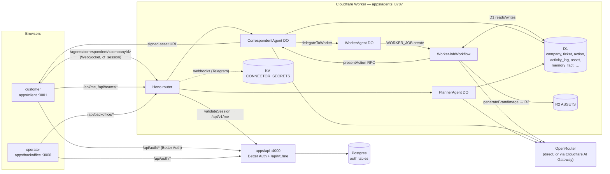

# Qolmeia — Architecture Review (post-P7.1)

**Date:** 2026-05-26
**Status:** Cloudflare migration substantively complete; legacy `apps/api` reduced to auth + a `/api/v1/me` relay target.
**Outcome:** Customer-side onboarding/chat and operator-side approval are end-to-end live against the new runtime. Postgres-backed product models still exist but are dead code.

This document is the single read for "where is Qolmeia, and what holds it up?" If you can only read one file in this repo, read this one. The companion line-items are in [`AGENTS.md`](../../AGENTS.md) (commands + env) and [`docs/ARCHITECTURE.md`](../ARCHITECTURE.md) (the pre-migration narrative, retained for context).

---

## §1. What Qolmeia is, in one paragraph

Qolmeia is an AI agency platform for small Brazilian businesses. A customer (the owner of a cafeteria, a salon, a small shop) signs in to **`apps/client`** and chats with their hired "Time" — a `PlannerAgent` that does the initial debrief, then a `CorrespondentAgent` that becomes the single contact point. The Correspondent delegates to specialist `WorkerAgent`s (today: a `Designer`; tomorrow: `Marketing Strategist`, `Copywriter`, …). Each Worker job runs inside a Cloudflare Workflow that pauses on approval-gated steps. Qolmeia's operators (OWNER/STAFF) sit in **`apps/backoffice`** triaging those approvals: every gated proposal lands on `/approvals`, decisions resume the Workflow, and the side-effect (an image generated by Nano Banana Pro into R2, a strategy doc, …) ships back to the customer's chat as inline markdown. The entire run-time — chat, agents, workflows, D1 storage, R2 assets, KV secrets — sits on Cloudflare. The Postgres-backed `apps/api` is now an auth-only service exposing Better Auth at `/api/auth/*` and a thin `/api/v1/me` membership read.

---

## §2. Two views of the same system

### §2.1 — The customer view (apps/client, `:3001`, role = CUSTOMER)

1. The customer arrives at the magic-link login page.
2. Better Auth (apps/api) emails a one-time link; click → session cookie is set on `localhost`.
3. `apps/client/src/lib/auth-helpers.ts → requireCustomer` hits `apps/agents` `/api/me` (a relay back to apps/api's `/api/v1/me`). The response includes `currentOrg.id` (the **companyId**) and `currentOrg.role = CUSTOMER`.
4. The client also fetches `/api/me/company` → `{ status: "onboarding" | "active" | "paused", brief, slug }`.
5. **status === "onboarding"** → the chat surface opens a WebSocket to `/agents/planner/<companyId>` (the `PlannerAgent` DO instance). The Planner runs a Portuguese debrief — industry, primary goal, audience, channels, brand voice — calling `extractBrief` (which incrementally updates `company.brief`) and `proposeTeam` (which suggests `Template` rows from D1). A "Confirmar Time" button at the bottom of the screen POSTs the selected `templateIds` to `/api/teams/:companyId/confirm`. That route materialises `team` + `team_member` rows, flips `company.status = 'active'`, and seeds the Correspondent's memory with the brief.
6. **status === "active"** → the chat surface re-mounts against `/agents/correspondent/<companyId>`. The Correspondent has access to four skills: `rememberFact`, `recallMemory`, `delegateToWorker`, `decideAction`. When the customer asks for something specialist ("Faça 3 banners para Instagram"), it calls `delegateToWorker` with a brief + `workerKind = "designer"`. The Designer is invoked via the `WorkerAgent` DO, which spawns a `WorkerJobWorkflow`. The Correspondent's reply is "O Designer está trabalhando nisso".
7. The Workflow generates a proposal (LLM call against the Designer's template `systemPrompt` + `skillIds` from D1) and writes it to `action` with `policy = require-approval`, `status = pending`. It then RPCs back into the `CorrespondentAgent.presentAction` method, which injects a 🟡 message into the chat with the proposed summary.
8. The customer sees the proposal. If they reply "Aprovado", the Correspondent's `decideAction` skill maps the natural-language reply to a `decision: "approved"` and sends a `decision:<actionId>` event to the paused Workflow. (In current dev, decisions also come from operators in the backoffice; both paths are equivalent at the Workflow boundary — they both call `WORKER_JOB.get(workflowId).sendEvent(...)`.)
9. The Workflow resumes, marks the action `executed`, marks the ticket `done`, and the actual deliverable lands. For `generateBrandImage` this means: an OpenRouter call to Nano Banana Pro, the PNG bytes uploaded to R2, an `asset` row in D1, and a signed URL like `/assets/<id>?token=<hmac>` that the Correspondent renders inline as ``.
10. The customer can also browse `/assets` (gallery of generated `asset` rows) and `/activity` (a customer-visible slice of the activity log).

The interaction pattern is **"single thread, two principals"**: the customer keeps talking to one Correspondent, the Correspondent fans work out and folds results back in. The operator never directly chats with the customer.

### §2.2 — The operator view (apps/backoffice, `:3000`, role = OWNER | STAFF)

1. The operator signs in with email + password (Better Auth's `signUpEmail` flow, same Postgres-backed instance).
2. `apps/backoffice/src/lib/auth-helpers.ts → requireStaff` hits `apps/agents/api/me`, which returns `currentOrg.role`. CUSTOMER bounces to `/no-access`; OWNER/STAFF passes.
3. **`/` (dashboard home)** — three cards: pending approvals count, tickets in progress count, the next 5 actions waiting for triage, and the 8 most recent activity entries.
4. **`/approvals`** — `GET /api/backoffice/actions?status=pending&sort=age`. The stale-backlog view, oldest-first, with `ageSeconds` rendered as "há 2min". One click → `/approvals/<id>`.
5. **`/approvals/<id>`** — the action detail page. Renders the proposal (`action.proposed.summary` as pt-BR text + the full JSON in a `<details>`), the ticket of origin, and the decision form. The form has three radios (Aprovar / Pedir ajustes / Rejeitar) and an optional/required feedback textarea. POST `/api/backoffice/actions/<id>/decide` → the Workflow resumes.
6. **`/tickets`** — `GET /api/backoffice/tickets` lists every ticket the company has, with title, status pill, origin (`user` | `delegation` | `scheduled`), and creation relative time.
7. **`/tickets/<id>`** — the briefing, the result (if done), and every action proposed by this ticket (with a deep-link into `/approvals/<id>` for each).
8. **`/activity`** — `GET /api/backoffice/activity?limit=50` paginated by `?before=<epochMs>`. Each row shows the type pill, summary, and an expandable `<details>` for the payload.

Every operator decision goes through the same `sendEvent` path the Correspondent uses — there's no privileged shortcut. The backoffice is a UI shell over the same primitives.

---

## §3. The four-app topology



Four processes; two persistence stores; one external LLM provider:

| Process / store                                     | What it owns                                                                                                                                                                                                                                          |
| --------------------------------------------------- | ----------------------------------------------------------------------------------------------------------------------------------------------------------------------------------------------------------------------------------------------------- |
| `apps/api` (Hono on Node)                           | Better Auth identity (users, sessions, accounts, verifications, orgs, memberships). Single source of truth for "who is this and which org are they in."                                                                                               |
| `apps/agents` (Cloudflare Worker + DOs + Workflows) | Everything product-shaped: chat sessions (`CorrespondentAgent`, `PlannerAgent`), task lifecycles (`WorkerAgent` → `WorkerJobWorkflow`), tickets, actions, activity log, brand briefs, memory facts, assets, connector instances, webhook idempotency. |
| `apps/client` (Next.js 16)                          | Customer UX. Magic-link auth, chat shell, asset gallery, activity.                                                                                                                                                                                    |
| `apps/backoffice` (Next.js 16)                      | Operator UX. Email+pw auth, approvals, tickets, activity.                                                                                                                                                                                             |
| Postgres                                            | Better Auth tables only. Legacy product models (`AgentRun`, `BrandAsset`, …) remain in `schema.prisma` but are unused by the live system.                                                                                                             |
| D1                                                  | Product data (see §5). System of record for the runtime.                                                                                                                                                                                              |
| R2                                                  | Binary assets (generated images, future knowledge docs). HMAC-signed URLs.                                                                                                                                                                            |
| KV                                                  | Per-connector secrets (Telegram bot token, etc.).                                                                                                                                                                                                     |
| OpenRouter                                          | Single AI provider. Routes either direct or through Cloudflare AI Gateway (placeholder account id → direct).                                                                                                                                          |

---

## §4. The approval Workflow in detail

This is the load-bearing primitive. Every customer-facing side-effect routes through it, and it's where the "agents vs. operator" question is actually answered.

```mermaid
sequenceDiagram
  autonumber
  actor Customer
  participant Corr as CorrespondentAgent (DO)
  participant Wrk as WorkerAgent (DO)
  participant Wf as WorkerJobWorkflow
  participant D1
  participant Operator
  participant Back as Backoffice REST
  participant Skill as generateBrandImage

  Customer->>Corr: "faça 3 banners de Instagram"
  Corr->>Corr: delegateToWorker(designer, brief)
  Corr->>D1: INSERT ticket (status=open, origin=delegation)
  Corr->>Wrk: handleTicket(ticketId) RPC
  Wrk->>Wf: WORKER_JOB.create({ticketId, …})
  Wf->>D1: setTicketWorkflowId

  rect rgb(245, 250, 255)
    Note over Wf: step.do("generate")
    Wf->>Wf: generateText(template.systemPrompt, template.skillIds)
  end

  rect rgb(255, 250, 240)
    Note over Wf: step.do("propose-deliverable")
    Wf->>D1: INSERT action (policy=require-approval, status=pending)
    Wf->>D1: UPDATE ticket SET status=awaiting_approval
    Wf->>D1: INSERT activity_log (ACTION_PROPOSED)
    Wf->>Corr: presentAction(actionId) RPC
    Corr->>Customer: 🟡 "ação pendente — aprovar/ajustar/rejeitar?"
  end

  Wf-->>Wf: step.waitForEvent("decision:&lt;actionId&gt;", timeout=60d)

  Operator->>Back: GET /api/backoffice/actions?status=pending&sort=age
  Back->>D1: SELECT ... ORDER BY created_at ASC
  Operator->>Back: POST /api/backoffice/actions/:id/decide<br/>{decision:"approved", feedback?}
  Back->>Wf: WORKER_JOB.get(workflowId).sendEvent(...)
  Wf-->>Wf: resume

  rect rgb(240, 255, 245)
    Note over Wf: step.do("apply-decision")
    Wf->>D1: UPDATE action SET status=approved + decided_at + by + feedback
    Wf->>Skill: execute (e.g. generateBrandImage)
    Skill->>Skill: OpenRouter Nano Banana Pro → PNG bytes
    Skill->>D1: INSERT asset (sha256 dedup) + ingestion row
    Wf->>D1: UPDATE action SET status=executed
    Wf->>D1: UPDATE ticket SET status=done
    Wf->>D1: INSERT activity_log (ACTION_EXECUTED)
  end

  Corr-->>Customer: (next chat turn) renders 
```

### What's special about this shape

- **The Workflow is the task; the DO is the agent.** WorkerAgent only registers identity and forwards to `WORKER_JOB.create`. Long jobs survive eviction. `step.waitForEvent` with `timeout: "60 days"` is genuinely cheap — Cloudflare bills only on resumes, not on idle.
- **One generic Workflow class, one generic action type.** The current `WorkerJobWorkflow` proposes a single `worker_deliverable` action. Specific action types (`publish_post`, `send_email`) get their own policy rows but reuse the same Workflow shape. The blast radius of adding a new action type is one row in `resolvePolicy` plus one skill that proposes that type.
- **The operator override is not a separate path.** `/api/backoffice/actions/:id/decide` calls the same `WORKER_JOB.get(workflowId).sendEvent(...)` the Correspondent's `decideAction` skill calls. Customer-side and operator-side decisions land at the same join point. This is intentional — it removes the temptation to ship "operator-only" mutations that bypass the agent loop.
- **The proposed summary is the LLM's own output.** The Workflow runs `generateText` against the Worker's template `systemPrompt` and gets back a long pt-BR response. That string is the proposal preview. The backoffice renders it directly. No second LLM call to "summarise the proposal" — the proposal IS the summary.

---

## §5. The data model (D1)

D1 is the system of record for everything that isn't auth. Schema in `apps/agents/migrations/0001-0003*.sql`.

| Table | Purpose | Key invariants |
| ---------------- | --------------------------------------------------------------------------------------------------------------------------------------------------------------- | ------------------------------------------------------------------------------------------------------ | ------------------------------------------------------------------------------------------------------ | --------------------------------------------------------------------------------------- | ----------------- | -------- | -------------------------------------------------------------- | --------------------------------------------------- |
| `company` | One row per tenant. `id` matches Better Auth `Organization.id`. `status ∈ onboarding                                                                            | active                                                                                                 | paused`. `brief`is the typed`CompanyBriefPartial` JSON. | Created out-of-band today (seed-p2.sql). Production needs an org-create hook (see §10). |
| `conversation` | One per `(company, external_thread_id)`. The web chat uses `external_thread_id = "web"` or `"web-planner"`. | Idempotent upsert. |
| `message` | The chat log. Insert-or-ignore on `id` (idempotent on re-deliveries). | Source-of-truth for chat; the AIChatAgent SDK also keeps an internal list, but D1 is canonical. |
| `template` | Worker catalog. `worker_kind` is the lookup key (`designer`, …). `system_prompt`, `model`, `skill_ids` (JSON), `default_policies` (JSON {action_type: policy}). | Code-defined skills + D1-defined templates; an operator can tune a template's prompt without a deploy. |
| `skill` | Operator overlay for code-defined skills. Just `display_name`, `description` (LLM-facing), `enabled` kill-switch, `param_hints`. | The actual `execute()` lives in code (`apps/agents/src/skills/<id>.ts`). |
| `team` | One per company. `confirmed_at IS NOT NULL` means the customer has confirmed. | Re-plan = same materialise call with a different `templateIds` set. |
| `agent_instance` | A hired role for this company. `role ∈ planner                                                                                                                  | correspondent                                                                                          | worker`. Each has a stable id derived from `(role, companyId)`or`(template, companyId)`. | Correspondent + Planner are seeded eagerly. Workers materialise on team confirm. |
| `team_member` | The delegation graph. `can_delegate_to` is a JSON array of `agent_instance.id`. | Acyclic by construction — the materialiser refuses to create a cycle. |
| `ticket` | A unit of work. `origin ∈ user                                                                                                                                  | delegation                                                                                             | scheduled`. `workflow_id`is the Cloudflare Workflow instance id (==`ticket.id` today for idempotency). | One ticket → at most one workflow. |
| `action` | A proposal awaiting decision. `policy ∈ auto-execute                                                                                                            | notify-only                                                                                            | require-approval`. `status ∈ pending                                                                   | approved                                                                                | changes_requested | rejected | executed`. `proposed`is JSON (currently`{summary, ticketId}`). | Single writer for status transitions: the Workflow. |
| `activity_log` | Append-only timeline. `type` is free-form (stable string codes: `ACTION_PROPOSED`, `ACTION_EXECUTED`, `TEAM_CONFIRMED`, …). | Best-effort writes — a failed log is logged to console, never throws. |
| `asset` | Binary deliverables (`generated_image`, `knowledge_doc`, `audio`, `brand_asset`). `(company_id, sha256)` unique. | Single writer: the skill that produced the bytes. |
| `memory_fact` | Per-agent recall. `kind` is free-form (`industry`, `brand_voice`, `goal`, `onboarding_summary`, `message`, …). `salience` tunes a vector recall ordering. | Vector channel in `lib/memory/`; in dev falls through to an in-memory adapter. |
| `connector` | Per-company channel config. `config_ref` points into KV `CONNECTOR_SECRETS`. | Telegram is the only live adapter (P6); WhatsApp/Slack/Discord are stubs. |
| `webhook_event` | Idempotency on inbound provider events. `(provider, external_id)` PK. | First write wins. |

Indexes track the hot reads — `ticket(company_id, agent_instance_id, status)`, `action(company_id, status, created_at)`, `activity_log(company_id, created_at)`, `memory_fact(agent_instance_id, created_at)`.

### Auth domain (Postgres, `packages/db/prisma/schema.prisma`)

Used only by `apps/api`. The product-domain models are still present (`AgentRun`, `BrandAsset`, `KnowledgeDoc`, …) but no live process reads or writes them. They will be removed in a follow-up. The auth-relevant tables today:

| Model                                                | Purpose                                                                                                                        |
| ---------------------------------------------------- | ------------------------------------------------------------------------------------------------------------------------------ |
| `User`                                               | Better Auth user.                                                                                                              |
| `Session` / `Account` / `Verification` / `RateLimit` | Better Auth machinery.                                                                                                         |
| `Organization`                                       | The tenant. `id` matches D1 `company.id`. Today this is set out-of-band (seed-dev.ts); needs an org-create hook in production. |
| `OrgMembership`                                      | `(userId, orgId, role)`. The authorization seam. CUSTOMER → client app; OWNER/STAFF → backoffice.                              |

---

## §6. The agent runtime, in three sentences

**One generic loop**: `AIChatAgent.onChatMessage` runs `streamText(getModel(env), messages, tools, system, stopWhen=stepCountIs(N))`. The DO holds a small recent-turns buffer in its SQLite store (the "always-in-context" window) plus a vector memory adapter (top-K facts injected into the system prompt). Skills are AI-SDK `tool({description, inputSchema, execute})` wrappers — code defines `execute()` and the Zod schema; D1 carries an operator-tunable overlay (description, kill-switch).

There are three DO classes:

- **`PlannerAgent`** (skills: `extractBrief`, `proposeTeam`). 5-step loop, no memory recall — the brief itself is the memory.
- **`CorrespondentAgent`** (skills: `rememberFact`, `recallMemory`, `delegateToWorker`, `decideAction`). 3-step loop, dual memory channels (recent-turns + vector). Also exposes RPCs: `presentAction`, `seedMemory`, `handleInboundFromConnector`.
- **`WorkerAgent`** (no skill list of its own — skills come from its `template.skillIds`). The DO's only job is `handleTicket → WORKER_JOB.create`. The actual work happens inside the Workflow.

The agent paths bypass Hono's router (`if (pathname.startsWith("/agents/"))`) and go through the agents SDK's `routeAgentRequest`, which maps URL → DO instance by name. The session gate (CUSTOMER-only for `/agents/*`) is enforced before the routing handoff in `apps/agents/src/index.ts`.

---

## §7. Skills — the action surface

Code module + D1 overlay pattern. The code defines `execute(input, ctx)` and the input Zod schema; D1 defines the LLM-facing description, the enabled kill-switch, and per-skill `default_config`. Templates reference skills by id; an unknown id raises at build time.

| Skill id             | Owners                 | What it does                                                                                                                  | Approval-gated?                                                                                            |
| -------------------- | ---------------------- | ----------------------------------------------------------------------------------------------------------------------------- | ---------------------------------------------------------------------------------------------------------- |
| `rememberFact`       | Correspondent, Workers | Inserts a `memory_fact` row + upserts in the vector adapter.                                                                  | No                                                                                                         |
| `recallMemory`       | Correspondent, Workers | Top-K query against the vector adapter scoped to the agent_instance.                                                          | No                                                                                                         |
| `delegateToWorker`   | Correspondent          | Creates a ticket, RPCs `WorkerAgent.handleTicket` (which spawns the Workflow). Enforces the delegation graph.                 | No (the delegation itself isn't user-visible)                                                              |
| `generateBrandImage` | Designer Worker        | Calls OpenRouter Nano Banana Pro, uploads to R2, dedups by sha256, returns a signed URL.                                      | **Yes** — proposes a `worker_deliverable` action with `policy = require-approval` from `default_policies`. |
| `decideAction`       | Correspondent          | Maps the customer's natural-language reply ("aprovado" / "muda X" / "esquece") to a `decision` event on the pending Workflow. | No                                                                                                         |
| `extractBrief`       | Planner                | Merges a partial `CompanyBriefPartial` into `company.brief`.                                                                  | No                                                                                                         |
| `proposeTeam`        | Planner                | Looks at the brief and suggests template ids. UI renders the picker.                                                          | No (the team confirm is the explicit consent)                                                              |

Adding a skill:

1. Code: `apps/agents/src/skills/<id>.ts` exporting `{id, description, inputSchema, execute}`.
2. Register: append to `ALL_SKILLS` in `apps/agents/src/skills/registry.ts`.
3. Overlay (optional but conventional): add an INSERT in a new migration so operators can edit description/enabled/config.
4. Reference by id from a template's `skill_ids` (or hard-code in a DO's `buildSkillTools` call for system agents like Correspondent).

---

## §8. The session story (cross-origin, cookies, bearer tokens)

A small but load-bearing piece. Three players: the cookie issuer (`apps/api`), the cookie validator (`apps/agents` for product reads, `apps/api` again for the membership relay), and the two Next apps that need to forward the cookie to either side.

- **Cookies are issued by `apps/api`** on `/api/auth/sign-in/email` (and the magic-link callback). `cookiePrefix: "qolmeia"`, `SameSite=Lax`, `HttpOnly`, domain implied = `localhost` in dev.
- **The Next apps** forward the `Cookie` header from server components (`apiGetServer`) and let the browser do its `credentials: "include"` thing on client-side fetches. The agents Worker's CORS config allows `localhost:3000` and `localhost:3001` with `Access-Control-Allow-Credentials: true`.
- **Bearer plugin** is enabled in Better Auth. The sign-in response returns a `token` that the client app passes to the agents Worker as `?cf_session=<token>` (especially for WebSocket upgrades, which can't include `credentials: "include"`).
- **`validateSession` in `apps/agents/src/lib/auth.ts`** is the join point. It prefers `cf_session` (Bearer), falls back to `Cookie`, and `fetch(auth/api/v1/me)` to resolve `currentOrg.id + role`. That call is the rate-limit hot path (Better Auth's RateLimit table is global; the auth service is on a 100/15min window per IP).

Practical implications:

- The auth service is the only Postgres-touching process; the agents Worker never touches Postgres directly.
- A future `/api/v1/me` cache in the Worker (KV with 30s TTL keyed by token) would cut auth load by ~10× for an active operator session.

---

## §9. Connectors

P6 added the connector adapter pattern; today Telegram is the only live channel.

- **Adapter contract** (`apps/agents/src/connectors/types.ts`): `parseInboundPayload`, `sendOutbound`, optional `verifySignature` / `verifyChallenge`.
- **Telegram adapter** (`apps/agents/src/connectors/telegram/adapter.ts`): parses Telegram bot API payloads, verifies the `X-Telegram-Bot-Api-Secret-Token` header, sends replies via the bot API.
- **Webhook route**: `POST /webhooks/:type/:connectorId` is the single inbound entry point. Looks up `connector` row → fetches secrets from KV via `config_ref` → adapter → normalised message → `CorrespondentAgent.handleInboundFromConnector` RPC.
- **Dedup**: `webhook_event(provider, external_id)` is the idempotency key.
- **Outbound** flows through the Correspondent's `handleInboundFromConnector` path (it both ingests + replies through the same adapter pair).

WhatsApp / Slack / Discord adapters are placeholder enum slots; the registry is total over `ConnectorType` so adding one is purely a new file + registry entry.

---

## §10. What works today, end-to-end (verified 2026-05-26)

Two scripted scenarios both run green:

1. **`scripts/e2e-chat-flow.mjs`** — customer signs in via Better Auth, sends a chat message asking for a logo, the Correspondent delegates to the Designer, the Workflow generates a real proposal (OpenRouter, ~5s), proposes an action with `policy=require-approval`, presents it to the chat, pauses. The operator signs in, polls `/api/backoffice/actions?status=pending` until the row appears, POSTs `decide` with `decision=approved`, polls again until the row transitions to `executed`. The associated ticket flips to `done`. The activity log records `ACTION_PROPOSED` followed by `ACTION_EXECUTED`. ✓

2. **`scripts/e2e-create-pending.mjs`** — same scenario but stops at the pending action. Used to seed the backoffice's `/approvals` page for screenshots. ✓

Screenshots verified in `.remember/tmp/screenshots/`:

- `02-bo-home.png` — dashboard home with "Aprovações pendentes: 1", "Tickets em curso: 1 / 2", a "Próximas aprovações" card showing the LLM-generated proposal preview, and 3 recent activity rows.
- `03-bo-approvals-list.png` — the pending action with the worker_deliverable type pill and "há 2min".
- `04-bo-approval-detail.png` — the decision form with three radios and the feedback textarea.
- `05-bo-tickets-list.png` — both tickets rendered, one `Aguardando Aprovação`, one `Concluído`.
- `06-bo-activity.png` — `ACTION_PROPOSED`, `ACTION_EXECUTED`, `ACTION_PROPOSED` rows.
- `08-client-chat.png` — the customer's view: the Designer's full markdown-formatted proposal followed by the Correspondent's "Aprova / Ajustes / Rejeita" prompt.

Test suites: `apps/agents` (101 tests, 21 files) green; `apps/backoffice` (16 tests, 4 files) green; `apps/client` and `apps/api` lint+typecheck green. Total ~5 974 lines of TypeScript in `apps/agents`.

---

## §11. Known gaps and deferred items

### Architectural

- **`apps/api` is not yet renamed to `apps/auth`.** The cutover plan (`docs/superpowers/plans/2026-05-25-p7-cutover-retire-apps-api.md`) calls for `git mv apps/api apps/auth` and deletion of the legacy product surface. Today it still has `connectors/`, `inbox/`, `agents/`, `workers/`, `routines/` source trees — dead code, never invoked. Removing them is mechanical but blast-radius-sensitive (one PR, atomic).
- **Postgres still carries the legacy product schema.** Rows are orphaned, no live code reads or writes them. A pruning migration is queued for the same cutover PR.
- **Redis is still in `docker-compose.yml`** but no process consumes it.
- **`/api/v1/me` is the rate-limit chokepoint.** Every backoffice page render plus every agents Worker `validateSession` call hits it. A 30s KV cache in the Worker would alleviate this in production; a lighter-weight session-claim signed by Better Auth would be the cleanest fix.

### Product surface

- **The customer-side `decideAction` skill is wired but not exercised end-to-end here.** The Correspondent's system prompt instructs it to detect approval/ajustes/rejeição in the customer's reply; the skill is registered. The E2E test only exercises the operator path. (Both paths converge at `sendEvent` so the workflow side is identical.)
- **`generateBrandImage` runs Nano Banana Pro but is gated by approval today.** Once approved the image lands in R2 and the Correspondent renders the signed URL. The agent's chat output uses markdown image syntax; the client's `<Message>` component already supports inline images.
- **The Planner onboarding flow has no integration test against a fresh tenant.** The seed creates a `company.status = "active"` row so it skips Planner. A flow that flips status back to `onboarding` would exercise the Planner debrief end-to-end.
- **Organization creation is out-of-band.** `apps/api/src/scripts/seed-dev.ts` creates Better Auth's `Organization` row + the matching D1 `company` row by hand. Production needs a hook (either Better Auth's `organization` plugin, or a webhook from the auth service to the agents Worker) that creates the D1 `company` row when an `Organization` is created in Postgres.
- **Re-plan is supported by the materialiser** (`materializeTeam` accepts a new `templateIds` set and is idempotent on `(team, agent_instance)`) but there's no UI for it. The Planner DO is dormant after team confirm; a "trocar Time" button on the client would re-open it.
- **The `/api/me` relay re-fetches `/api/v1/me` on every call.** A modest improvement: memoise per `cf_session` for 30s in a Worker KV.

### Operator UX

- **Approval detail proposed-JSON dump is raw.** For `worker_deliverable` actions today the JSON has just `{summary, ticketId}`; for richer action types (e.g. a `publish_post` with `{platform, body, scheduledFor}`), a typed renderer per action type would be cleaner. The skill-renderer registry pattern from the old backoffice is a good shape to revive when the second action type arrives.
- **No multi-org switcher.** A user with memberships in multiple companies sees only `currentOrg` (resolved from… whichever membership `findFirst` returns; nondeterministic). The Better Auth org plugin supports `setActiveOrganization`; wiring it through the backoffice is straightforward but unstarted.
- **Activity log payload is rendered as `<pre>`.** Fine for debug; not pretty for operators. A per-type renderer registry would help (mirror the action-type approach).

### Channels

- **WhatsApp / Slack / Discord adapters are placeholders.** The skeletons are in `connectors/registry.ts`; each needs its provider integration written (Meta Cloud API for WhatsApp, etc.).
- **Telegram outbound is text-only.** Image outbound needs the `sendPhoto` path on the bot API — not hard, just untested.

---

## §12. The seams (worth knowing before changing anything)

These are the single-writer / single-reader join points. Changing the semantics of any of them is a system-wide change.

| Seam                        | Path                                              | What it owns                                                                                   |
| --------------------------- | ------------------------------------------------- | ---------------------------------------------------------------------------------------------- |
| `validateSession`           | `apps/agents/src/lib/auth.ts`                     | The only place that reads Better Auth membership.                                              |
| `AIChatAgent.onChatMessage` | inherited by `CorrespondentAgent`, `PlannerAgent` | The chat loop.                                                                                 |
| `WorkerAgent.handleTicket`  | `apps/agents/src/agents/worker.ts`                | The only place a Workflow is created.                                                          |
| `WorkerJobWorkflow.run`     | `apps/agents/src/workflows/worker-job.ts`         | The only place an action transitions out of `pending`.                                         |
| `proposeAction`             | `apps/agents/src/db/action.ts`                    | The only place an action row is inserted.                                                      |
| `decideAction` (db helper)  | same                                              | The only place a status transitions to approved/rejected/changes_requested.                    |
| `markExecuted`              | same                                              | The only place a status transitions to executed (called by the Workflow after the skill runs). |
| `materializeTeam`           | `apps/agents/src/db/team.ts`                      | The only place `team` + `team_member` rows are created. Acyclicity check lives here.           |
| `logActivity`               | `apps/agents/src/activity/log.ts`                 | The only place activity_log rows are written. Best-effort.                                     |
| `buildSkillTools`           | `apps/agents/src/skills/registry.ts`              | The only place skills are joined with their D1 overlay and wrapped into AI-SDK tools.          |
| `getModel`                  | `apps/agents/src/lib/ai-gateway.ts`               | The only place OpenRouter is configured.                                                       |
| `getMemoryAdapter`          | `apps/agents/src/lib/memory/index.ts`             | The selector between Vectorize and the in-memory dev adapter.                                  |
| `getAdapter`                | `apps/agents/src/connectors/registry.ts`          | Total `Record<ConnectorType, ConnectorAdapter>` lookup.                                        |

A change that crosses two of these is a refactor; a change that crosses three is a redesign.

---

## §13. One-line summary

A customer signs in (Better Auth on `apps/api`), the client routes status-driven between `PlannerAgent` (onboarding) and `CorrespondentAgent` (active) — both per-company Durable Objects on `apps/agents` — the Correspondent delegates to a `WorkerAgent` which spawns a `WorkerJobWorkflow` that proposes an approval-gated action to D1 + presents it to the chat, the operator on `apps/backoffice` decides via REST which resumes the Workflow at the same `sendEvent` join point the Correspondent uses, the skill executes (e.g. Nano Banana Pro → R2), and the Correspondent renders the signed asset URL inline as markdown — every transition appending to an append-only `activity_log` keyed on the company id.

---

## §14. The next move

If picking up from here, the highest-leverage thread is **finishing the cutover atomically** so the system stops carrying two parallel runtimes. Concretely (one PR each, in order):

1. **Rename `apps/api` → `apps/auth`** and delete `connectors/`, `inbox/`, `agents/`, `workers/`, `routines/` from it. Update env, turbo filters, CI. (The dead code is sitting there confusingly.)
2. **Prune `packages/db/prisma/schema.prisma`** to the Better Auth tables. Snapshot Postgres first; the orphans don't hurt anything but they confuse new readers.
3. **Drop the Redis service from `docker-compose.yml`** and the `REDIS_URL` from `.env.example`.
4. **Add an org-create hook** so creating an `Organization` in apps/auth provisions a matching D1 `company` row (today's seed is hand-rolled).
5. **Add a thin KV cache in front of `validateSession`** to take the auth service off the hot path of every backoffice render.

After that, the next product-shaped slice is the **second action type** — picking `publish_post` or `send_email` and proving the per-action-type renderer pattern. That's where the system's design earns its keep.
