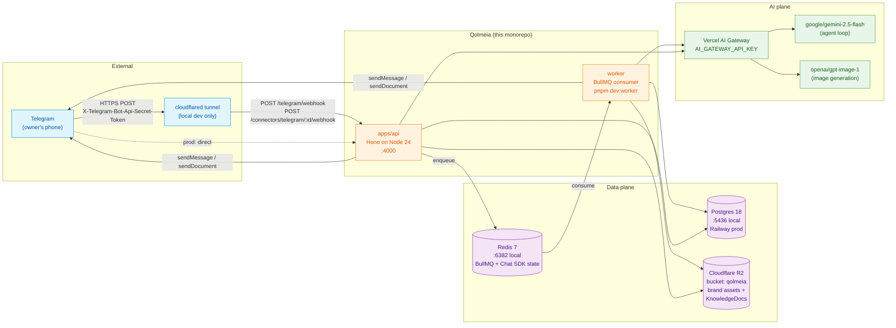
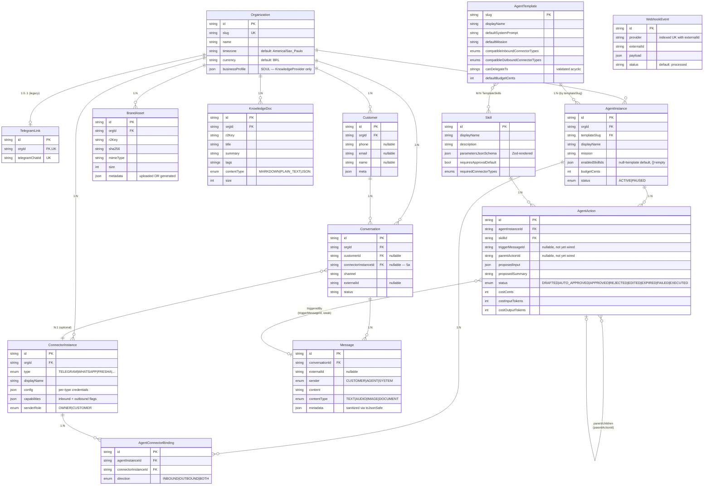
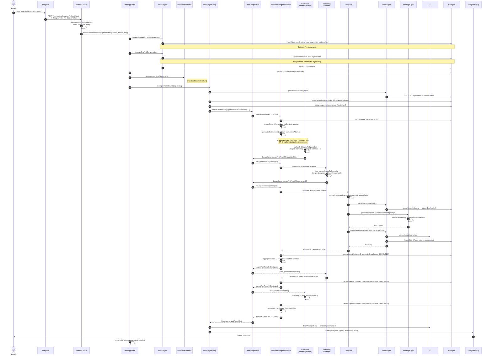
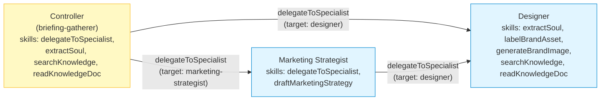
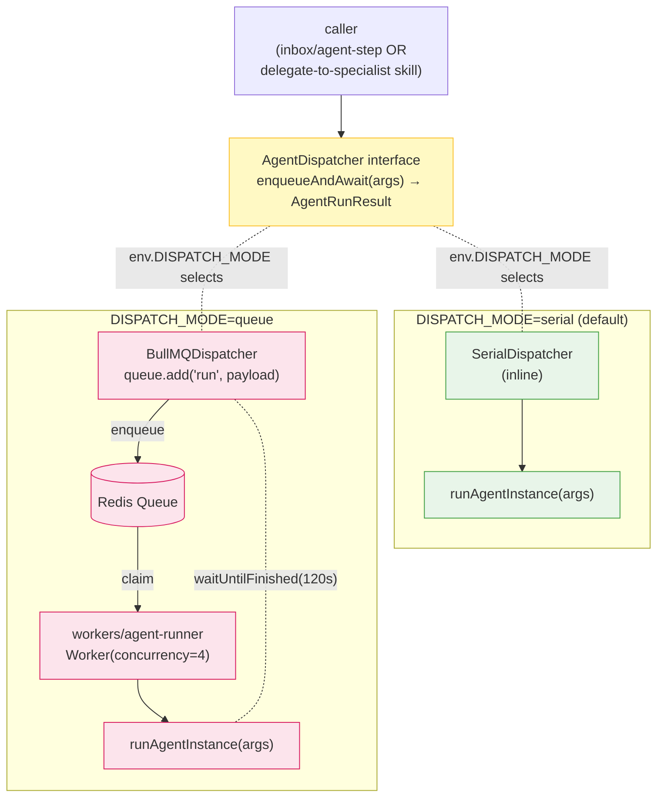
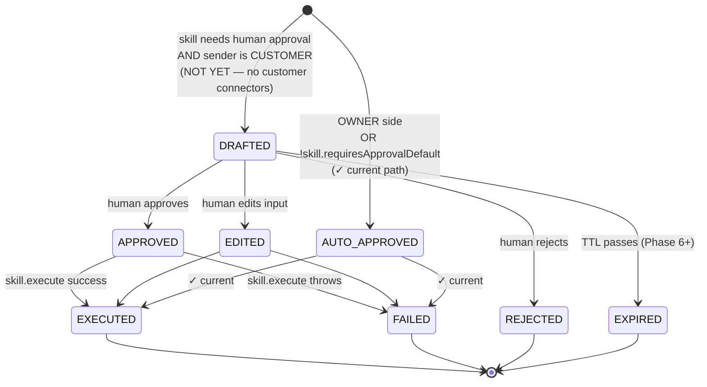
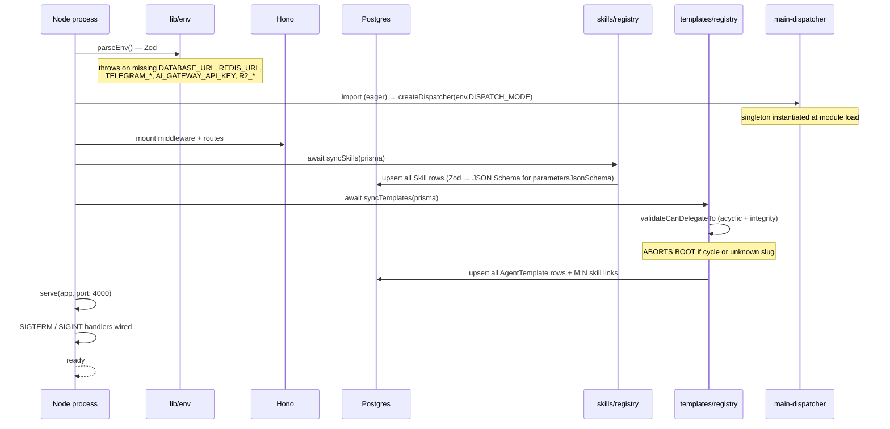
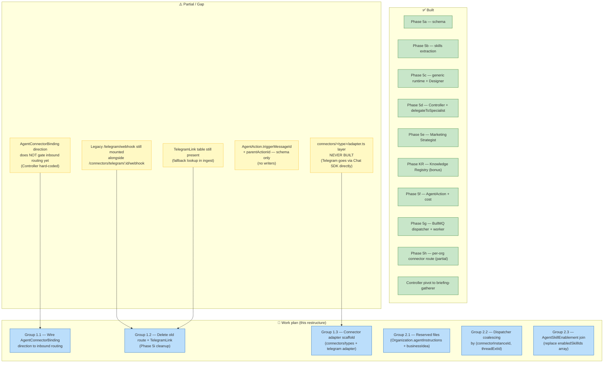

# Qolmeia — Current Architecture Diagrams

**Date:** 2026-05-20
**HEAD:** `566e07c` (Controller pivot to briefing-gatherer + explicit-invocation router)
**Companion to:** `docs/ARCHITECTURE.md` (prose) — this file is the visual reference.

All diagrams are Mermaid. They render in GitHub, GitLab, most IDEs (VS Code with the Markdown Mermaid extension, JetBrains, Cursor), and the Mermaid Live Editor at https://mermaid.live.

---

## 1. System context

External actors, the API and worker processes, and the data + AI substrate they depend on.



**Two processes share the same code:**
- `API` (Hono server) — webhook receiver, executes inline in `DISPATCH_MODE=serial` (default for local dev + tests).
- `Worker` (BullMQ consumer) — only runs in `DISPATCH_MODE=queue`. Webhook returns 200 immediately; runtime executes in the worker. Both processes import the same `runAgentInstance`.

---

## 2. Module dependencies

The internal structure of `apps/api/src/`. Read top-to-bottom: HTTP entry on top, persistence at the bottom. Arrows are dependency direction (caller → callee).

```mermaid
flowchart TB
  subgraph HTTP["HTTP entry"]
    routes_old["routes/telegram/webhook.ts<br/>(legacy — pending 5i cleanup)"]
    routes_new["routes/connectors/telegram.ts<br/>POST /connectors/telegram/:id/webhook"]
  end

  subgraph Chat["Chat SDK adapter"]
    bot["telegram/bot.ts<br/>Chat singleton +<br/>onNewMention / onSubscribedMessage"]
  end

  subgraph Inbox["inbox/ pipeline"]
    pipeline["pipeline.ts<br/>orchestrator (~150 LOC)"]
    ingest["ingest.ts<br/>dedup + org + conversation"]
    attachments["attachments.ts<br/>image/audio download"]
    agent_step["agent-step.ts<br/>context load + dispatch + post"]
    jsonsafe["json-safe.ts"]
  end

  subgraph Agents["agents/"]
    main_dispatcher["main-dispatcher.ts<br/>module singleton"]
    dispatcher["dispatcher.ts<br/>AgentDispatcher iface +<br/>SerialDispatcher factory"]
    bullmq_dispatcher["bullmq-dispatcher.ts<br/>queue + waitUntilFinished"]
    runtime["runtime.ts<br/>runAgentInstance"]
    step_aggregator["step-aggregator.ts<br/>walk step.content[]"]
    agent_instance["agent-instance.ts<br/>ensureAgentInstance"]
    actions["actions.ts<br/>recordAgentAction"]
    cost["cost.ts<br/>budget rollup + soft-warn"]
  end

  subgraph Templates["agents/templates/"]
    tmpl_registry["registry.ts<br/>syncTemplates + validateCanDelegateTo"]
    tmpl_renderer["renderer.ts<br/>renderSystemPrompt"]
    tmpl_controller["controller.ts<br/>briefing-gatherer (566e07c)"]
    tmpl_strategist["marketing-strategist.ts"]
    tmpl_designer["designer.ts"]
  end

  subgraph Skills["agents/skills/"]
    skill_registry["registry.ts<br/>syncSkills + ALL_SKILLS"]
    skill_types["types.ts<br/>defineSkill + SkillContext"]
    skill_delegate["delegate-to-specialist.ts"]
    skill_extract["extract-soul.ts"]
    skill_label["label-brand-asset.ts"]
    skill_gen["generate-brand-image.ts"]
    skill_strategy["draft-marketing-strategy.ts<br/>(stub)"]
    skill_search["search-knowledge.ts"]
    skill_read["read-knowledge-doc.ts"]
  end

  subgraph Knowledge["knowledge/"]
    k_provider["provider.ts<br/>getBusinessContext (read seam)"]
    k_apply["apply.ts<br/>applySoulUpdate (single writer)"]
    k_soul["soul.ts<br/>SoulProfile type"]
    k_brand_asset["brand-asset.ts<br/>ingestBrandAsset + ingestGeneratedAsset"]
    k_brand_ctx["brand-context.ts<br/>getBrandContext + enrichPromptWithBrand"]
    k_doc["knowledge-doc.ts<br/>KnowledgeDoc CRUD"]
  end

  subgraph Workers["workers/"]
    w_index["index.ts"]
    w_runner["agent-runner.ts<br/>BullMQ Worker"]
  end

  subgraph Lib["lib/"]
    lib_env["env.ts (Zod)"]
    lib_storage["storage.ts (R2)"]
    lib_image["image-gen.ts (gpt-image-1)"]
    lib_logger["logger.ts (Pino)"]
  end

  subgraph DB["@repo/db"]
    prisma[("Prisma client")]
  end

  routes_old --> bot
  routes_new --> bot
  bot --> pipeline
  pipeline --> ingest
  pipeline --> attachments
  pipeline --> agent_step
  pipeline --> jsonsafe
  agent_step --> main_dispatcher
  agent_step --> k_provider
  agent_step --> agent_instance

  main_dispatcher --> dispatcher
  main_dispatcher --> bullmq_dispatcher
  dispatcher --> runtime
  bullmq_dispatcher --> runtime
  w_runner --> runtime
  w_index --> w_runner

  runtime --> step_aggregator
  runtime --> actions
  runtime --> cost
  runtime --> tmpl_registry
  runtime --> tmpl_renderer
  runtime --> skill_registry

  skill_delegate --> agent_instance
  skill_delegate --> tmpl_registry
  skill_delegate --> main_dispatcher
  skill_extract --> k_apply
  skill_label --> prisma
  skill_gen --> k_brand_ctx
  skill_gen --> lib_image
  skill_gen --> k_brand_asset
  skill_search --> k_doc
  skill_read --> k_doc
  skill_read --> lib_storage

  tmpl_controller --> skill_registry
  tmpl_strategist --> skill_registry
  tmpl_designer --> skill_registry

  k_brand_asset --> lib_storage
  k_brand_asset --> prisma
  k_doc --> lib_storage
  k_doc --> prisma
  k_provider --> prisma
  k_apply --> prisma
  ingest --> prisma
  actions --> prisma
  agent_instance --> prisma
  cost --> prisma

  classDef http fill:#e1f5ff,stroke:#0288d1
  classDef chat fill:#fff3e0,stroke:#f57c00
  classDef inbox fill:#f3e5f5,stroke:#8e24aa
  classDef agent fill:#e8f5e9,stroke:#43a047
  classDef tmpl fill:#fff9c4,stroke:#fbc02d
  classDef skill fill:#fce4ec,stroke:#d81b60
  classDef know fill:#e0f7fa,stroke:#00838f
  classDef work fill:#ffebee,stroke:#c62828
  classDef lib fill:#eceff1,stroke:#455a64
  classDef db fill:#d7ccc8,stroke:#5d4037

  class routes_old,routes_new http
  class bot chat
  class pipeline,ingest,attachments,agent_step,jsonsafe inbox
  class main_dispatcher,dispatcher,bullmq_dispatcher,runtime,step_aggregator,agent_instance,actions,cost agent
  class tmpl_registry,tmpl_renderer,tmpl_controller,tmpl_strategist,tmpl_designer tmpl
  class skill_registry,skill_types,skill_delegate,skill_extract,skill_label,skill_gen,skill_strategy,skill_search,skill_read skill
  class k_provider,k_apply,k_soul,k_brand_asset,k_brand_ctx,k_doc know
  class w_index,w_runner work
  class lib_env,lib_storage,lib_image,lib_logger lib
  class prisma db
```



**Layer rules (enforced by file location, checked by code review):**
- `routes/` → `telegram/bot` → `inbox/` → `agents/` → `knowledge/` + `lib/` → `prisma`
- `agents/skills/` reach into `knowledge/` + `lib/` only; never into `inbox/` or `routes/`
- `agents/templates/` are pure config + prompts; no I/O
- `workers/` mirrors the API's wiring from `agents/` downward
- `knowledge/*` are the single-writer / single-reader seams (verified by `grep -rn "businessProfile" / "brandAsset.create" / "brandAsset.update"`)

---

## 3. Data model (ERD)

All Prisma models, current relations, with Phase 5a additions and the KR Knowledge Registry. `TelegramLink` still exists (pending Phase 5i cleanup).



**Active vs. dormant fields:**
- `AgentConnectorBinding` — rows seeded by Phase 5h, but `direction` not yet gating inbound routing (still hard-coded to Controller).
- `AgentAction.triggerMessageId` + `parentActionId` — schema fields exist, no writers yet. Roadmap item.
- `Conversation.connectorInstanceId` — written by ingest, not yet read by any approval/routing logic.

---

## 4. Inbound request lifecycle (sequence)

Pedro sends *"gera uma imagem promocional para minha promo de Black Friday"* — full flow including the 3-level delegation that the post-pivot Controller exposes when the request is explicit.



**Key invariants visible above:**
- The dispatcher is the single seam between sync (Serial) and async (BullMQ) execution. Delegation re-enters through the same dispatcher.
- `AgentAction` rows are written from `runtime.ts` (one per tool call). Status is always `EXECUTED` or `FAILED` today; `DRAFTED`/`APPROVED` lifecycle waits for customer-facing channels.
- Cost rollup happens once per agent run, after all tool calls complete.
- Outbound is always through `thread.post` (Chat SDK), which handles `sendMessage` vs `sendDocument` based on whether `files` is present.

---

## 5. Delegation DAG

Static topology validated by `validateCanDelegateTo` at boot. Acyclic by construction.



**Post-pivot Controller behaviour (commit `566e07c`):**
- Old: orchestrator-chef that auto-delegated by inferred intent.
- New: briefing-gatherer that explicitly asks the owner before invoking a specialist (*"gera uma imagem?"*).
- Default skills now include `extractSoul`, `searchKnowledge`, `readKnowledgeDoc` — Controller can capture soul updates and answer Q&A directly without delegating.

---

## 6. Dispatch modes

The dispatcher seam — same interface, two backends. Selected by `env.DISPATCH_MODE`.



**What flows through the queue payload:** plain serializable AgentDispatchArgs (orgId, templateSlug, mission, input, currentContext, newAssets, existingAssets). The `prisma` and `dispatcher` references can't serialize — the worker re-attaches them from module singletons (`@repo/db` and `agents/main-dispatcher`).

**No FlowProducer.** Delegation uses the same `enqueueAndAwait` recursively — each child is a top-level job; the parent waits on `job.waitUntilFinished()`. Simple, but limits depth by the 120s timeout.

---

## 7. AgentAction lifecycle (state)

Schema supports the full Co-piloto lifecycle. Today, only the highlighted transitions are exercised.



**Currently exercised:** `[*] → AUTO_APPROVED → EXECUTED` (happy path) and `[*] → AUTO_APPROVED → FAILED` (error path).

**Unexercised (waiting on customer-facing connectors + web UI):** the `DRAFTED` branch + `APPROVED` / `EDITED` / `REJECTED` / `EXPIRED` transitions. Schema is ready; no writers yet for these states.

---

## 8. Boot sequence



**Implication for changes to templates/skills:** they take effect on next boot. Adding a new skill = code + Zod schema + register + restart. The DB rows are always derived from code, never edited by hand.

---

## 9. The seams (visual)

Single-writer / single-reader audit, expressed as a diagram of who reaches what.

```mermaid
flowchart LR
  subgraph Writers
    apply["knowledge/apply.ts<br/>applySoulUpdate"]
    brand_asset["knowledge/brand-asset.ts<br/>ingestBrandAsset<br/>ingestGeneratedAsset"]
    label_skill["agents/skills/label-brand-asset.ts"]
    ensure["agents/agent-instance.ts<br/>ensureAgentInstance"]
    record["agents/actions.ts<br/>recordAgentAction"]
    sync_skills["agents/skills/registry.ts<br/>syncSkills"]
    sync_tmpls["agents/templates/registry.ts<br/>syncTemplates"]
  end

  subgraph Tables[("Postgres tables")]
    org_bp["Organization.businessProfile"]
    ba_create["BrandAsset (insert)"]
    ba_update["BrandAsset.metadata (update)"]
    ai_table["AgentInstance"]
    aa_table["AgentAction"]
    sk_table["Skill"]
    tmpl_table["AgentTemplate"]
  end

  subgraph Readers
    provider["knowledge/provider.ts<br/>getBusinessContext"]
    brand_ctx["knowledge/brand-context.ts<br/>getBrandContext"]
    runtime_r["agents/runtime.ts<br/>(via context loaders)"]
  end

  apply --> org_bp
  brand_asset --> ba_create
  label_skill --> ba_update
  ensure --> ai_table
  record --> aa_table
  sync_skills --> sk_table
  sync_tmpls --> tmpl_table

  org_bp --> provider
  ba_create --> brand_ctx
  ba_update --> brand_ctx
  provider --> runtime_r
  brand_ctx --> runtime_r

  classDef wr fill:#ffcdd2,stroke:#c62828
  classDef tb fill:#d7ccc8,stroke:#5d4037
  classDef rd fill:#c8e6c9,stroke:#2e7d32
  class apply,brand_asset,label_skill,ensure,record,sync_skills,sync_tmpls wr
  class org_bp,ba_create,ba_update,ai_table,aa_table,sk_table,tmpl_table tb
  class provider,brand_ctx,runtime_r rd
```

**Audit commands (should hold true):**
```bash
grep -rn "businessProfile" apps/api/src       # only knowledge/apply.ts + knowledge/provider.ts
grep -rn "brandAsset.create" apps/api/src     # only knowledge/brand-asset.ts
grep -rn "brandAsset.update" apps/api/src     # only agents/skills/label-brand-asset.ts
grep -rn "agentInstance.upsert" apps/api/src  # only agents/agent-instance.ts
grep -rn "as Skill<" apps/api/src             # NOTHING (defineSkill killed the cast)
```

---

## 10. Gaps vs. spec (visualized)

What's planned but not built (the work plan addresses these).



---

## 11. Where to look next

- Prose architecture: `docs/ARCHITECTURE.md` (HEAD `8371163`-era, pre-Controller-pivot — will be updated after the restructure lands)
- Phase 5 spec: `docs/superpowers/specs/2026-05-20-qolmeia-multi-agent-architecture-design.md`
- Research informing the upcoming restructure: `docs/research/2026-05-20-paperclip-and-multica.md`
- Test bar: 140 tests, oxlint 0/0, oxfmt clean, `pnpm fallow:dead` clean
