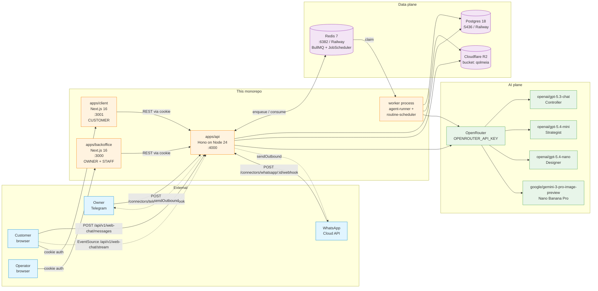
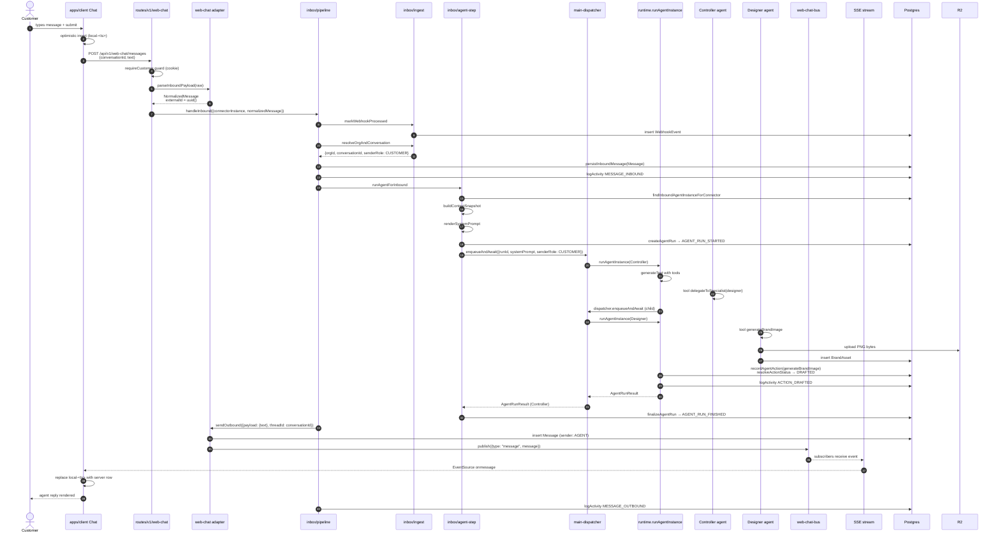
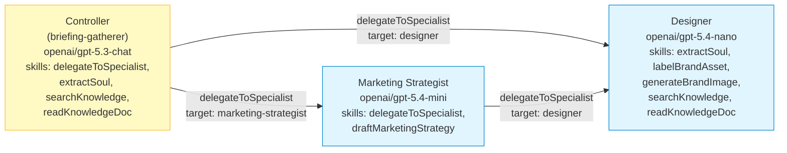
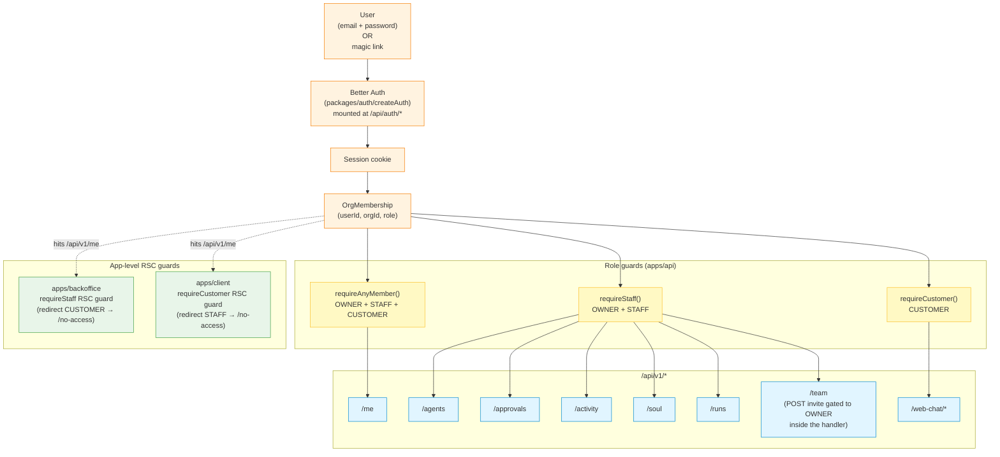
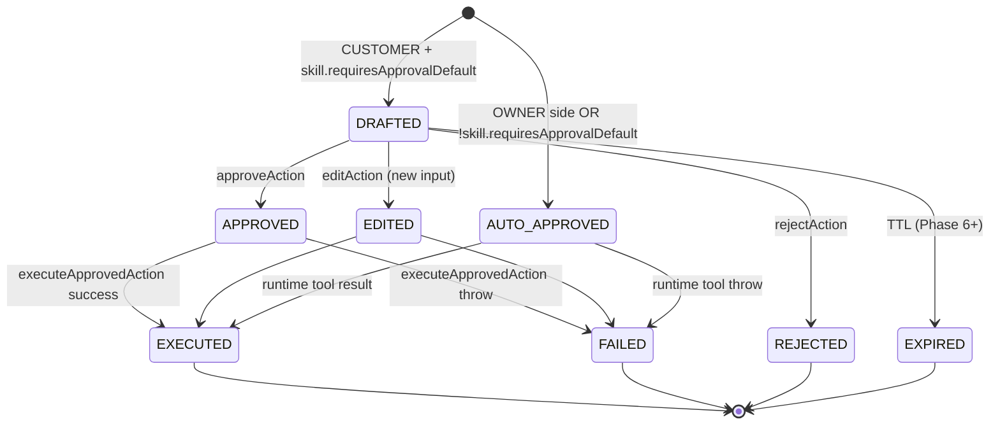
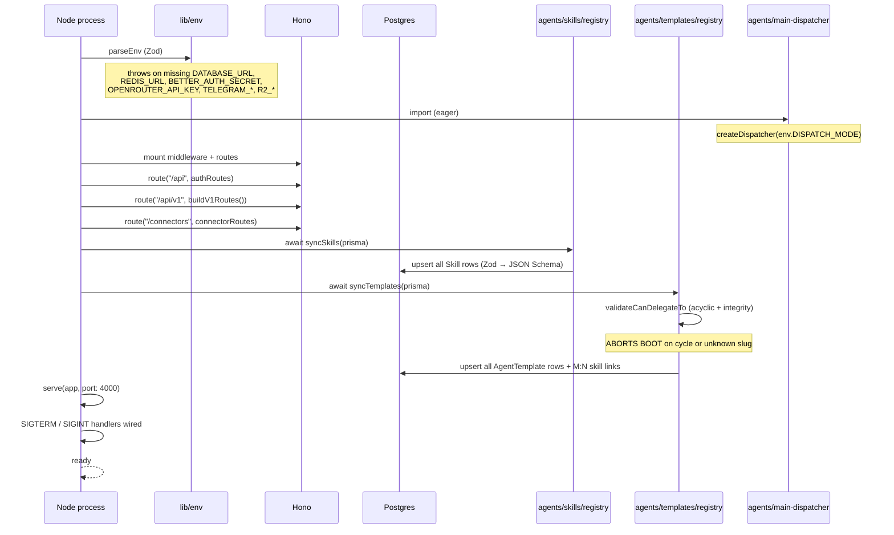

# Qolmeia — Current Architecture Diagrams

**Date:** 2026-05-21
**HEAD:** `a35dfcc` (PR #9 merged — post-restructure, 3 apps + 6 packages)
**Companion to:** [`docs/ARCHITECTURE.md`](../ARCHITECTURE.md) (prose). This file is the visual reference.

All diagrams are Mermaid. They render in GitHub, GitLab, most IDEs (VS Code with the Markdown Mermaid extension, JetBrains, Cursor), and the Mermaid Live Editor at https://mermaid.live.

Supersedes `current-state-2026-05-20.md`, which captured the pre-restructure single-app baseline.

---

## 1. System context

Three apps share one API. Two inbound channels are signature-verified webhooks; one is an in-app composer guarded by a CUSTOMER cookie. The worker is a second Node process that consumes BullMQ + drives the routine scheduler.



---

## 2. Module dependencies

`apps/api/src/` arrows point from caller to callee. The two Next apps + six packages framed above the API call graph.

```mermaid
flowchart TB
  subgraph Pkg["Packages"]
    pkg_auth["@repo/auth<br/>createAuth"]
    pkg_db["@repo/db<br/>Prisma 7"]
    pkg_tx["@repo/transactional<br/>Resend + React Email"]
    pkg_ui["@repo/ui<br/>shadcn lib"]
    pkg_vt["@repo/config-vitest"]
    pkg_ts["@repo/typescript-config"]
  end

  subgraph BO["apps/backoffice"]
    bo_app["app/(dashboard)/*<br/>app/(auth)/*"]
    bo_comp["components/*<br/>+ approval/schema-form"]
    bo_lib["lib/api-server<br/>lib/api-client<br/>lib/auth-helpers"]
  end

  subgraph CLI["apps/client"]
    cli_app["app/(client)/*<br/>app/login app/auth/verify"]
    cli_comp["components/chat<br/>composer<br/>sse-subscriber"]
    cli_lib["lib/api-server<br/>lib/api-client<br/>lib/auth-helpers"]
  end

  subgraph API["apps/api/src"]
    idx["index.ts<br/>boot + syncSkills + syncTemplates"]
    auth_route["routes/auth.ts<br/>Better Auth /api/auth/*"]
    conn_route["routes/connectors/index.ts<br/>POST /connectors/:type/:id/webhook"]
    v1_route["routes/v1/index.ts<br/>buildV1Routes(deps)"]
    v1_me["routes/v1/me"]
    v1_agents["routes/v1/agents"]
    v1_appr["routes/v1/approvals"]
    v1_act["routes/v1/activity"]
    v1_soul["routes/v1/soul"]
    v1_runs["routes/v1/runs"]
    v1_team["routes/v1/team"]
    v1_wc["routes/v1/web-chat<br/>+ SSE stream"]
    mw_staff["middleware/require-staff"]
    mw_cust["middleware/require-customer"]
    inbox["inbox/pipeline<br/>handleInbound"]
    inbox_ing["inbox/ingest"]
    inbox_att["inbox/attachments"]
    inbox_step["inbox/agent-step"]
    inbox_own["inbox/owner-commands"]
    conn_reg["connectors/registry<br/>getAdapter"]
    adp_tg["connectors/telegram"]
    adp_wa["connectors/whatsapp"]
    adp_web["connectors/web-chat"]
    adp_frs["connectors/fresha"]
    bus["lib/web-chat-bus"]
    disp["agents/main-dispatcher"]
    disp_serial["agents/dispatcher (Serial)"]
    disp_bull["agents/bullmq-dispatcher"]
    runtime["agents/runtime<br/>runAgentInstance"]
    runs_mod["agents/runs"]
    actions_mod["agents/actions"]
    appr_mod["agents/approvals"]
    cost_mod["agents/cost"]
    tmpl_reg["agents/templates/registry<br/>+ controller + strategist + designer"]
    skills["agents/skills/*"]
    skill_reg["agents/skills/registry<br/>ALL_SKILLS + syncSkills"]
    know["knowledge/*<br/>provider + apply + brand-asset + brand-context + knowledge-doc"]
    act_log["activity/log + query"]
    routines["routines/*"]
    workers["workers/{agent-runner,routine-scheduler,index}"]
    lib_ai["lib/ai<br/>openrouter + resolveModelForAgent"]
    lib_img["lib/image-gen<br/>Nano Banana Pro"]
    lib_st["lib/storage R2"]
    lib_auth["lib/auth"]
  end

  bo_app --> bo_comp
  bo_app --> bo_lib
  cli_app --> cli_comp
  cli_app --> cli_lib
  bo_comp --> pkg_ui
  cli_comp --> pkg_ui
  bo_lib --> pkg_auth
  cli_lib --> pkg_auth
  bo_lib -.->|fetch| v1_route
  cli_lib -.->|fetch| v1_route
  cli_comp -.->|EventSource| v1_wc

  idx --> auth_route
  idx --> conn_route
  idx --> v1_route
  idx --> skill_reg
  idx --> tmpl_reg
  auth_route --> lib_auth
  lib_auth --> pkg_auth
  pkg_auth --> pkg_db
  pkg_auth --> pkg_tx

  v1_route --> v1_me & v1_agents & v1_appr & v1_act & v1_soul & v1_runs & v1_team & v1_wc
  v1_route --> mw_staff
  v1_route --> mw_cust
  v1_team --> pkg_tx
  v1_wc --> inbox
  v1_wc --> bus

  conn_route --> conn_reg
  conn_route --> inbox
  conn_reg --> adp_tg & adp_wa & adp_web & adp_frs
  adp_web --> bus

  inbox --> inbox_ing & inbox_att & inbox_step & inbox_own
  inbox_step --> disp
  inbox_step --> runs_mod
  inbox_step --> know
  disp --> disp_serial & disp_bull
  disp_serial --> runtime
  disp_bull --> runtime
  workers --> runtime
  workers --> routines

  runtime --> actions_mod
  runtime --> cost_mod
  runtime --> tmpl_reg
  runtime --> skill_reg
  runtime --> lib_ai
  appr_mod --> actions_mod
  skills --> know
  skills --> lib_img
  skills --> tmpl_reg
  skills --> disp

  act_log --> pkg_db
  know --> pkg_db
  know --> lib_st
  runs_mod --> pkg_db
  routines --> pkg_db
  routines --> runs_mod

  classDef pkg fill:#d7ccc8,stroke:#5d4037
  classDef bo fill:#fff9c4,stroke:#fbc02d
  classDef cli fill:#e1f5ff,stroke:#0288d1
  classDef api fill:#e8f5e9,stroke:#43a047
  class pkg_auth,pkg_db,pkg_tx,pkg_ui,pkg_vt,pkg_ts pkg
  class bo_app,bo_comp,bo_lib bo
  class cli_app,cli_comp,cli_lib cli
```



Layer rules (enforced by file location):

- `routes/` → `inbox/` → `agents/` → `knowledge/` + `lib/` → Prisma.
- `agents/skills/` reach into `knowledge/` + `lib/` only; never into `inbox/` or `routes/`.
- `agents/templates/` are pure config + prompts; no I/O.
- `workers/` mirrors the API's wiring from `agents/` downward.
- The two Next apps never read the database directly — they only fetch the API.

---

## 3. ERD

Every Prisma model on `main`. Stars on the auth + Better Auth half.

```mermaid
erDiagram
  Organization ||--o{ OrgMembership : "1:N"
  Organization ||--o{ Customer : "1:N"
  Organization ||--o{ Conversation : "1:N"
  Organization ||--o{ BrandAsset : "1:N"
  Organization ||--o{ KnowledgeDoc : "1:N"
  Organization ||--o{ AgentInstance : "1:N"
  Organization ||--o{ ConnectorInstance : "1:N"
  Organization ||--o{ ActivityLog : "1:N"
  Organization ||--o{ Routine : "1:N"

  User ||--o{ OrgMembership : "1:N"
  User ||--o{ Session : "1:N"
  User ||--o{ Account : "1:N"

  Customer ||--o{ Conversation : "1:N"
  Conversation ||--o{ Message : "1:N"
  Conversation }o--|| ConnectorInstance : "N:1 (optional)"

  AgentTemplate ||--o{ AgentInstance : "1:N (by templateSlug)"
  AgentTemplate }o--o{ Skill : "M:N TemplateSkills"

  AgentInstance ||--o{ AgentConnectorBinding : "1:N"
  AgentInstance ||--o{ AgentAction : "1:N"
  AgentInstance ||--o{ AgentSkillEnablement : "1:N"
  AgentInstance ||--o{ AgentRun : "1:N"
  AgentInstance ||--o{ Routine : "1:N"
  ConnectorInstance ||--o{ AgentConnectorBinding : "1:N"

  Skill ||--o{ AgentAction : "1:N"
  Skill ||--o{ AgentSkillEnablement : "1:N"

  AgentRun ||--o{ AgentAction : "1:N"
  AgentRun }o--o| AgentRun : "parent / children<br/>(parentRunId)"
  AgentRun }o--o| Message : "triggerMessageId"

  AgentAction }o--o| AgentAction : "parent / children<br/>(parentActionId)"
  AgentAction }o--o| Message : "triggerMessageId"

  Organization {
    string id PK
    string slug UK
    string name
    string timezone "America/Sao_Paulo"
    string currency "BRL"
    json businessProfile "AI-extracted soul"
    text agentInstructions "owner-curated"
    text businessIdea "owner-curated"
  }
  User {
    string id PK
    string email UK
    string name
    string username UK
    bool emailVerified
  }
  Session {
    string id PK
    string userId FK
    string token UK
    datetime expiresAt
    string impersonatedBy
  }
  Account {
    string id PK
    string userId FK
    string providerId
    string password "hashed"
    string accessToken
  }
  Verification { string id PK }
  RateLimit { string key UK }
  OrgMembership {
    string id PK
    string userId FK
    string orgId FK
    enum role "OWNER|STAFF|CUSTOMER"
  }
  Customer {
    string id PK
    string orgId FK
    string phone
    string email
  }
  Conversation {
    string id PK
    string orgId FK
    string customerId FK
    string connectorInstanceId FK
    enum channel
    enum status
  }
  Message {
    string id PK
    string conversationId FK
    string externalId
    enum sender
    enum contentType
    json metadata
  }
  WebhookEvent {
    string id PK
    string provider
    string externalId
    json payload
  }
  BrandAsset {
    string id PK
    string orgId FK
    string r2Key
    string sha256
    int size
    json metadata
  }
  KnowledgeDoc {
    string id PK
    string orgId FK
    string r2Key
    string title
    strings tags
    enum contentType
  }
  AgentTemplate {
    string slug PK
    string defaultSystemPrompt
    string defaultModel "OpenRouter id"
    strings canDelegateTo "acyclic"
    int defaultBudgetCents
  }
  AgentInstance {
    string id PK
    string orgId FK
    string templateSlug FK
    string mission
    string modelOverride "OpenRouter id, nullable"
    int budgetCents
    enum status
  }
  Skill {
    string id PK
    string displayName
    json parametersJsonSchema "Zod → JSON Schema"
    bool requiresApprovalDefault
  }
  AgentSkillEnablement {
    string id PK
    string agentInstanceId FK
    string skillId FK
    json configOverride
  }
  ConnectorInstance {
    string id PK
    string orgId FK
    enum type
    json config
    enum senderRole "OWNER|CUSTOMER"
  }
  AgentConnectorBinding {
    string id PK
    string agentInstanceId FK
    string connectorInstanceId FK
    enum direction "INBOUND|OUTBOUND|BOTH"
  }
  AgentRun {
    string id PK
    string agentInstanceId FK
    string triggerMessageId FK
    string parentRunId FK
    json contextSnapshot "frozen at dispatch"
    text systemPrompt "frozen at dispatch"
    enum status
    int costCents
  }
  AgentAction {
    string id PK
    string agentInstanceId FK
    string skillId FK
    string runId FK
    json proposedInput
    enum status "DRAFTED|AUTO_APPROVED|APPROVED|REJECTED|EDITED|EXPIRED|FAILED|EXECUTED"
    int costCents
  }
  ActivityLog {
    string id PK
    string orgId FK
    enum type
    enum refType
    string refId
    text summary "pt-BR"
    json payload
  }
  Routine {
    string id PK
    string orgId FK
    string agentInstanceId FK
    string name "unique per org"
    string schedule "cron"
    bool enabled "starts false"
    json config
  }
```



Invariants worth surfacing:

- `OrgMembership` is the only place `role` lives — `User` has no `role` column.
- `AgentSkillEnablement` zero rows ⇒ template defaults; ≥1 row ⇒ explicit override.
- `AgentRun.contextSnapshot` + `systemPrompt` are frozen at dispatch — runtime never re-reads them.
- `AgentConnectorBinding(direction)` is what `findInboundAgentInstanceForConnector` reads. No more hardcoded controller routing.

---

## 4. WEB_CHAT inbound lifecycle (sequence)

The most illustrative path because it exercises every seam — SSE, optimistic write, approval gating. Telegram + WhatsApp follow the same shape after step 6, differing only in `verifySignature` and `sendOutbound`.



---

## 5. WEB_CHAT data flow (zoomed)

Same flow, abstracted to the components that own each transition. Useful when reasoning about replacing the in-process bus with Redis.

```mermaid
flowchart LR
  comp["Composer<br/>(apps/client)"]
  api_post["POST /api/v1/web-chat/messages"]
  pipe["inbox/pipeline<br/>handleInbound"]
  runtime["runAgentInstance"]
  send["adapter.sendOutbound"]
  msg_table[("Message table")]
  bus["lib/web-chat-bus<br/>EventEmitter"]
  sse_route["GET /api/v1/web-chat/stream"]
  evtsrc["EventSource"]
  chat_ui["Chat component<br/>(TanStack Query cache)"]

  comp -->|fetch + cookie| api_post
  api_post --> pipe
  pipe --> runtime
  runtime --> send
  send -->|create| msg_table
  send -->|publish| bus
  bus -->|on(channel)| sse_route
  sse_route -->|SSE event| evtsrc
  evtsrc -->|onmessage| chat_ui
  chat_ui -->|render| comp

  classDef ui fill:#e1f5ff,stroke:#0288d1
  classDef api fill:#e8f5e9,stroke:#43a047
  classDef data fill:#f3e5f5,stroke:#8e24aa
  class comp,chat_ui,evtsrc ui
  class api_post,pipe,runtime,send,sse_route,bus api
  class msg_table data
```

When `apps/api` scales to N replicas, swap `lib/web-chat-bus` for a Redis pub/sub backed bus. Every other component stays the same.

---

## 6. Delegation DAG

Static topology validated by `validateCanDelegateTo` at boot. Acyclic by construction. Each template ships its own OpenRouter model.



Per-template model selection lives in `lib/ai.ts → resolveModelForAgent({ instance, template })` — `instance.modelOverride` wins; otherwise `template.defaultModel`. Ops can swap a per-org instance onto a cheaper / smarter model without touching the template.

---

## 7. Auth + role gating



---

## 8. AgentAction lifecycle

Schema supports the full lifecycle. Customer-side approval-gated branch is now exercised by `apps/client`; the backoffice editor drives the DRAFTED → APPROVED/EDITED/REJECTED → EXECUTED transitions.



Helpers live in `agents/approvals.ts`. The backoffice editor at `/approvals/[id]` POSTs to `/api/v1/approvals/:id/{approve|reject|edit}` which call them.

---

## 9. Boot sequence



The worker process (`pnpm dev:worker`) follows the same shape but mounts BullMQ workers instead of HTTP routes. `routine-scheduler.ts` calls `reconcileRoutines` on boot to drive BullMQ JobSchedulers from `Routine` rows.

---

## 10. The seams (visualised)

Single-writer / single-reader audit, expressed as who reaches what. The arrows in red are write paths; green is read.

```mermaid
flowchart LR
  subgraph Writers
    apply["knowledge/apply.ts<br/>applySoulUpdate"]
    own_cmd["inbox/owner-commands.ts<br/>+ routes/v1/soul.ts"]
    brand_asset["knowledge/brand-asset.ts<br/>ingestBrandAsset +<br/>ingestGeneratedAsset"]
    label_skill["agents/skills/label-brand-asset.ts"]
    ensure["agents/agent-instance.ts<br/>ensureAgentInstance"]
    record["agents/actions.ts<br/>recordAgentAction"]
    appr["agents/approvals.ts"]
    runs["agents/runs.ts<br/>createAgentRun + finalizeAgentRun"]
    act_w["activity/log.ts<br/>logActivity"]
    sync_skills["agents/skills/registry.ts<br/>syncSkills"]
    sync_tmpls["agents/templates/registry.ts<br/>syncTemplates"]
    sync_rts["routines/registry.ts<br/>syncRoutines"]
    web_send["connectors/web-chat<br/>sendOutbound"]
  end

  subgraph Tables[("Postgres tables")]
    org_bp["Organization.businessProfile"]
    org_owner["Organization.agentInstructions +<br/>businessIdea"]
    ba_create["BrandAsset (insert)"]
    ba_update["BrandAsset.metadata (update)"]
    ai_table["AgentInstance"]
    aa_table["AgentAction"]
    ar_table["AgentRun"]
    al_table["ActivityLog"]
    sk_table["Skill"]
    tmpl_table["AgentTemplate"]
    rt_table["Routine"]
    msg_table["Message"]
  end

  subgraph Readers
    provider["knowledge/provider.ts<br/>getBusinessContext"]
    brand_ctx["knowledge/brand-context.ts<br/>getBrandContext"]
    runtime_r["agents/runtime.ts"]
    activity_q["activity/query.ts<br/>getRecentActivity"]
    bus_sub["lib/web-chat-bus<br/>subscribe"]
  end

  apply --> org_bp
  own_cmd --> org_owner
  brand_asset --> ba_create
  label_skill --> ba_update
  ensure --> ai_table
  record --> aa_table
  appr --> aa_table
  runs --> ar_table
  act_w --> al_table
  sync_skills --> sk_table
  sync_tmpls --> tmpl_table
  sync_rts --> rt_table
  web_send --> msg_table

  org_bp --> provider
  org_owner --> provider
  ba_create --> brand_ctx
  ba_update --> brand_ctx
  provider --> runtime_r
  brand_ctx --> runtime_r
  al_table --> activity_q
  msg_table --> bus_sub

  classDef wr fill:#ffcdd2,stroke:#c62828
  classDef tb fill:#d7ccc8,stroke:#5d4037
  classDef rd fill:#c8e6c9,stroke:#2e7d32
  class apply,own_cmd,brand_asset,label_skill,ensure,record,appr,runs,act_w,sync_skills,sync_tmpls,sync_rts,web_send wr
  class org_bp,org_owner,ba_create,ba_update,ai_table,aa_table,ar_table,al_table,sk_table,tmpl_table,rt_table,msg_table tb
  class provider,brand_ctx,runtime_r,activity_q,bus_sub rd
```

Audit commands (kept current, should all hold true):

```bash
grep -rn "businessProfile" apps/api/src       # ⇒ knowledge/apply.ts (writer) + knowledge/provider.ts (reader)
grep -rn "agentInstructions" apps/api/src     # ⇒ knowledge/provider.ts (reader) + inbox/owner-commands.ts + routes/v1/soul.ts (writers)
grep -rn "businessIdea" apps/api/src          # ⇒ knowledge/provider.ts (reader) + inbox/owner-commands.ts + routes/v1/soul.ts (writers)
grep -rn "brandAsset.create" apps/api/src     # ⇒ knowledge/brand-asset.ts
grep -rn "brandAsset.update" apps/api/src     # ⇒ agents/skills/label-brand-asset.ts
grep -rn "agentInstance.upsert" apps/api/src  # ⇒ agents/agent-instance.ts
grep -rn "agentAction.create" apps/api/src    # ⇒ agents/actions.ts + agents/approvals.ts
grep -rn "agentRun.create" apps/api/src       # ⇒ agents/runs.ts
grep -rn "activityLog.create" apps/api/src    # ⇒ activity/log.ts
grep -rn "routine.create" apps/api/src        # ⇒ routines/registry.ts (syncRoutines)
grep -rn "as Skill<" apps/api/src             # ⇒ NOTHING — defineSkill killed the cast
```

---

## 11. Where to look next

- Prose architecture: [`docs/ARCHITECTURE.md`](../ARCHITECTURE.md)
- Pre-restructure baseline (for delta-reading): `docs/architecture/current-state-2026-05-20.md`
- Multi-agent spec: `docs/superpowers/specs/2026-05-20-qolmeia-multi-agent-architecture-design.md`
- Restructure research: `docs/research/2026-05-20-paperclip-and-multica.md`
- Test bar: 557 tests, oxlint 0/0, oxfmt clean, `pnpm fallow:dead` clean
