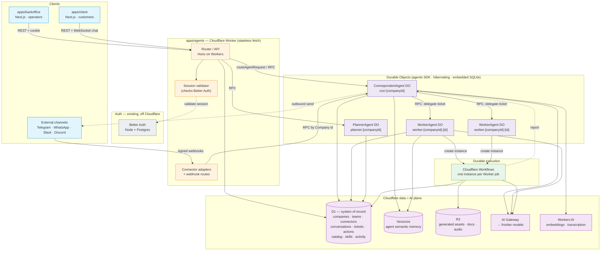
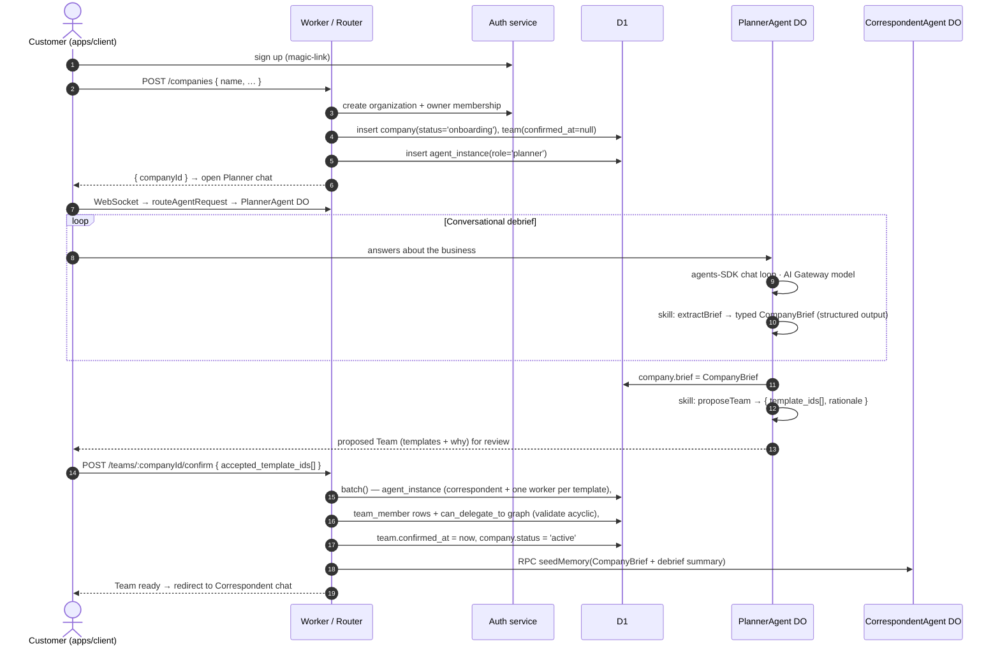
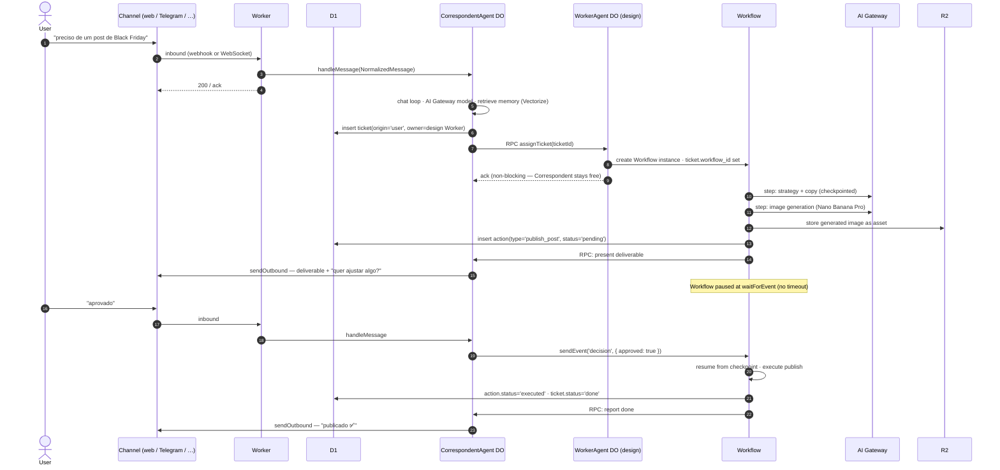

# Cloudflare-Native Agent Platform — Greenfield Rebuild Design Spec

**Date:** 2026-05-22
**Status:** Draft — refined through a design grilling session (16 decisions locked, §2)
**Author:** Pedro + Claude (design session)
**Supersedes:** the entire `apps/api` backend (Hono on Node + Prisma/Postgres + Redis/BullMQ + OpenRouter). The two Next.js apps (`apps/backoffice`, `apps/client`) survive and re-point. **Auth is not superseded** — it stays on the existing Node + Postgres Better Auth service (§9).

This is a **design doc**, not an implementation plan. No application code. It exists for Pedro and his team to review the load-bearing choices before any phase plan is written.

---

## 1. Goal + non-goals

### 1.1 Goal

Rebuild the Qolmeia agent backend from scratch on Cloudflare's native stack so the agency model — Company / Planner / Correspondent / Team / Worker / Connectors — runs as **stateful, addressable agents** rather than a stateless Node service plus a Postgres/Redis fleet.

The target the spec implements:

- A **Company** is the tenant. Creating one triggers an onboarding **debrief**: a **Planner** agent interviews the customer conversationally and **proposes a Team**; the customer confirms.
- The **Planner** is a persistent agent. It runs the initial debrief and stays available so the customer can return to scale the Team, swap Workers, or re-debrief when the business changes. It owns team composition long-term.
- Every Company has exactly one **Correspondent** — the single communication path. It relays Team progress, surfaces deliverables, runs the approve/reject/change loop, and holds persistent memory of the Company. Reachable through any **Connector**.
- A **Team** is a customer-chosen set of **Worker** agents (marketing, support, design, sales, …). Workers have persistent memory and do scoped jobs.
- **Connectors** are inbound/outbound channels (web chat, Telegram, WhatsApp, Slack, Discord), configured per Company, **shared across all agents**. Every channel is a first-class citizen — full channel parity (§6).
- **Users** (owner / employees) talk to the agency through any connector and approve / reject / request changes by chat.

### 1.2 Architecture principle — Cloudflare-first, not Cloudflare-only

Cloudflare is the default for every new platform component (Workers, Durable Objects, D1, Vectorize, Workflows, R2, AI Gateway). A non-Cloudflare service is allowed where it is genuinely the better tool — but each exception must be **justified at the boundary** and **isolated** from platform data. The one exception at launch: **auth** stays on the existing Node + Postgres Better Auth service, to avoid a risky rewrite. Its Postgres database never holds platform data.

### 1.3 Non-goals

- Porting any code from `apps/api`. Concepts are salvaged (§14); code is not.
- Rebuilding the two Next.js apps. They get a new API base URL and updated endpoint/transport contracts — nothing more (§11).
- Rewriting auth. The Node + Postgres Better Auth service is reused as-is.
- Self-hosting / a plugin marketplace.
- Hard budget enforcement, billing surfaces, LGPD/compliance — future specs.
- Frontier-model fine-tuning, voice synthesis, video. Audio is **input transcription** only.
- Migrating live tenant data. The cutover is a clean switch (§12).

---

## 2. Locked decisions

Resolved one-by-one in the design grilling. These are **decided**, not proposals — the rest of the spec is built on them.

| #   | Decision                  | Locked answer                                                                                                                                                                                                                                                                                     | Why                                                                                                                                                                                                                                       |
| --- | ------------------------- | ------------------------------------------------------------------------------------------------------------------------------------------------------------------------------------------------------------------------------------------------------------------------------------------------- | ----------------------------------------------------------------------------------------------------------------------------------------------------------------------------------------------------------------------------------------- |
| 1   | Model-call layer          | **Cloudflare AI Gateway** in front of frontier models. AI SDK provider points its `baseURL` at the Gateway; the provider key is a Worker secret behind it.                                                                                                                                        | Keeps frontier-class quality (GPT-5.x / Gemini / Nano Banana) while gaining caching, rate-limiting, retries, fallbacks, and unified observability. Embeddings use Workers AI natively (§5.3).                                             |
| 2   | Agent harness             | **`agents` SDK** — each agent is a Durable Object subclassing `Agent` / `AIChatAgent`. We own the orchestration logic.                                                                                                                                                                            | GA, documented, stable. Built-in DO SQLite state, `this.schedule()`, WebSocket hibernation, AI-SDK integration, `routeAgentRequest` / `getAgentByName`. Retires the old spec's #1 risk (betting on the experimental `@cloudflare/think`). |
| 3   | Agent topology            | **One DO per agent instance.** Planner `planner:{companyId}`, Correspondent `corr:{companyId}`, each Worker `worker:{companyId}:{workerId}`.                                                                                                                                                      | The DO _is_ the agent's identity + single-threaded execution guarantee. Isolated memory, approval queue, and scheduling per agent. Mirrors the agency org chart 1:1.                                                                      |
| 4   | Planner lifecycle         | **Persistent DO.** Runs onboarding, then stays for re-planning / team scaling.                                                                                                                                                                                                                    | Team composition changes over a Company's life; the Planner owns that. Idle DOs hibernate at zero cost.                                                                                                                                   |
| 5   | Delegation + 13 Workflows | **Every Worker job runs as a Cloudflare Workflow.** The Correspondent delegates a ticket to a Worker DO; the Worker starts a Workflow per task. Non-blocking — the Correspondent stays conversational. Queue is _not_ in the delegation path.                                                     | Workflows give checkpointed steps, automatic retries, and `waitForEvent`. A crash mid-campaign resumes from the last step instead of re-billing image generation.                                                                         |
| 6   | Data boundary             | **D1 is the system-of-record** for everything queryable (company/user registry, team, connectors, conversations, messages, tickets, runs, actions, catalog, skills). Each DO's SQLite holds **working memory only** — recent turns, scratchpad, in-flight state.                                  | The backoffice queries D1 directly; no cross-DO fan-out to list conversations across tenants.                                                                                                                                             |
| 7   | Connectors                | **Uniform `ConnectorAdapter` contract.** Stateless Worker routes every channel; **no connector DO.** Full channel parity — web chat, WhatsApp, Telegram are identical at the agent layer; transport differences live inside adapters.                                                             | Cloudflare's documented routing pattern (`routeAgentRequest` + webhook routes). Parity comes from the shared adapter contract, not a shared DO.                                                                                           |
| 8   | Approval model            | **Policy per action type**, default `require-approval` (configurable per company/Worker to `auto-execute` / `notify-only`). The executing **Workflow pauses at `waitForEvent`** until the User decides; **no timeout cap** — the checkpoint sleeps free until approve / reject / request-changes. | Request-changes resumes the same Workflow with feedback; no work lost. Stale-backlog visibility is a backoffice concern, not a timeout.                                                                                                   |
| 9   | Worker catalog            | **Fully D1-defined.** Worker templates (prompt, model, skill list, default policies) are D1 rows, editable by operators in the backoffice with no deploy.                                                                                                                                         | Fast iteration on agent behavior. Skills themselves stay code (§10) — a D1 template references skills by string ID.                                                                                                                       |
| 10  | Skill model               | **Code registry + D1 overlay.** `execute()` and the zod input schema are code modules. A D1 `skill` table holds the operator-tunable layer: LLM-facing description, parameter hints, `defaultConfig`, `enabled`. Runtime joins the two.                                                           | The description is the biggest lever on tool-selection quality — operators tune it without a deploy. The executable contract stays version-controlled.                                                                                    |
| 11  | Auth                      | **Keep the existing Node + Postgres Better Auth service** unchanged. The agent Worker validates its sessions.                                                                                                                                                                                     | Avoids a rewrite risk. Honors the Cloudflare-first-not-only principle (§1.2).                                                                                                                                                             |
| 12  | Agent memory              | **Vector/semantic memory from day one** (Cloudflare Vectorize) **+ a recent-turns buffer** in DO SQLite. Full history in D1.                                                                                                                                                                      | Long-term recall across a Company's history; the recent-turns buffer guarantees the live thread even if retrieval misfires.                                                                                                               |
| 14  | Client transport          | **`agents` SDK WebSocket** — the client uses `useAgentChat` to connect straight to its Correspondent DO. The `ai-elements` chat UI components stay (transport-agnostic).                                                                                                                          | Streaming, reconnection, state sync handled by the SDK. Replaces the hand-rolled SSE transport.                                                                                                                                           |
| 16  | Onboarding                | **Conversational Planner debrief.** The Planner interviews the customer, calls a structured-output skill that crystallizes a typed `CompanyBrief`, then proposes a Team.                                                                                                                          | Feels like an agency intake, not a form; works over any channel.                                                                                                                                                                          |
| —   | Phasing                   | **Vertical walking skeleton first** — one thin end-to-end path live on Cloudflare, then broaden (§12).                                                                                                                                                                                            | Proves the hard integration (DO + Workflow + D1 + AI Gateway) earliest.                                                                                                                                                                   |
| —   | UI theme                  | shadcn preset **`b1txbSwNv`** (`pnpm dlx shadcn@latest apply --preset b1txbSwNv`) is the design system for both Next.js apps.                                                                                                                                                                     | —                                                                                                                                                                                                                                         |

---

## 3. Cloudflare topology



One Worker script, three DO classes, one D1 database, one Vectorize index, Workflows for task execution. The Next apps never touch DOs or D1 directly — every request goes through the Worker's Hono router, which validates the session against the external auth service and RPC-routes to the right DO.

---

## 4. The agent model

### 4.1 Roles → Durable Object classes

Three DO classes. Behaviour is **data-driven** off D1 rows (the `agent_instance` and its `template`), not the class.

| DO class                                 | Keying                          | Backing row                           | Purpose                                                                                                                                                                    |
| ---------------------------------------- | ------------------------------- | ------------------------------------- | -------------------------------------------------------------------------------------------------------------------------------------------------------------------------- |
| `PlannerAgent extends AIChatAgent`       | `planner:{companyId}`           | `agent_instance` role=`planner`       | Conversational onboarding debrief; proposes + re-plans the Team. Persistent.                                                                                               |
| `CorrespondentAgent extends AIChatAgent` | `corr:{companyId}`              | `agent_instance` role=`correspondent` | The single comms path. Holds Company memory, delegates, runs the approval loop.                                                                                            |
| `WorkerAgent extends Agent`              | `worker:{companyId}:{workerId}` | `agent_instance` role=`worker`        | Scoped specialist. Marketing / design / support / sales differ by their D1 `template`, not by class. Launches a Workflow per delegated job. Can be chatted for follow-ups. |

**One parameterized `WorkerAgent` class, not one per specialty.** A marketing Worker and a design Worker differ only in their D1 `template` (system prompt, enabled skills, model). One class keeps `wrangler.jsonc` DO migrations small and means adding a specialty is a D1 row, not a deploy.

`PlannerAgent` and `CorrespondentAgent` extend **`AIChatAgent`** because they are chat-facing — `useAgentChat` connects to them directly and the SDK manages message history + tool-approval plumbing. `WorkerAgent` extends the plainer **`Agent`** — it is task-facing; its work runs in Workflows. It can be promoted to `AIChatAgent` later if direct Worker chat becomes a product need.

### 4.2 How delegation works

The Correspondent delegates by **DO-to-DO RPC**, and the Worker executes the job as a **Cloudflare Workflow**:

1. The Correspondent decides a User request needs a Worker. It writes a `ticket` row in D1 and RPCs the target `WorkerAgent` DO: `assignTicket(ticketId)`.
2. The Worker DO validates the request against the delegation graph (`team_member.can_delegate_to`), then **creates a Workflow instance** for the job and stores `workflow_id` on the ticket. It returns immediately — the Correspondent is never blocked.
3. The Workflow runs the job as checkpointed steps (research → draft → generate → assemble). Steps that need reasoning call the AI SDK through AI Gateway; steps reading/writing memory RPC the Worker DO; long external calls (image gen) are their own retryable steps.
4. When the job produces a gated deliverable, the Workflow files an `action` row and **pauses at `waitForEvent`** (§4.4).
5. On completion the Workflow writes `ticket.result`, sets `ticket.status='done'`, and RPCs the Correspondent to report.

Worker-to-Worker delegation is the same shape: a Workflow step can RPC another Worker DO to assign a child ticket, subject to the same graph check. The delegation graph is stored in D1 and validated acyclic at Team-confirmation time.

**The split in one line: the DO is _who the agent is_ (identity + memory + addressable); the Workflow is _what the agent is currently doing_ (durable execution).** The DO's single-threaded execution serializes a chat message and a Workflow callback that both touch the same Worker — that is the concrete reason the Worker stays a DO rather than the Workflow owning everything.

### 4.3 How memory works

Per-agent memory is **vector/semantic from day one**, paired with a recent-turns buffer:

- **D1** is the durable transcript — every `message` row, queryable by the backoffice.
- **Cloudflare Vectorize** holds the semantic index. Every stored message is embedded (Workers AI embedding model, §5.3) and upserted to one platform Vectorize index, with metadata `{ companyId, agentInstanceId, messageId, role, createdAt }`. Retrieval per turn: embed the incoming message, query Vectorize filtered to this agent, take top-K neighbours, inject them as a context block. Recency is a metadata weight so old-but-similar memories don't crowd out recent ones.
- **DO SQLite** holds the **recent-turns buffer** — the last N raw turns, always in context regardless of retrieval. This guarantees a coherent live thread even if vector retrieval misfires or returns nothing.
- **Structured facts** the agent chooses to remember (a brand decision, a standing preference) are written by a `rememberFact` skill into D1 (`memory_fact`), embedded into Vectorize alongside messages, and recalled the same way.
- **Shared Company data** (brand kit, business profile, knowledge-doc index) lives in D1/R2 and is read into a context block at turn start — not duplicated as agent memory.

The Correspondent's memory is _the_ Company memory: every interaction, promise, and delivered artifact across every channel. Because the Correspondent is one DO instance, memory is unified — a conversation started on WhatsApp continues coherently on web.

### 4.4 The approval lifecycle

Approval is governed by a **policy per action type** and executed through the Workflow's `waitForEvent`:

- Each action type has a policy in D1 — default `require-approval`, configurable per company / per Worker to `auto-execute` or `notify-only`.
- When a Workflow reaches a gated action, it writes an `action` row (`status='pending'`) with the proposed payload, RPCs the Correspondent to present it to the User, and **pauses at `step.waitForEvent`**. The half-finished job is frozen in the Workflow checkpoint at zero cost.
- The User replies on any connector. The Correspondent interprets the reply and **sends the event** that resumes the Workflow:
  - **approve** → the Workflow resumes and executes the action.
  - **reject** → the Workflow resumes, discards the action, closes the ticket.
  - **request-changes** → the Workflow resumes _from the same checkpoint_ with the User's feedback appended; the Worker revises and re-proposes. No work is lost; no Workflow is restarted.
- **No timeout cap.** A User can take days. A backoffice view of "actions awaiting decision, sorted by age" surfaces stale backlog; cancellation is a deliberate operator action.
- The backoffice can decide an `action` directly (operator override) — same D1 rows, same resume event.
- Every transition writes `activity_log`.

What is gated, by default: anything customer-facing or irreversible (publishing, sending to a third party, volume image generation). Internal steps (drafting, delegation, memory writes) are `auto-execute`.

### 4.5 Tickets

A `ticket` is the unit of work, in **D1**, owned by an `agent_instance_id`, with a lifecycle. The Correspondent creates tickets from User requests; Workers create child tickets when they delegate. The D1 row carries only cross-agent-visible status and the `workflow_id`; agent-private scratch state for an in-progress job stays in the Worker DO's SQLite and is summarized into `ticket.result` on completion.

### 4.6 Scheduled work

Recurring agent work (a weekly report, a daily scan) uses the `agents` SDK's `this.schedule(cron, method, payload)` on the relevant DO — no separate scheduler service. A scheduled tick that needs multi-step durable work creates a Workflow, exactly like a delegated job. Queues are not used at launch; the topology leaves room (a `ticket` row is a durable work record a Queue consumer could claim) if cross-agent fan-out volume ever demands buffering.

---

## 5. Data model

Three stores. The boundary rule (decision 6): **D1 = system-of-record for everything queryable. DO SQLite = agent working memory. Vectorize = semantic recall.**

### 5.1 D1 schema

SQLite dialect. `TEXT` ids (ULID), `INTEGER` epoch-ms timestamps, `TEXT` enums with `CHECK` constraints, JSON stored as `TEXT`. Every tenant-scoped table carries `company_id`. Auth tables are **not** here — they live in the external auth service's Postgres (§9); `company.id` equals the auth service's organization id.

```sql
-- ── Tenancy ────────────────────────────────────────────────────
company(
  id TEXT PRIMARY KEY,            -- == auth-service organization id
  name TEXT NOT NULL, slug TEXT UNIQUE NOT NULL,
  timezone TEXT NOT NULL DEFAULT 'America/Sao_Paulo',
  locale   TEXT NOT NULL DEFAULT 'pt-BR',
  status   TEXT NOT NULL DEFAULT 'onboarding'
    CHECK(status IN ('onboarding','active','paused')),
  brief TEXT,                     -- JSON CompanyBrief, produced by the Planner debrief
  created_at INTEGER NOT NULL, updated_at INTEGER NOT NULL
)

-- ── Catalog (decision 9 — fully D1-defined, operator-editable) ──
template(                         -- a Worker type the customer can hire
  id TEXT PRIMARY KEY,
  worker_kind TEXT NOT NULL,      -- marketing|design|support|sales|…
  display_name TEXT NOT NULL,
  description TEXT NOT NULL,      -- customer-facing, shown in the Team picker
  system_prompt TEXT NOT NULL,
  model TEXT NOT NULL,            -- AI Gateway model id
  skill_ids TEXT NOT NULL,        -- JSON array of skill ids (validated against the code registry)
  default_policies TEXT NOT NULL, -- JSON: { actionType: 'require-approval'|'auto-execute'|'notify-only' }
  status TEXT NOT NULL DEFAULT 'active' CHECK(status IN ('active','retired')),
  version INTEGER NOT NULL DEFAULT 1,
  created_at INTEGER NOT NULL, updated_at INTEGER NOT NULL
)

skill(                            -- D1 overlay over the code skill registry (decision 10)
  id TEXT PRIMARY KEY,            -- matches a code-registry skill id
  display_name TEXT NOT NULL,
  description TEXT NOT NULL,      -- the LLM-facing description — the tool-selection lever
  param_hints TEXT,              -- JSON: per-parameter description overrides
  default_config TEXT,           -- JSON: e.g. { imageSize, subModel, temperature }
  enabled INTEGER NOT NULL DEFAULT 1,
  updated_at INTEGER NOT NULL
)
-- execute() + zod input schema are NOT here — they are code. A skill row with no
-- matching registry entry is a config error caught at agent boot.

-- ── Team + agents ──────────────────────────────────────────────
team(
  id TEXT PRIMARY KEY,
  company_id TEXT NOT NULL UNIQUE REFERENCES company(id),
  confirmed_at INTEGER,           -- null until the customer confirms the Planner's proposal
  created_at INTEGER NOT NULL
)

agent_instance(
  id TEXT PRIMARY KEY,
  company_id TEXT NOT NULL REFERENCES company(id),
  role TEXT NOT NULL CHECK(role IN ('planner','correspondent','worker')),
  template_id TEXT REFERENCES template(id),   -- null for planner/correspondent
  template_version INTEGER,                   -- pinned at hire time
  display_name TEXT NOT NULL,
  model_override TEXT,            -- null = use template/role default
  status TEXT NOT NULL DEFAULT 'active' CHECK(status IN ('active','paused')),
  created_at INTEGER NOT NULL, updated_at INTEGER NOT NULL,
  UNIQUE(company_id, role, template_id)       -- one correspondent; one worker per template
)

team_member(                      -- team membership + delegation graph
  team_id TEXT NOT NULL REFERENCES team(id),
  agent_instance_id TEXT NOT NULL REFERENCES agent_instance(id),
  can_delegate_to TEXT NOT NULL DEFAULT '[]', -- JSON array of agent_instance ids
  PRIMARY KEY(team_id, agent_instance_id)
)

-- ── Connectors ─────────────────────────────────────────────────
connector(
  id TEXT PRIMARY KEY,
  company_id TEXT NOT NULL REFERENCES company(id),
  type TEXT NOT NULL CHECK(type IN ('web','telegram','whatsapp','slack','discord')),
  display_name TEXT NOT NULL,
  config_ref TEXT NOT NULL,       -- reference into Worker Secrets / secret store (§15)
  inbound INTEGER NOT NULL DEFAULT 1, outbound INTEGER NOT NULL DEFAULT 1,
  status TEXT NOT NULL DEFAULT 'active' CHECK(status IN ('active','disabled')),
  created_at INTEGER NOT NULL,
  UNIQUE(company_id, type)
)

conversation(
  id TEXT PRIMARY KEY,
  company_id TEXT NOT NULL REFERENCES company(id),
  connector_id TEXT NOT NULL REFERENCES connector(id),
  external_thread_id TEXT NOT NULL,
  user_id TEXT,                   -- resolved auth-service user id, when known
  created_at INTEGER NOT NULL,
  UNIQUE(connector_id, external_thread_id)
)

message(                          -- durable transcript; also embedded into Vectorize
  id TEXT PRIMARY KEY,
  company_id TEXT NOT NULL REFERENCES company(id),
  conversation_id TEXT NOT NULL REFERENCES conversation(id),
  agent_instance_id TEXT,         -- author, when an agent
  role TEXT NOT NULL CHECK(role IN ('user','agent','system')),
  content TEXT NOT NULL,
  attachments TEXT,               -- JSON
  created_at INTEGER NOT NULL
)

webhook_event(                    -- inbound idempotency
  provider TEXT NOT NULL, external_id TEXT NOT NULL,
  received_at INTEGER NOT NULL,
  PRIMARY KEY(provider, external_id)
)

-- ── Work ───────────────────────────────────────────────────────
ticket(
  id TEXT PRIMARY KEY,
  company_id TEXT NOT NULL REFERENCES company(id),
  agent_instance_id TEXT NOT NULL REFERENCES agent_instance(id),
  parent_ticket_id TEXT REFERENCES ticket(id),
  title TEXT NOT NULL, brief TEXT NOT NULL,
  status TEXT NOT NULL DEFAULT 'open'
    CHECK(status IN ('open','in_progress','awaiting_approval','blocked','done','rejected','cancelled')),
  origin TEXT NOT NULL CHECK(origin IN ('user','delegation','scheduled')),
  workflow_id TEXT,               -- Cloudflare Workflow instance id
  result TEXT,                    -- JSON deliverable summary
  created_at INTEGER NOT NULL, updated_at INTEGER NOT NULL
)

action(                           -- the approve/reject/change loop
  id TEXT PRIMARY KEY,
  ticket_id TEXT NOT NULL REFERENCES ticket(id),
  company_id TEXT NOT NULL REFERENCES company(id),
  action_type TEXT NOT NULL,      -- keys the policy
  policy TEXT NOT NULL,           -- resolved: require-approval|auto-execute|notify-only
  proposed TEXT NOT NULL,         -- JSON: what the agent wants to do
  status TEXT NOT NULL DEFAULT 'pending'
    CHECK(status IN ('pending','approved','rejected','changes_requested','executed')),
  decided_by_user_id TEXT, decided_at INTEGER, feedback TEXT,
  created_at INTEGER NOT NULL
)

asset(                            -- R2-backed assets
  id TEXT PRIMARY KEY,
  company_id TEXT NOT NULL REFERENCES company(id),
  kind TEXT NOT NULL CHECK(kind IN ('generated_image','knowledge_doc','audio','brand_asset')),
  r2_key TEXT NOT NULL, sha256 TEXT NOT NULL, mime TEXT NOT NULL, bytes INTEGER NOT NULL,
  metadata TEXT,                  -- JSON
  created_at INTEGER NOT NULL,
  UNIQUE(company_id, sha256)
)

memory_fact(                      -- distilled durable facts; mirrored into Vectorize
  id TEXT PRIMARY KEY,
  company_id TEXT NOT NULL REFERENCES company(id),
  agent_instance_id TEXT NOT NULL REFERENCES agent_instance(id),
  kind TEXT NOT NULL,
  content TEXT NOT NULL,
  salience REAL NOT NULL DEFAULT 0.5,
  created_at INTEGER NOT NULL
)

activity_log(                     -- append-only per-company timeline
  id TEXT PRIMARY KEY,
  company_id TEXT NOT NULL REFERENCES company(id),
  type TEXT NOT NULL,
  ref_type TEXT, ref_id TEXT,
  summary TEXT NOT NULL,          -- pt-BR
  payload TEXT, actor_id TEXT,
  created_at INTEGER NOT NULL
)
```

Indexes: `ticket(company_id, agent_instance_id, status)`, `message(conversation_id, created_at)`, `action(company_id, status, created_at)` (the backoffice stale-backlog view), `activity_log(company_id, created_at)`, `conversation(company_id)`.

### 5.2 Per-agent DO SQLite (working memory)

Each DO's embedded SQLite, never read by another agent. Managed via the `agents` SDK's `this.sql`:

- **Recent-turns buffer** — the last N turns of this agent's conversation, the always-in-context window.
- **Catalog cache** — the agent's resolved `template` + `skill` metadata, cached on cold start, invalidated on a `version` bump, so every boot doesn't re-read D1.
- **Job scratch** — intermediate reasoning/artifacts for a ticket the agent currently owns, keyed by `ticket_id`, discarded or summarized into `ticket.result` on completion.
- **`agents` SDK state** (`this.setState`) — small UI-sync state pushed to connected clients (typing indicators, run status).

### 5.3 Vectorize + the AI plane

- **One Vectorize index** for the platform; per-agent isolation by metadata filter (`agentInstanceId`). Vectors: message + `memory_fact` embeddings.
- **Embeddings run on Workers AI natively** (`@cf/baai/bge-*` or current best) — cheap, low-latency, no Gateway hop. This is the deliberate hybrid: embeddings = Workers AI; chat/generation = AI Gateway frontier (decision 1).
- **Chat + generation models** are reached through **AI Gateway** — an AI SDK provider with its `baseURL` set to the Company's Gateway endpoint, the provider key held as a Worker secret. The per-agent model id is `template.model` (or `agent_instance.model_override`), so each Worker role picks its tier without call-site branching.
- **Audio transcription** uses a Workers AI speech model — a `transcribeAudio` skill makes audio-in just another input modality.
- **Image generation** (Nano Banana Pro class) is reached through AI Gateway; output bytes land in R2 as an `asset`.

### 5.4 Invariants

- Every `company` has exactly one `team` and exactly one `agent_instance` with `role='correspondent'` (and one `planner`).
- A `connector` is company-scoped; any of that company's agents may use it (no per-agent binding).
- `team_member.can_delegate_to` references only `agent_instance` ids in the same team; the graph is acyclic — validated at Team-confirmation and on any edit.
- `template.skill_ids` and every `skill.id` must resolve against the code skill registry — checked at agent boot; an unknown id fails loudly.
- `ticket.agent_instance_id`, `parent_ticket_id`, and the ticket's `company_id` are same-company.
- `webhook_event` is write-once; a duplicate short-circuits the inbound pipeline.
- `asset` dedups on `(company_id, sha256)`.
- `activity_log` is append-only and best-effort — a failed log write never fails the request.

---

## 6. Connectors

### 6.1 The uniform adapter contract (decision 7)

Every channel — web chat, Telegram, WhatsApp, Slack, Discord — is a `ConnectorAdapter`: a plain module in the Worker, no class, no DO. Parity comes from the **identical interface**, not from shared infrastructure.

```
type ConnectorAdapter = {
  type: 'web' | 'telegram' | 'whatsapp' | 'slack' | 'discord'
  verify(req, config): Promise<boolean>                       // signature / secret check
  parseInbound(raw, config): Promise<NormalizedMessage | null>
  sendOutbound(args: { config, threadId, payload }): Promise<{ externalMessageId }>
  resolveIdentity(raw, config): Promise<{ companyId, userId? }>
}

type NormalizedMessage = {
  externalId, externalThreadId, text, authorDisplayName,
  attachments: { kind: 'image'|'audio'|'document', bytes|url, mime }[],
  timestamp
}
```

The Correspondent DO exposes **one channel-blind inbound handler** (`handleMessage(NormalizedMessage)`) and **one outbound emit**. Workers, skills, and the approval loop never know which channel a message came from. Adding a channel = one adapter module + one registry entry + one D1 enum value; nothing above the `NormalizedMessage` line changes.

### 6.2 Channel parity — and where transport differences live

The one genuine difference between channels is **transport**: web chat is a persistent WebSocket that can stream tokens; Telegram/WhatsApp are webhook-in + REST-out and cannot stream. That difference is **fully encapsulated inside each adapter**. The agent emits the same message events for every channel; the web adapter renders them token-by-token, the Telegram adapter buffers and sends one message plus a "typing…" indicator. Agent code is byte-identical across channels. Streaming is an adapter rendering choice, never an agent capability — that is the discipline that keeps parity real.

### 6.3 Routing — the stateless Worker is the router

This is Cloudflare's documented model — `routeAgentRequest` for client connections, webhook routes for external providers, both terminating at the same agent. **No connector DO.**

**External channel (webhook):**

```
Provider → POST /webhooks/:type/:connectorId   (stateless Worker fetch)
  1. Load connector row; 404 if missing / wrong type / disabled.
  2. adapter.verify(req, config) → 401 on mismatch.
  3. Insert webhook_event; duplicate → 200, stop.
  4. adapter.parseInbound(raw, config) → NormalizedMessage (null → 200, stop).
  5. adapter.resolveIdentity → companyId; upsert conversation.
  6. getAgentByName(env.CORRESPONDENT, `corr:${companyId}`).handleMessage(normalized)
  7. Return 200 immediately; the DO does the agentic work asynchronously.
```

**Web channel:** the authenticated client opens a WebSocket; `routeAgentRequest` connects it straight to `corr:{companyId}`. The web adapter normalizes inside the Correspondent's WebSocket message handler and calls the same `handleMessage`. Per-company rate limiting uses Cloudflare's Rate Limiting API, not a DO.

---

## 7. Onboarding flow



Notes:

- The Planner runs the `agents` SDK chat loop with an AI Gateway model. The debrief lives in its DO memory.
- `extractBrief` is a structured-output skill (AI SDK `generateObject`) running alongside the chat — the Planner converses freely and crystallizes a typed `CompanyBrief` (industry, goals, audience, channels, brand) on a schema. The `CompanyBrief` schema is a real artifact to design in the P6 plan.
- `proposeTeam` reads the live `template` catalog from D1 and returns a recommended set; the client renders it for confirmation.
- Team confirmation is one D1 `batch()` (D1 has no interactive transactions) that materializes the Correspondent + one Worker per accepted template, the `team_member` rows, and the delegation graph.
- The Planner DO stays **persistent** (decision 4) — the customer returns to it to scale or re-plan the Team.
- The Correspondent is seeded with the brief + debrief summary so it starts with memory, not blank.

---

## 8. Request lifecycle — User message → delegation → approved reply



`request-changes` resumes the _same_ Workflow from the same checkpoint with the feedback appended; `reject` resumes it to discard and close. Operator override from the backoffice sends the identical `decision` event.

### 8.1 Error matrix

| Failure                                | Where                         | Behaviour                                                                                                          |
| -------------------------------------- | ----------------------------- | ------------------------------------------------------------------------------------------------------------------ |
| Connector signature mismatch           | `adapter.verify`              | 401 immediate, no D1 write                                                                                         |
| Duplicate provider update              | `webhook_event` insert        | 200 OK, pipeline short-circuits                                                                                    |
| Unparseable / receipt payload          | `parseInbound` returns null   | 200 OK, no DO call                                                                                                 |
| Correspondent DO evicted mid-turn      | DO runtime                    | `agents` SDK hibernation; re-wakes on next event, recent-turns buffer intact in DO SQLite                          |
| Workflow step fails                    | Cloudflare Workflows          | Step-level retry with backoff; exhausted → `ticket.status='blocked'`, `activity_log` error, Correspondent notified |
| Delegation outside the Team / cycle    | pre-RPC graph check           | Rejected before RPC; surfaced as a graceful message                                                                |
| AI Gateway / model error or rate limit | model call in a Workflow step | Caught; step retries; on exhaustion `ticket→blocked`; Correspondent tells the User "tive um problema"              |
| Vectorize query failure                | memory retrieval              | Degrade gracefully — fall back to the recent-turns buffer; log; turn still completes                               |
| D1 query timeout (30 s)                | any D1 call                   | Surfaced as 5xx; the webhook already returned 200 so no provider retry storm; `activity_log` + ops alert           |
| Outbound send fails                    | `adapter.sendOutbound`        | Ticket/action rows unchanged; `activity_log` error; Correspondent retries next turn (no double-charge)             |
| Action awaiting decision indefinitely  | `waitForEvent`                | By design — no timeout. Backoffice stale-backlog view surfaces it; operator may cancel                             |

---

## 9. Auth

**Reuse the existing Node + Postgres Better Auth service unchanged** (decision 11). No rewrite.

- The auth service owns identity: `user`, `session`, `account`, organization, and org membership (`owner` / `staff` / `customer` roles). Its Postgres database holds **only** auth-domain data.
- `company.id` in D1 equals the auth service's organization id — the shared join key between the two domains.
- The agent Worker has a **session validator** in its Hono router: on each request it verifies the Better Auth session (cookie / token) against the auth service and receives `{ userId, memberships: [{ companyId, role }] }`. Role guards (`requireOwnerOrStaff`, `requireCustomer`, `requireMember`) resolve membership before any handler runs; the matched `companyId` + `role` ride on the request context.
- Both Next apps keep their existing Better Auth client wiring — only the agent-API base URL changes. Login / magic-link flows are untouched.
- Connector webhook routes (`/webhooks/*`) are **not** session-authed — they are signature-verified by the adapter (§6.3).
- Session validation is a cross-service call. To keep it cheap: short-TTL cache of validated sessions in the Worker, or signed-JWT sessions the Worker verifies locally with a shared key — a P2 implementation choice.

---

## 10. How the existing Next apps integrate

Minimal-touch. UI, components, and page structure are untouched; only the API edges and the chat transport move.

| Change         | `apps/backoffice`                                                                                                                                                        | `apps/client`                                                                                                                                                                                                                                   |
| -------------- | ------------------------------------------------------------------------------------------------------------------------------------------------------------------------ | ----------------------------------------------------------------------------------------------------------------------------------------------------------------------------------------------------------------------------------------------- |
| API base URL   | env var → the `apps/agents` Worker URL                                                                                                                                   | same                                                                                                                                                                                                                                            |
| Auth client    | unchanged — still points at the existing Better Auth service                                                                                                             | same                                                                                                                                                                                                                                            |
| REST contracts | re-homed under the Worker's Hono router: `/api/companies`, `/api/teams`, `/api/templates`, `/api/skills`, `/api/tickets`, `/api/actions`, `/api/activity`, `/api/agents` | `/api/companies` (create), `/api/teams/:id/confirm`                                                                                                                                                                                             |
| Real-time chat | n/a (operator UI is request/response)                                                                                                                                    | the hand-rolled SSE `useChat` transport is replaced by **`useAgentChat`** (`agents` SDK WebSocket to the Correspondent DO). `ai-elements` UI components stay. Resumable streaming + reconnect come for free. The one non-trivial client change. |
| UI theme       | shadcn preset `b1txbSwNv` applied as the design system                                                                                                                   | same                                                                                                                                                                                                                                            |

The backoffice barely notices — REST in, REST out, plus a template/skill editor for the D1 catalog (decision 9) and the stale-action backlog view. The client app swaps its chat data hook for `useAgentChat` — a net simplification. No component rewrites.

CORS: the Worker's router sets `Access-Control-Allow-Origin` to the two Next app origins, `credentials: true`.

---

## 11. Phasing — vertical walking skeleton

Each phase is shippable and gets its own future plan. `apps/api` keeps serving the live apps until the final cutover.

| Phase                                              | Scope                                                                                                                                                                                                                                                                                                                                                        | Acceptance                                                                                                                                                        |
| -------------------------------------------------- | ------------------------------------------------------------------------------------------------------------------------------------------------------------------------------------------------------------------------------------------------------------------------------------------------------------------------------------------------------------ | ----------------------------------------------------------------------------------------------------------------------------------------------------------------- |
| **P1 — Thin slice**                                | New `apps/agents` Worker. One `wrangler.jsonc`: `CorrespondentAgent` DO class, a D1 binding (minimal schema), an AI Gateway provider, the web connector adapter. Authenticated WebSocket chat via `routeAgentRequest` / `useAgentChat`. The DO runs an `agents` SDK chat loop through AI Gateway and replies — no tools, no Team, hard-coded single Company. | A customer chats a DO-hosted agent in `apps/client` over WebSocket; replies stream; deployed to `*.workers.dev`.                                                  |
| **P2 — Schema + auth + memory**                    | Full D1 schema (§5.1). Session validation against the existing auth service; role guards. Vectorize memory — message embedding (Workers AI) + retrieval + recent-turns buffer. `rememberFact`/`recallMemory` skills.                                                                                                                                         | A customer chats the Correspondent; it remembers across turns and reconnects; an operator and a customer authenticate; role guards gate routes.                   |
| **P3 — Catalog + skills + one Worker**             | D1 `template` + `skill` tables. Code skill registry + the D1-overlay join. `WorkerAgent` DO class. `agent_instance` / `team` / `team_member`. Correspondent → Worker delegation by RPC. One real Worker (design) — but its job still runs inline (no Workflow yet).                                                                                          | A customer asks for an image; the Correspondent delegates to a design Worker; the Worker generates an image to R2 and replies.                                    |
| **P4 — Workflows + approval loop**                 | Every Worker job runs as a Cloudflare Workflow. `ticket` + `action` tables. The policy-per-action-type approval loop with `waitForEvent` (§4.4). `activity_log`. Backoffice `/api/tickets`, `/api/actions`, `/api/activity` + the operator override + stale-backlog view.                                                                                    | A gated deliverable pauses a Workflow at `waitForEvent`; the customer approves by chat and the Workflow resumes; request-changes loops; an operator can override. |
| **P5 — Onboarding / Planner**                      | `PlannerAgent` DO class. Company creation, the conversational debrief, `extractBrief` (structured `CompanyBrief`), `proposeTeam`, Team confirmation as a D1 `batch()`. Correspondent memory seeding. The backoffice template/skill editor.                                                                                                                   | A new customer creates a Company, completes the debrief, confirms a Team, and lands in a seeded Correspondent chat; operators edit the catalog.                   |
| **P6 — More channels + Worker types + scheduling** | Remaining connector adapters (Telegram, WhatsApp, Slack, Discord) + `transcribeAudio`. More Worker templates (marketing, support, sales). `this.schedule()` recurring agent work.                                                                                                                                                                            | A customer reaches the agency on Telegram and via voice note; a Worker runs scheduled work; channel parity holds.                                                 |
| **P7 — Cutover + retire `apps/api`**               | Re-point both Next apps' env to the Worker. Delete `apps/api`, `@repo/db` (Prisma), BullMQ/Redis config, OpenRouter keys. Update `CLAUDE.md` / docs.                                                                                                                                                                                                         | The two Next apps run entirely against `apps/agents`; the old backend, Postgres-for-platform-data, and Redis are gone. Auth's Postgres stays.                     |

P1 is the **walking skeleton** — the minimum that proves the hard integration (DO + `agents` SDK + D1 + AI Gateway + WebSocket chat) end-to-end. Everything after is additive.

---

## 12. Testing strategy

| Layer                            | Tooling                                    | Mocked / real                                                                                                                                                                       |
| -------------------------------- | ------------------------------------------ | ----------------------------------------------------------------------------------------------------------------------------------------------------------------------------------- |
| DO agents                        | Vitest + `@cloudflare/vitest-pool-workers` | Real `workerd` via Miniflare — real DO SQLite, D1, bindings. The model call is the seam: stub the AI Gateway provider with a scripted `LanguageModel` so the loop is deterministic. |
| Connector adapters               | Vitest (plain)                             | Pure functions — fixture provider payloads in, mocked `fetch` out.                                                                                                                  |
| Webhook routing                  | `vitest-pool-workers`                      | Real Worker `fetch` + Miniflare D1 + DO. Assert dedup, verify, RPC dispatch.                                                                                                        |
| Session validation / role guards | `vitest-pool-workers`                      | Mock the external auth service's validation response; assert guard behaviour and membership resolution.                                                                             |
| Delegation + Workflows           | `vitest-pool-workers`                      | Real parent/child DOs + Miniflare Workflows; scripted models. Assert `can_delegate_to` enforcement, cycle rejection, `waitForEvent` resume on approve/reject/changes.               |
| Memory                           | `vitest-pool-workers`                      | Miniflare Vectorize; assert embed → upsert → retrieve, and graceful fallback to the recent-turns buffer on retrieval failure.                                                       |
| Scheduled work                   | `vitest-pool-workers`                      | Miniflare alarm/schedule APIs; advance time, assert tick behaviour.                                                                                                                 |
| Full inbound → approved reply    | `vitest-pool-workers`                      | End-to-end: fixture inbound → DO → Workflow → scripted model → `waitForEvent` → decision event → assert outbound + D1 rows + `activity_log`.                                        |

`@cloudflare/vitest-pool-workers` runs tests inside `workerd`, so DO storage, D1, Vectorize, schedules, and Workflows are exercised for real. The single consistent mock is the **LLM** — every test injects a scripted model. External provider HTTP is mocked at `fetch`.

---

## 13. What's discarded vs salvaged

### Discarded (code — none of it ports)

- The entire `apps/api` Hono-on-Node service and its two-process (API + worker) split.
- Postgres + Prisma **for platform data** (`@repo/db`, `schema.prisma`). Postgres survives only for the auth service.
- Redis + BullMQ — queues, JobSchedulers, `agent-runner` / `routine-scheduler`, `DISPATCH_MODE`.
- OpenRouter integration and the AI-SDK-via-OpenRouter wiring.
- BullMQ-based delegation (`FlowProducer`, parent/child jobs) — replaced by DO RPC + Workflows.
- The `tsdown` build and Node 24 runtime assumptions for the backend.

### Salvaged (concepts only)

- **The agency mental model** — Company/tenant, the single account-manager agent, specialist Team, delegation. The product itself; carries straight over (Correspondent, Worker, Planner).
- **The connector-adapter idea** — `parseInbound` / `sendOutbound` / `verify` + a `NormalizedMessage`. Re-implemented as plain Worker modules with the parity discipline (§6).
- **The approval-rule shape** — sender-role × per-skill default, re-expressed as the policy-per-action-type model driving the `action` table (§4.4).
- **The code skill registry** — typed `id` + description + zod schema + `execute()`. Carries over, now with a D1 metadata overlay (decision 10).
- **The template/instance idea** — the `template` is now a fully D1-defined, operator-editable catalog row (decision 9); `agent_instance` references it.
- **The append-only activity log** — `activity_log` in D1, same single-writer best-effort discipline.
- **Existing auth** — reused wholesale, not salvaged-as-concept (decision 11).

---

## 14. Risks + open questions

### Real risks

- **AI Gateway is an external dependency in the hot path.** Every frontier-model call hops through AI Gateway to a provider. Gateway or provider downtime degrades the platform. Mitigations: AI Gateway's own fallback routing (configure a secondary model), caching, and graceful "tive um problema" messaging. Accept the dependency consciously — it is the price of frontier quality (decision 1).
- **Vectorize retrieval quality is a tuning workstream.** Top-K, similarity threshold, recency weighting, and stale-context suppression all need iteration. The recent-turns buffer is the safety net; budget real time for retrieval tuning in P2.
- **D1 as a shared multi-tenant chokepoint.** D1 processes queries sequentially per database with a 30 s timeout. One D1 for all tenants carries `ticket` / `message` / `action` / catalog. Fine for launch; watch it; a D1-per-shard or read-replica plan is the scale answer.
- **DO SQLite 10 GB ceiling per agent.** The recent-turns buffer is bounded, but if anything unbounded accrues in DO SQLite it bites a long-lived heavy tenant. Keep durable history in D1, embeddings in Vectorize, DO SQLite genuinely working-set-only.
- **`waitForEvent` with no timeout → invisible backlog.** Correct for not losing work, but pending Workflows accumulate silently. The backoffice stale-action view (sorted by age) is a required mitigation, not a nice-to-have — it ships in P4.
- **Two stores, one mental model.** Auth in Postgres, platform in D1, joined on `company.id == organization.id`. The boundary must stay clean: no platform code reads auth's Postgres, no auth data leaks into D1.
- **Lock-in.** Deeply Cloudflare-coupled — DOs, D1, Vectorize, Workflows, the `agents` SDK. No realistic lift-to-another-cloud path. Accepted consciously for the cost/latency/durability story.

### Open questions

1. **`CompanyBrief` schema.** The exact typed shape the Planner's `extractBrief` produces and the provisioning consumes — designed in the P5 plan.
2. **Connector secrets.** `connector.config_ref` points into a secret store rather than holding tokens in D1 plaintext. Confirm the mechanism (Worker Secrets vs a secret-store binding) in the P3 plan.
3. **Worker chat follow-ups.** `WorkerAgent` extends `Agent`, not `AIChatAgent`. If customers should chat a Worker directly (not only via the Correspondent), promote the class. Confirm the product need.
4. **Audio output.** Audio is input-only here. If Users expect voice replies, a TTS step + per-connector voice-message support is a future addition.
5. **Multi-User concurrency on one Correspondent.** Two Users of one Company message at once — the single Correspondent DO serializes them (single-threaded). Likely fine; confirm under expected load, or add per-User conversation lanes.
6. **Cost attribution.** Per-Company cost tracking via AI Gateway analytics (it logs per-request usage). Not designed here — a billing-spec concern.
7. **Re-planning UX.** The Planner is persistent; the customer returns to re-plan. Is re-planning a fresh debrief, or a lighter "add/remove a Worker" flow? Not designed here.
8. **`apps/agents` monorepo tooling.** The new app uses Wrangler, not Turborepo's tsdown path. How it slots into pnpm workspaces + Turborepo `build`/`test`/`lint` — a P1 tooling question.

---

## 15. References

- Agents SDK — https://developers.cloudflare.com/agents/ · https://github.com/cloudflare/agents
- Agent class + state/SQL — https://developers.cloudflare.com/agents/api-reference/store-and-sync-state/
- Routing (`routeAgentRequest`, `getAgentByName`) — https://developers.cloudflare.com/agents/api-reference/routing/
- Chat agents + `useAgentChat` — https://developers.cloudflare.com/agents/api-reference/chat-agents/
- Scheduling — https://developers.cloudflare.com/agents/api-reference/schedule-tasks/
- Webhooks from a Worker — https://developers.cloudflare.com/agents/guides/webhooks/
- AI Gateway — https://developers.cloudflare.com/ai-gateway/
- Cloudflare Workflows — https://developers.cloudflare.com/workflows/
- Vectorize — https://developers.cloudflare.com/vectorize/
- D1 limits — https://developers.cloudflare.com/d1/platform/limits/
- Durable Objects limits — https://developers.cloudflare.com/durable-objects/platform/limits/
- `@cloudflare/vitest-pool-workers` — https://developers.cloudflare.com/workers/testing/vitest-integration/
- Prior Qolmeia specs — `docs/superpowers/specs/2026-05-20-qolmeia-multi-agent-architecture-design.md`, `docs/ARCHITECTURE.md`
