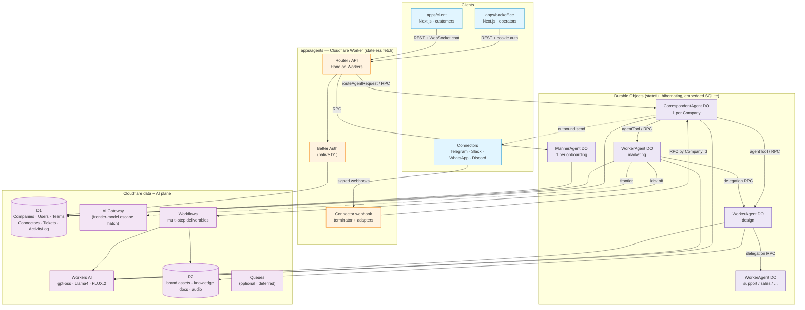
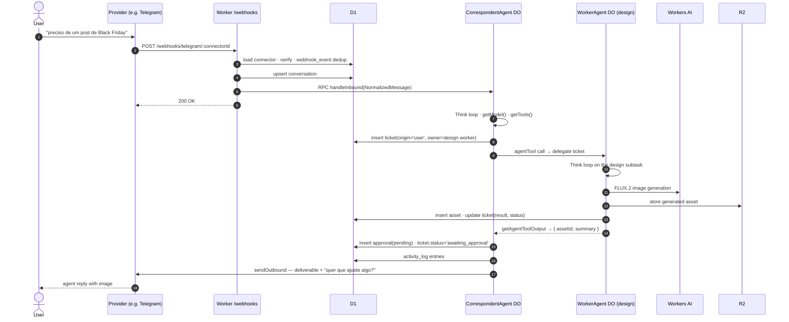
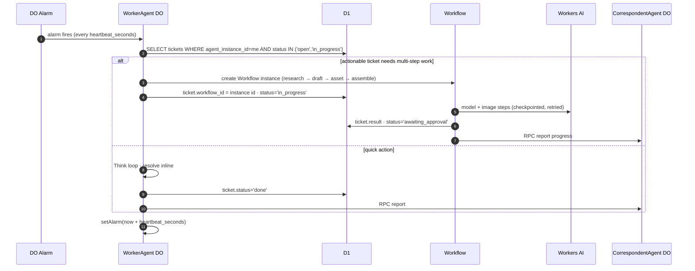

# Cloudflare-Native Agent Platform — Greenfield Rebuild Design Spec

**Date:** 2026-05-22
**Status:** Draft (awaiting review)
**Author:** Pedro + Claude (design session)
**Supersedes:** the entire `apps/api` backend (Hono on Node + Postgres + Redis + OpenRouter). The two Next.js apps (`apps/backoffice`, `apps/client`) survive and re-point.

This is a **design doc**, not an implementation plan. No application code. It exists for Pedro and his team to review the load-bearing choices before any phase plan is written.

---

## 1. Goal + non-goals

### 1.1 Goal

Rebuild the Qolmeia agent backend from scratch on Cloudflare's native stack so the agency model — Company / Correspondent / Team / Worker / Planner / Connectors — runs as **stateful, addressable, individually-billable agents** rather than a stateless Node service plus a Postgres/Redis fleet.

The target the spec implements:

- A **Company** is the tenant. Creating one triggers a web-driven onboarding **debrief**: a **Planner** agent interviews the customer and **suggests a Team**; the customer confirms.
- Every Company has exactly one **Correspondent** — the single communication path. Reports team progress, surfaces deliverables, relays approve/reject/change. Has persistent memory of the Company. Reachable through any **Connector** the Company configured.
- A **Team** is a customer-chosen set of **Worker** agents (marketing, support, design, sales, …). Workers have persistent memory, do scoped jobs, and **invoke each other** (delegation).
- **Connectors** are inbound/outbound channels (Telegram, Slack, WhatsApp, Discord, web), configured per Company, **shared across all agents**.
- **Users** (owner / employees) talk to the agency through any connector including audio, and approve / reject / request changes by chat.
- **Workers behave like employees** — heartbeats, a ticket/task model, scoped responsibilities (Paperclip-inspired).

### 1.2 Non-goals

- Porting any code from `apps/api`. Concepts are salvaged (see §14); code is not.
- Rebuilding the two Next.js apps. They get a new API base URL, a new auth client wiring, and updated endpoint contracts — nothing more (§11).
- Self-hosting / a plugin marketplace. Cloudflare-only deployment.
- Hard budget enforcement, billing, LGPD/compliance surfaces — out of scope for this rebuild, future specs.
- Frontier-model fine-tuning, voice synthesis, video. Audio is **input transcription** only.
- Migrating live tenant data. There is no production tenant data worth migrating; the cutover is a clean switch (§12).

---

## 2. Decisions to confirm

Each row is a load-bearing choice. The **Recommendation** column is what this spec assumes downstream; the reader confirms or overrides before any phase plan is written.

| # | Decision | Options | Recommendation | Rationale |
|---|----------|---------|----------------|-----------|
| D1 | Agent harness | `@cloudflare/think` base class · raw `agents` SDK primitives · `AIChatAgent` (`@cloudflare/ai-chat`) | **`@cloudflare/think`** | Cloudflare explicitly steers new chat-from-scratch projects to Think ([blog](https://blog.cloudflare.com/project-think/)). It gives the agentic loop, tool calling, sub-agents (`agentTool`/`subAgent`), durable execution via fibers, persistent tree-structured sessions with FTS5, message persistence, streaming, and stream resumption — all backed by DO SQLite. `AIChatAgent` is now positioned as the older path; raw primitives mean we rebuild the loop ourselves. **Caveat: Think is experimental.** API surface is "stable but may evolve." See §15. |
| D2 | Model-call layer | Vercel AI SDK v6 + `workers-ai-provider` · Think native `getModel()` · raw `env.AI` binding | **Vercel AI SDK v6 + `workers-ai-provider`, returned from Think's `getModel()`** | This is exactly Think's documented pattern — `getModel()` returns `createWorkersAI({ binding: this.env.AI })("@cf/…")`. Think owns the `streamText` loop internally; we only supply the model. Keeps the door open to swap a model for an **AI Gateway** route (frontier models, see D8) without touching loop code. |
| D3 | Auth | Better Auth (native D1, v1.5+) · Cloudflare Access · Workers-native (custom JWT/sessions) | **Better Auth 1.5+ with native D1** | Better Auth 1.5 ships first-class D1 support — `betterAuth({ database: env.DB })`, auto-detected, batch()-based atomicity ([discussion](https://github.com/better-auth/better-auth/discussions/7963)). Two distinct audiences (operators, customers) with email+password and magic-link — Cloudflare Access is built for org-internal SSO, not customer-facing multi-tenant auth. Keeps continuity with the team's existing Better Auth knowledge. **Caveats:** per-request instantiation required (workerd isolation); CLI `generate` needs `getPlatformProxy()`; avoid `cookieCache` + `secondaryStorage` together (open bug #4203). |
| D4 | D1 vs DO-SQLite split | All-in-D1 · all-in-DO-SQLite · split | **Split** — D1 holds shared/relational/cross-tenant data; each agent DO's embedded SQLite holds that agent's private memory + working state | D1 is the queryable system-of-record the backoffice needs (list Companies, Tickets across a Team, ActivityLog). Per-agent memory is high-write, agent-private, and naturally colocated with the agent's compute — DO SQLite. Cross-agent queries never need an agent's private memory. See §5. |
| D5 | New app directory | New `apps/agents` · replace `apps/api` in place | **New `apps/agents`** dir; keep `apps/api` until cutover, then delete it | The build tooling is incompatible (tsdown/Node vs Wrangler/workerd). A parallel dir lets the new Worker reach a deployable state while `apps/api` still serves the current apps. One clean deletion at cutover beats an in-place mutation that is half-Node-half-Worker for weeks. |
| D6 | Old `apps/api` retirement | Retire incrementally · retire at one cutover | **One cutover.** `apps/api` is deleted, with its Postgres/Redis/OpenRouter config, in the final phase once `apps/agents` passes acceptance and the Next apps point at it | There is no shared runtime between the two backends, so incremental retirement buys nothing. A single PR removes `apps/api`, the Prisma package, BullMQ, and Redis. |
| D7 | Connector inbound handler placement | Connector webhooks hit the main Worker; DO does the work · webhooks hit the DO directly | **Main Worker (stateless `fetch`) terminates webhooks, normalizes, then routes to the Correspondent DO by Company id** | Webhook signature verification, dedup, and connector→Company resolution are stateless and benefit from the Worker's edge placement. The DO should receive a clean `NormalizedMessage`, not raw provider payloads. |
| D8 | Model catalog | Workers AI only · Workers AI + AI Gateway to external providers | **Workers AI for the default tier; AI Gateway as the escape hatch for frontier models** | **Honest correction to the brief: there is no GPT-5.4 on Workers AI.** Workers AI carries open-weight models (`gpt-oss-120b`/`20b`, Llama 4, Gemma 4, Kimi K2.x, Nemotron) plus FLUX.2 for images ([models](https://developers.cloudflare.com/workers-ai/models/)). Frontier OpenAI/Anthropic models are *not* on Workers AI; reach them via **AI Gateway** as a proxy. The per-agent model is a config field so each Worker role picks its tier. See §5 `agent_instance.model`. |
| D9 | Heartbeats / scheduled work | DO alarms · Cloudflare Workflows · Queues + cron | **DO alarms for the per-agent heartbeat tick; Workflows for any multi-step durable job a tick kicks off** | Each Worker agent is a DO and already owns `setAlarm()`. A heartbeat is "wake on schedule, scan my tickets, act" — that is one alarm handler. Long, multi-step deliverable work (research → draft → image → assemble) wants Workflows' checkpointing and retries. Queues only enter if cross-agent fan-out volume demands buffering — deferred (§4.6). |
| D10 | Ticket model | Tickets in D1 · tickets in the owning Worker's DO-SQLite | **Tickets in D1**, owned-by `agent_instance_id`, so the backoffice and the Correspondent can both read a Team's full board without RPC-fanning every Worker | A ticket is cross-agent visible (Correspondent reports on them, operators audit them, Workers delegate them). Agent-private *scratch* state for an in-progress ticket stays in the Worker's DO-SQLite. |

---

## 3. Cloudflare topology



One Worker script, many DO classes, one D1 database. The Next apps never touch DOs or D1 directly — every request goes through the Worker's Hono router, which authenticates against D1 and RPC-routes to the right DO.

---

## 4. The agent model

### 4.1 Roles → Durable Object classes

Three DO classes, not one-per-role. Behaviour is **data-driven** off the `agent_instance` row, not the class.

| DO class | Instances | Backing row | Purpose |
|----------|-----------|-------------|---------|
| `CorrespondentAgent extends Think` | exactly one per Company | `agent_instance` where `role = 'correspondent'` | The single comms path. Holds Company memory. |
| `WorkerAgent extends Think` | one per hired Worker per Company | `agent_instance` where `role = 'worker'` | Scoped specialist. Marketing / design / support / sales / … differentiated by `worker_kind` + system prompt + tool set, **not** by class. |
| `PlannerAgent extends Think` | one per onboarding session | `agent_instance` where `role = 'planner'` | Runs the debrief, proposes a Team. Short-lived; can be torn down after confirmation or kept dormant for re-planning. |

**Decision — one parameterized `WorkerAgent` class, not one class per specialty.** A "marketing worker" and a "design worker" differ only in system prompt, enabled tools, and model tier — all configuration. One class keeps `wrangler.jsonc` migrations small (DO classes are capped at 500/account; see §15) and means adding a new specialty is a D1 row, not a deploy. The DO id is derived from `agent_instance.id` so each hired Worker is a distinct, addressable, hibernating instance.

DO instance naming: `idFromName(agent_instance.id)`. Stable, deterministic, one DO per hired agent.

### 4.2 How an agent invokes another agent

Two mechanisms, both Think-native, both DO-to-DO:

1. **`agentTool()` — preferred for delegation.** The Correspondent (or a Worker) exposes a child agent *as a tool* in its tool set. When the model calls it, Think runs the child as a retained sub-run with event replay, abort bridging, and UI drill-in. The parent's model sees the child's structured output via `getAgentToolOutput`. This is the delegation path: Correspondent → Worker, Worker → Worker.
2. **`subAgent(...).chat()` — low-level RPC streaming** when the parent code (not the model) owns forwarding/cancellation. Used where delegation is deterministic rather than model-decided (e.g. the Planner programmatically asking a costed sub-step).

A delegation call is a DO RPC: the parent DO resolves the child DO stub by `agent_instance.id` and invokes it. RPC latency is comparable to a function call (colocated). The delegation graph (who-may-delegate-to-whom) is stored in D1 as `team_member.can_delegate_to` and enforced before the RPC — a Worker cannot invoke an agent outside its Company's Team, and cycles are rejected at Team-confirmation time.

### 4.3 How memory works

Per-agent memory lives in **that agent's DO embedded SQLite**, managed through Think's `Session` API (tree-structured messages, context blocks, non-destructive compaction, FTS5 full-text search). Concretely:

- **Correspondent memory** — the durable record of the Company: who the Users are, what was promised, what was delivered, standing preferences, the running narrative of every Team interaction. This is the "persistent memory of the Company" the brief requires. It is *the* Correspondent DO's SQLite.
- **Worker memory** — each Worker's own working history: prior deliverables in its specialty, brand decisions it made, what approaches worked. Its own DO SQLite.
- **Shared facts** that must be queryable cross-agent (the Company's brand palette, business profile, knowledge-doc index) live in D1 and/or R2 and are *read* into an agent's context block at turn start — not duplicated as agent memory.

Compaction and `truncateOlderMessages` (Think defaults) keep per-turn context cost bounded as memory grows. A `recallMemory` tool backed by `Session` FTS5 lets an agent search its own history explicitly rather than relying on the rolling window.

### 4.4 How heartbeats work

A Worker behaves like an employee: it wakes on a schedule, checks its work, acts.

- Each `WorkerAgent` DO sets a recurring **alarm** (`this.ctx.storage.setAlarm`). The alarm handler is the heartbeat tick.
- A tick: query D1 for this Worker's open `ticket` rows in actionable states; for each, decide an action; for anything multi-step, kick off a **Workflow**; report material progress to the Correspondent via RPC.
- Heartbeat cadence is a config field (`agent_instance.heartbeat_seconds`), so a support Worker can tick every few minutes while a strategy Worker ticks daily.
- DO alarms have a 15-minute max wall time per invocation — a tick must dispatch long work to Workflows, not do it inline (see §15).
- Hibernation: between ticks the DO is evicted and costs nothing. The alarm re-wakes it. This is the cost story — 10k mostly-idle agents, ~100 awake at once.

### 4.5 Tickets / tasks

A `ticket` is the employee-style unit of work (Paperclip-inspired, deliberately lighter than Multica's Issue). It lives in **D1** (D10), is owned by an `agent_instance_id`, has a lifecycle, and is what heartbeats scan. The Correspondent creates tickets when a User asks for work; Workers create child tickets when they delegate. Agent-private scratch state for an in-progress ticket stays in the Worker's DO SQLite; the D1 row carries only cross-agent-visible status.

### 4.6 Queues — deferred

Cross-agent invocation is synchronous DO RPC today. Queues earn their place only if a Worker fans out to many children faster than they can absorb, or if connector-outbound needs rate-limit buffering. Neither is true at launch. The schema and topology leave room (a `ticket` row is already a durable work record a Queue consumer could claim) but Phase 1–8 ship without Queues.

---

## 5. Data model

Two stores. The split rule (D4): **D1 = shared, relational, cross-tenant, backoffice-queryable. DO-SQLite = agent-private memory + working state.**

### 5.1 D1 schema (Cloudflare serverless SQLite)

SQLite dialect. `TEXT` ids (UUID/ULID), `INTEGER` epoch-ms timestamps, `TEXT` enums with `CHECK` constraints (SQLite has no native enum). Every tenant-scoped table carries `company_id`. JSON blobs stored as `TEXT` with app-side parse.

```sql
-- ── Tenancy + auth ──────────────────────────────────────────────
company(
  id TEXT PRIMARY KEY, name TEXT NOT NULL, slug TEXT UNIQUE NOT NULL,
  timezone TEXT NOT NULL DEFAULT 'America/Sao_Paulo',
  locale   TEXT NOT NULL DEFAULT 'pt-BR',
  status   TEXT NOT NULL DEFAULT 'onboarding'  -- onboarding | active | paused
    CHECK(status IN ('onboarding','active','paused')),
  business_profile TEXT,        -- JSON, AI-curated; single-writer
  owner_brief      TEXT,        -- free text, owner-curated (the "IDEA.md" reserved field)
  created_at INTEGER NOT NULL, updated_at INTEGER NOT NULL
)

-- Better Auth owns: user, session, account, verification (native D1 schema).
-- membership is ours — the authorization seam.
membership(
  id TEXT PRIMARY KEY,
  user_id TEXT NOT NULL,        -- FK Better Auth user
  company_id TEXT NOT NULL REFERENCES company(id),
  role TEXT NOT NULL CHECK(role IN ('owner','staff','customer')),
  created_at INTEGER NOT NULL,
  UNIQUE(user_id, company_id)
)

-- ── Team + agents ──────────────────────────────────────────────
team(
  id TEXT PRIMARY KEY,
  company_id TEXT NOT NULL UNIQUE REFERENCES company(id),  -- one team per company
  confirmed_at INTEGER,         -- null until customer confirms the Planner's proposal
  created_at INTEGER NOT NULL
)

agent_instance(
  id TEXT PRIMARY KEY,
  company_id TEXT NOT NULL REFERENCES company(id),
  role TEXT NOT NULL CHECK(role IN ('correspondent','worker','planner')),
  worker_kind TEXT,             -- marketing|design|support|sales|… ; null unless role='worker'
  display_name TEXT NOT NULL,
  system_prompt TEXT NOT NULL,
  model TEXT NOT NULL,          -- '@cf/openai/gpt-oss-120b' | 'gateway:openai/gpt-frontier' | …
  status TEXT NOT NULL DEFAULT 'active' CHECK(status IN ('active','paused')),
  heartbeat_seconds INTEGER,    -- null = no heartbeat (correspondent, planner)
  created_at INTEGER NOT NULL, updated_at INTEGER NOT NULL,
  UNIQUE(company_id, role, worker_kind)   -- one correspondent; one worker per kind
)

team_member(            -- which agents are on the team + the delegation graph
  team_id TEXT NOT NULL REFERENCES team(id),
  agent_instance_id TEXT NOT NULL REFERENCES agent_instance(id),
  can_delegate_to TEXT NOT NULL DEFAULT '[]',  -- JSON array of agent_instance ids
  PRIMARY KEY(team_id, agent_instance_id)
)

-- ── Connectors ─────────────────────────────────────────────────
connector(
  id TEXT PRIMARY KEY,
  company_id TEXT NOT NULL REFERENCES company(id),
  type TEXT NOT NULL CHECK(type IN ('telegram','slack','whatsapp','discord','web')),
  display_name TEXT NOT NULL,
  config TEXT NOT NULL,         -- JSON; tokens/secrets (see §15 on secret storage)
  inbound  INTEGER NOT NULL DEFAULT 1,   -- bool
  outbound INTEGER NOT NULL DEFAULT 1,
  status TEXT NOT NULL DEFAULT 'active' CHECK(status IN ('active','disabled')),
  created_at INTEGER NOT NULL,
  UNIQUE(company_id, type)
)
-- Connectors are company-scoped and shared across ALL the company's agents.
-- There is no per-agent connector binding — any agent may send on any connector.

conversation(
  id TEXT PRIMARY KEY,
  company_id TEXT NOT NULL REFERENCES company(id),
  connector_id TEXT NOT NULL REFERENCES connector(id),
  external_thread_id TEXT NOT NULL,   -- provider chat/thread id
  user_id TEXT,                       -- resolved Better Auth user, when known
  created_at INTEGER NOT NULL,
  UNIQUE(connector_id, external_thread_id)
)

webhook_event(           -- inbound idempotency
  provider TEXT NOT NULL, external_id TEXT NOT NULL,
  received_at INTEGER NOT NULL,
  PRIMARY KEY(provider, external_id)
)

-- ── Work ───────────────────────────────────────────────────────
ticket(
  id TEXT PRIMARY KEY,
  company_id TEXT NOT NULL REFERENCES company(id),
  agent_instance_id TEXT NOT NULL REFERENCES agent_instance(id),  -- current owner
  parent_ticket_id TEXT REFERENCES ticket(id),     -- delegation chain
  title TEXT NOT NULL, brief TEXT NOT NULL,
  status TEXT NOT NULL DEFAULT 'open'
    CHECK(status IN ('open','in_progress','awaiting_approval','blocked','done','rejected','cancelled')),
  origin TEXT NOT NULL CHECK(origin IN ('user','delegation','heartbeat')),
  workflow_id TEXT,                  -- Cloudflare Workflow instance id, if dispatched
  result TEXT,                       -- JSON deliverable summary
  created_at INTEGER NOT NULL, updated_at INTEGER NOT NULL
)

approval(                -- the approve/reject/change loop
  id TEXT PRIMARY KEY,
  ticket_id TEXT NOT NULL REFERENCES ticket(id),
  company_id TEXT NOT NULL REFERENCES company(id),
  proposed TEXT NOT NULL,            -- JSON: what the agent wants to do/deliver
  status TEXT NOT NULL DEFAULT 'pending'
    CHECK(status IN ('pending','approved','rejected','changes_requested')),
  decided_by_user_id TEXT, decided_at INTEGER, feedback TEXT,
  created_at INTEGER NOT NULL
)

asset(                   -- R2-backed brand assets / knowledge docs / audio
  id TEXT PRIMARY KEY,
  company_id TEXT NOT NULL REFERENCES company(id),
  kind TEXT NOT NULL CHECK(kind IN ('brand_asset','knowledge_doc','audio')),
  r2_key TEXT NOT NULL, sha256 TEXT NOT NULL, mime TEXT NOT NULL, bytes INTEGER NOT NULL,
  metadata TEXT,                     -- JSON: palette/labels/title/summary
  created_at INTEGER NOT NULL,
  UNIQUE(company_id, sha256)
)

activity_log(            -- append-only per-company timeline
  id TEXT PRIMARY KEY,
  company_id TEXT NOT NULL REFERENCES company(id),
  type TEXT NOT NULL,                -- message_in|message_out|ticket_opened|ticket_done|
                                     -- approval_requested|approval_decided|agent_run|heartbeat|…
  ref_type TEXT, ref_id TEXT,
  summary TEXT NOT NULL,             -- pt-BR
  payload TEXT,                      -- JSON
  actor_id TEXT,                     -- user or agent_instance id
  created_at INTEGER NOT NULL
)
```

Indexes: `ticket(company_id, agent_instance_id, status)`, `ticket(agent_instance_id, status)` (heartbeat scan), `activity_log(company_id, created_at)`, `approval(company_id, status)`, `conversation(company_id)`.

### 5.2 Per-agent DO-SQLite (each agent DO's embedded store)

Owned and managed mostly by Think's `Session` layer; the agent never queries another agent's DO SQLite.

- **Session messages** — tree-structured conversation history, context blocks, compaction state, FTS5 index (Think-managed).
- **Fiber checkpoints** — Think's durable-execution checkpoints for crash recovery (Think-managed).
- **Memory facts** — a small app-managed table (`memory_fact(id, kind, content, salience, created_at)`) for distilled, durable facts the agent chooses to remember beyond raw transcript — written by a `rememberFact` tool, read by `recallMemory`.
- **Ticket scratch** — in-progress reasoning/intermediate artifacts for a ticket the agent currently owns, keyed by `ticket_id`. Discarded or summarized into the D1 `ticket.result` on completion.

### 5.3 Invariants

- Every `company` has exactly one `team` (`team.company_id` UNIQUE) and exactly one `agent_instance` with `role='correspondent'`.
- A `connector` is company-scoped; any of that company's agents may use it (no per-agent binding).
- `team_member.can_delegate_to` references only `agent_instance` ids in the *same* team; the delegation graph is acyclic — validated at Team-confirmation time and re-validated on any Team edit.
- `agent_instance.heartbeat_seconds` is non-null only for `role='worker'`.
- `ticket.agent_instance_id` and the ticket's `company_id` belong to the same company; `parent_ticket_id` (if set) is same-company.
- `webhook_event` is write-once; a duplicate `(provider, external_id)` short-circuits the inbound pipeline.
- `asset` dedups on `(company_id, sha256)`.
- `business_profile` has a single writer (the knowledge-apply path); `owner_brief` is writable only by an owner User.
- `activity_log` is append-only and best-effort (a failed log write never fails the request).

---

## 6. Connectors

### 6.1 Adapter pattern (Cloudflare-native)

A connector is an **adapter module** in the Worker — a pure function set, no per-connector class, no DO. The salvaged concept from `apps/api` (`ConnectorAdapter`); the implementation is greenfield on workerd.

```
type ConnectorAdapter = {
  type: 'telegram' | 'slack' | 'whatsapp' | 'discord' | 'web'
  verify(req, connectorConfig): Promise<boolean>            // signature / secret check
  parseInbound(rawBody, connectorConfig): Promise<NormalizedMessage | null>
  sendOutbound(args: { connectorConfig, threadId, payload }): Promise<{ externalMessageId }>
}

type NormalizedMessage = {
  externalId, externalThreadId, text, authorDisplayName,
  attachments: { kind: 'image'|'audio'|'document', bytes|url, mime }[],
  timestamp
}
```

A `registry` maps `type → adapter`, total over the enum; unimplemented adapters throw `NotImplemented`. Adding a connector type = one module + one registry entry + one D1 enum value.

### 6.2 Shared-across-agents

Connectors are **company-scoped, not agent-scoped**. There is no binding table. Any agent in the company that needs to send a message resolves the company's `connector` rows and uses the right adapter. Concretely, agents get a `sendMessage` tool whose implementation: takes a `connector_id` (or picks the conversation's connector), loads config from D1, calls `adapter.sendOutbound`. The Correspondent is the *usual* sender, but a Worker can notify a User directly when its system prompt and the situation call for it.

### 6.3 Webhook routing

```
Provider → POST /webhooks/:type/:connectorId   (main Worker, stateless fetch)
  1. Load connector row from D1 (404 if missing / wrong type / disabled).
  2. adapter.verify(req, config)  → 401 on mismatch.
  3. Insert webhook_event (provider, externalId); duplicate → 200, stop.
  4. adapter.parseInbound(rawBody, config) → NormalizedMessage (null → 200, stop: receipts).
  5. Resolve/insert conversation by (connectorId, externalThreadId); resolve user_id if known.
  6. RPC the company's CorrespondentAgent DO with { conversation, normalizedMessage }.
  7. Return 200 immediately. The DO does the agentic work asynchronously.
```

Audio attachments: the adapter passes bytes/URL through; the Correspondent's tool set includes a `transcribeAudio` tool (Workers AI speech model) so audio-in is just another input modality. Web connector has no provider — the `/webhooks/web` path is replaced by the authenticated chat route (§11), but it presents the same `NormalizedMessage` to the DO.

---

## 7. Onboarding flow

Web-driven. The customer is in `apps/client`; no connector is configured yet.

```mermaid
sequenceDiagram
  autonumber
  actor Cust as Customer (apps/client)
  participant W as Worker / Router
  participant D1 as D1
  participant PL as PlannerAgent DO
  participant CO as CorrespondentAgent DO

  Cust->>W: POST /companies  { name, … }
  W->>D1: insert company(status='onboarding'), membership(owner), team(confirmed_at=null)
  W->>D1: insert agent_instance(role='planner')
  W-->>Cust: { companyId, plannerChatUrl }

  Cust->>W: WebSocket /agents/planner/:companyId  (debrief chat)
  W->>PL: routeAgentRequest → PlannerAgent DO
  loop Debrief interview
    Cust->>PL: answers about the business
    PL->>PL: Think agentic loop · stores debrief in its Session
  end
  PL->>PL: tool: proposeTeam → { worker_kinds[], rationale }
  PL-->>Cust: proposed Team (kinds + why) for review

  Cust->>W: POST /teams/:companyId/confirm  { accepted_worker_kinds[] }
  W->>D1: insert agent_instance rows (correspondent + one worker per kind)
  W->>D1: insert team_member rows + can_delegate_to graph; validate acyclic
  W->>D1: team.confirmed_at = now; company.status='active'
  W->>CO: RPC seedMemory(business_profile, debrief summary from Planner)
  W-->>Cust: Team ready → redirect to chat with the Correspondent
```

Notes:

- The Planner is a `PlannerAgent` DO running Think. Its debrief transcript is its Session memory. `proposeTeam` is a tool returning structured output (`getAgentToolOutput`-style) the client renders for confirmation.
- Team confirmation is a transactional D1 write (D1 `batch()` for atomicity — no interactive transactions). It materializes the Correspondent + one Worker per accepted kind, plus `team_member` rows and the delegation graph.
- After confirmation the Planner DO can be left dormant (re-planning later) or torn down. Recommendation: keep dormant — DOs cost nothing idle.
- The Correspondent is seeded with the Company's business profile and the debrief summary so it starts with memory, not blank.

---

## 8. The Correspondent

### 8.1 Role

Exactly one per Company. The single communication path. It does not do specialist work itself — it interviews, routes, reports, and relays. Concretely it:

- Receives every inbound User message (from any connector) and every Worker progress report.
- Decides whether to answer directly, open a `ticket`, or delegate to a Worker (`agentTool` call).
- Surfaces deliverables and relays the approve/reject/change loop.
- Maintains the running narrative of the Company.

### 8.2 Memory

The Correspondent DO's embedded SQLite is *the* Company memory: every interaction, every promise, every delivered artifact, standing User preferences. Think's `Session` handles tree-structured history, compaction, and FTS5. A `rememberFact`/`recallMemory` tool pair lets it persist and search distilled facts. Shared brand/profile data is read from D1/R2 into a context block at turn start.

### 8.3 Multi-connector reachability

The Correspondent is not tied to a connector. Inbound from Telegram, Slack, WhatsApp, Discord, or web all RPC the *same* Correspondent DO (resolved by `company_id`). Outbound: the Correspondent picks the connector — usually the conversation's originating connector, but it can proactively reach a User on a different one (e.g. a User configured Slack later; the Correspondent can use it). Because the DO is one instance, memory is unified across channels — a conversation started on WhatsApp continues coherently on web.

### 8.4 The approve / reject / change loop

```mermaid
flowchart LR
  W["Worker produces deliverable"] -->|RPC report| C["Correspondent"]
  C -->|insert approval(pending),<br/>ticket.status='awaiting_approval'| D1[(D1)]
  C -->|sendOutbound: deliverable + ask| U["User (any connector)"]
  U -->|reply: approve / reject / change| C
  C -->|update approval + ticket| D1
  C -->|approved → notify Worker: ship| W
  C -->|changes_requested → re-delegate w/ feedback| W
  C -->|rejected → close ticket| W
```

- A Worker that produces something gated reports to the Correspondent, which creates an `approval(pending)` row and moves the `ticket` to `awaiting_approval`.
- The Correspondent presents the deliverable to the User over their connector in natural language and waits.
- The User's chat reply ("approve", "muda a cor", "não") is interpreted by the Correspondent's model; it writes the `approval` decision and routes: approved → Worker ships; `changes_requested` → Correspondent re-delegates the ticket with the feedback; rejected → ticket closed.
- The backoffice can also decide an `approval` directly (operator override) — same D1 rows, the Correspondent observes the change on its next relevant turn or via a DO RPC notification.
- Every transition writes `activity_log`.

What approval gates: configurable per `worker_kind` / per tool. Default: anything customer-facing or irreversible (publishing, sending to a third party, spending on image generation at volume) is gated; internal steps (delegation, drafting, memory writes) are not. This is the salvaged "approval rule" *shape* (sender role × per-skill default) — re-expressed as a per-tool policy, not ported code.

---

## 9. Auth

**Better Auth 1.5+ with native D1** (D3). Single source of truth in the Worker; the two Next apps only validate cookies.

- Better Auth runs *inside* the `apps/agents` Worker, mounted on the Hono router at `/api/auth/*`. `betterAuth({ database: env.DB })` — native D1, auto-detected. Instantiated **per request** (workerd isolation: bindings are request-scoped).
- **Operators** (`apps/backoffice`): email + password.
- **Customers** (`apps/client`): magic-link (the `magic-link` plugin).
- Atomicity via D1 `batch()` — Better Auth's D1 dialect handles this; no interactive transactions on D1.
- Authorization is the `membership` table: `(user_id, company_id, role)`. Role guards in the Hono router resolve `membership` before any handler runs — `requireOwnerOrStaff`, `requireCustomer`, `requireMember`. The matched `company_id` + `role` ride on the request context.
- Both Next apps use Better Auth's client (`createAuthClient`) pointed at the Worker's `/api/auth/*`. Cookies are issued by the Worker; the Next apps' middleware just checks presence and redirects.
- Sessions: DB-backed in D1. Avoid `cookieCache` + `secondaryStorage` together until upstream bug #4203 is resolved (D3 caveat).
- CLI schema generation (`better-auth generate`) needs Cloudflare's `getPlatformProxy()` so the CLI can reach a local D1 — a build-tooling note for the phase plan, not a runtime concern.

The connector webhook routes (`/webhooks/*`) are **not** cookie-authed — they are signature-verified by the adapter (§6.3).

---

## 10. Request lifecycles

### 10.1 User message via a connector → Correspondent → delegation → reply



### 10.2 Onboarding debrief

Covered by the sequence diagram in §7. Shape: Company insert → Planner DO → WebSocket debrief chat (Think loop) → `proposeTeam` → customer confirms → D1 `batch()` materializes Correspondent + Workers + delegation graph → Correspondent seeded → redirect to Correspondent chat.

### 10.3 Heartbeat-driven Worker task



The tick is bounded (alarm 15-min max wall time) — anything longer is a Workflow. The Worker re-arms its own alarm at the end of every tick.

### 10.4 Error matrix

| Failure | Where | Behaviour |
|---------|-------|-----------|
| Connector signature mismatch | `/webhooks` adapter.verify | 401 immediate; no D1 write |
| Duplicate provider update | `webhook_event` insert | 200 OK, pipeline short-circuits |
| Unparseable / receipt payload | adapter.parseInbound returns null | 200 OK, no DO call |
| Correspondent DO evicted mid-turn | DO runtime | Think fiber checkpoints in DO SQLite; resumes from last checkpoint on re-wake |
| Worker DO crash during delegation | parent `agentTool` | Think agent-tool retains the child run; abort bridged to parent; ticket stays non-`done`, retried next heartbeat |
| Delegation to an agent outside the Team / cycle | pre-RPC graph check | Rejected before RPC; tool returns `{ok:false}`; model surfaces a graceful message |
| Workflow step fails | Cloudflare Workflows | Step-level retry with backoff; exhausted → ticket.status='blocked', activity_log error, Correspondent notified |
| Workers AI model error / rate limit | model call | Caught in tool; ticket→`blocked`; Correspondent tells the User "tive um problema" |
| Workers AI daily neuron cap hit | model call | Hard fail from Workers AI (caps reset 00:00 UTC); ticket→`blocked`; ops alert. See §15 |
| D1 query timeout (30 s) | any D1 call | Surfaced as a 5xx; the originating webhook already returned 200 so no provider retry storm; activity_log + ops alert |
| DO SQLite approaching 10 GB | per-agent memory growth | Compaction + `truncateOlderMessages` keep it bounded; if a single agent genuinely needs >10 GB, that is a design smell — see §15 |
| Outbound send to provider fails | adapter.sendOutbound | ticket/approval rows unchanged; activity_log error; Correspondent retries on next turn (no double-charge) |

---

## 11. How the existing Next apps integrate

Minimal-touch. The two Next apps' UI, components, and page structure are untouched; only the API edges move.

| Change | `apps/backoffice` | `apps/client` |
|--------|-------------------|----------------|
| API base URL | env var → the `apps/agents` Worker URL (`*.workers.dev` or a custom domain) | same |
| Auth client | `createAuthClient` re-pointed at the Worker's `/api/auth/*` — Better Auth client API is unchanged, so existing login/magic-link calls work as-is | same |
| Endpoint contracts | REST surface re-homed under the Worker's Hono router: `/api/companies`, `/api/teams`, `/api/tickets`, `/api/approvals`, `/api/activity`, `/api/agents` | `/api/companies` (create), `/api/teams/:id/confirm`, chat |
| Real-time chat | n/a (operator UI is request/response) | the home-rolled SSE `useChat` transport is replaced by **Think's WebSocket chat** via `useAgentChat` / `routeAgentRequest` — Cloudflare's hook, resumable streams, reconnect-safe. This is the one non-trivial client change. |
| Cookies | issued by the Worker; same-site config must allow the Worker's domain | same |

The contracts shift from "Hono-on-Node REST + custom SSE" to "Hono-on-Workers REST + Think WebSocket chat." The backoffice barely notices (REST in, REST out). The client app swaps its chat transport for `useAgentChat` — a net simplification, since resumable streaming and reconnect come for free. No component rewrites; the chat container changes its data hook.

CORS: the Worker's router sets `Access-Control-Allow-Origin` to the two Next app origins, `credentials: true`.

---

## 12. Phasing

Eight phases. Each is shippable and gets its own future plan. The current `apps/api` keeps serving the live apps until Phase 8.

| Phase | Scope | Ships / acceptance |
|-------|-------|--------------------|
| **P1 — Thin slice** | New `apps/agents` Worker. One `wrangler.jsonc` with: one DO class (`CorrespondentAgent extends Think`), one D1 binding (empty `company` table), the `AI` binding. One connector adapter (`telegram`) end-to-end: webhook → verify → dedup → RPC the DO. The DO runs a Think loop with `getModel()` → `workers-ai-provider` and replies "hello from Workers AI" with no tools. No auth, no Team, hard-coded single Company. | A Telegram message round-trips through a DO-hosted Think agent on Workers AI. Deployed to `*.workers.dev`. |
| **P2 — D1 schema + auth** | Full D1 schema (§5.1). Better Auth on native D1 with both flows (email/password, magic-link). `membership` + role guards. The Hono REST skeleton (`/api/companies`, `/api/me`). | An operator and a customer can authenticate; `membership` gates routes; D1 migrations apply via Wrangler. |
| **P3 — Real Correspondent + memory** | `CorrespondentAgent` gets a real tool set, Think `Session` memory, `rememberFact`/`recallMemory`, business-profile context blocks from D1. The web connector path: authenticated WebSocket chat via `routeAgentRequest` / `useAgentChat`. | A customer chats the Correspondent in `apps/client`; it remembers across turns and across reconnects. |
| **P4 — Worker agents + delegation** | `WorkerAgent` DO class (parameterized). `team` / `team_member` / `agent_instance` rows. Correspondent → Worker delegation via `agentTool`; Worker → Worker delegation; the acyclic delegation-graph check. One real `worker_kind` (design) doing FLUX.2 image generation to R2. `asset` table. | A customer asks for an image; Correspondent delegates to the design Worker; asset lands in R2; reply returns. |
| **P5 — Tickets + approval loop** | `ticket` + `approval` tables. The approve/reject/change loop (§8.4). `activity_log`. Backoffice `/api/tickets`, `/api/approvals`, `/api/activity` endpoints + the operator override path. | A gated deliverable creates an `approval`; the customer approves by chat; an operator can override in the backoffice. |
| **P6 — Onboarding / Planner** | `PlannerAgent` DO class. Company-creation flow, the debrief chat, `proposeTeam`, Team confirmation as a D1 `batch()` that materializes the Correspondent + Workers. Correspondent memory seeding. | A new customer creates a Company, completes the debrief, confirms a Team, and lands in a seeded Correspondent chat. |
| **P7 — Heartbeats + Workflows + more connectors** | Worker DO alarms (heartbeat ticks). Cloudflare Workflows for multi-step deliverables. Remaining connector adapters (Slack, WhatsApp, Discord) + `transcribeAudio` for audio-in. More `worker_kind`s (marketing, support, sales). | A Worker wakes on a schedule, picks up a ticket, runs a Workflow; a customer reaches the agency on Slack and via voice note. |
| **P8 — Cutover + retire `apps/api`** | Re-point `apps/backoffice` + `apps/client` env to the Worker. Delete `apps/api`, `@repo/db` (Prisma), BullMQ/Redis config, OpenRouter keys. Update root `CLAUDE.md` / `docs`. | The two Next apps run entirely against `apps/agents`; the old backend and its Postgres/Redis are gone. |

Phase 1 — the **thin slice** — is deliberately the minimum that proves the whole stack: one Worker, one DO class, one Think agent, one connector, one Workers AI call. Everything else is additive.

---

## 13. Testing strategy

| Layer | Tooling | Mocked / real |
|-------|---------|----------------|
| DO agents (Correspondent, Worker, Planner) | Vitest + `@cloudflare/vitest-pool-workers` | Runs in real `workerd` via Miniflare. Real DO SQLite, real D1 (Miniflare's local D1), real bindings. The model call is the seam — stub `getModel()` to return a canned/scripted `LanguageModel` so the Think loop is deterministic. |
| Connector adapters | Vitest (plain) | Pure functions — `verify`/`parseInbound`/`sendOutbound`. Mock `fetch` for outbound; fixture provider payloads for inbound. |
| Webhook routing | Vitest + `vitest-pool-workers` | Real Worker `fetch`, real Miniflare D1, real DO. Assert dedup, verify, RPC dispatch. |
| Hono REST + auth | Vitest + `vitest-pool-workers` | Real Better Auth against Miniflare D1. Assert role guards, membership resolution. |
| Delegation / agent-tools | `vitest-pool-workers` | Real parent + child DOs; scripted models on both. Assert `can_delegate_to` enforcement, cycle rejection, `getAgentToolOutput` plumbing. |
| Heartbeats | `vitest-pool-workers` | Miniflare alarm APIs; advance time, assert tick behaviour. |
| Workflows | `vitest-pool-workers` | Miniflare Workflows; assert step retry + checkpoint resumption with an injected failing step. |
| Full inbound→reply | `vitest-pool-workers` | End-to-end: fixture webhook → DO → scripted model → assert outbound payload + D1 rows + activity_log. |

`@cloudflare/vitest-pool-workers` runs tests *inside* `workerd`, so DO storage, D1, alarms, and Workflows are exercised for real rather than mocked. The single consistent mock is the **LLM** — every test injects a scripted model so the agentic loop is deterministic. External provider HTTP (Telegram/Slack/etc.) is mocked at `fetch`. AI Gateway / frontier routes are mocked the same way.

---

## 14. What's discarded vs. salvaged

### Discarded (code — none of it ports)

- The entire `apps/api` Hono-on-Node service.
- Postgres + Prisma (`@repo/db`, `schema.prisma`, the 23-model schema, `prisma.config.ts`).
- Redis + BullMQ (queues, JobSchedulers, the `agent-runner` / `routine-scheduler` worker processes, `DISPATCH_MODE`).
- OpenRouter integration and the AI-SDK-via-Gateway model wiring.
- The two-process (API + worker) split — collapses into one Worker script plus DOs.
- The `tsdown` build, the Node 24 runtime assumptions.
- BullMQ-based delegation (`FlowProducer`, parent/child jobs) — replaced by DO RPC + `agentTool`.

### Salvaged (concepts only)

- **The agency mental model** — Company/tenant, the single account-manager agent, specialist team, delegation. This *is* the product; it carries straight over (Correspondent replaces Controller; Worker replaces specialist `AgentInstance`; Planner is new).
- **The connector-adapter idea** — `parseInbound`/`sendOutbound`/`verify` + a `NormalizedMessage`. Re-implemented as plain Worker modules (§6).
- **The approval-rule shape** — sender-role × per-skill default, now a per-tool / per-`worker_kind` policy driving the `approval` table (§8.4).
- **The append-only activity log** — `activity_log` in D1, same single-writer best-effort discipline.
- **Heartbeats / paused-by-default proactive work** — the Routine concept becomes DO alarms + Workflows; the Paperclip-inspired "Workers behave like employees" framing is now first-class (§4.4).
- **The two-tier template/instance idea** — collapsed: `agent_instance` is data-driven; "template" is just the system prompt + tool set + model fields on the row, no separate table.

---

## 15. Open questions + honest concerns

### Things in the Cloudflare stack that genuinely worry me

- **`@cloudflare/think` is experimental.** Cloudflare's own words: API "stable but may evolve." We are betting the harness on a preview SDK that already shipped breaking-ish behaviour changes in May 2026 (the `pruneMessages` default change). Mitigation: pin exact versions, keep the model layer behind `getModel()` so a harness swap is contained, budget for churn. **This is the single biggest risk.** Confirm appetite before committing (D1).
- **No frontier models on Workers AI.** The brief assumes GPT-5.4 on Workers AI — it is not there. Workers AI is open-weight (gpt-oss, Llama 4, Gemma 4, Kimi, Nemotron) + FLUX.2. Frontier OpenAI/Anthropic quality requires routing out through **AI Gateway**, which adds latency, a second billing surface, and a non-Cloudflare dependency — partially defeating "all-native." The team must decide whether open-weight models are good enough for the Correspondent and strategy Workers, or accept the Gateway hop (D8).
- **Workers AI neuron caps and latency.** Workers AI bills in neurons with **daily caps that reset at 00:00 UTC**; exceeding a cap hard-fails requests. For a multi-tenant agency this is a real availability risk — one busy day across tenants can exhaust the allocation. FLUX.2 is explicitly "one of the slower models." Needs a capacity/quota plan and probably per-Company rate limiting before launch.
- **DO SQLite 10 GB ceiling per agent.** The Correspondent accumulates Company memory forever. 10 GB is large, but "forever" is longer. Think's compaction/truncation bounds *context cost*, not *storage*. A long-lived heavy tenant could approach the cap. Needs a memory-archival story (cold facts to R2/D1) before it bites — flagged, not solved here.
- **D1 30 s query timeout + sequential processing.** D1 processes queries sequentially per database; throughput is query-duration-bound (~1000 q/s at 1 ms queries). One D1 for all tenants is a shared chokepoint. The split (D4) helps — agent memory is off D1 — but `ticket`/`activity_log`/auth all share it. May need per-region read replicas or a D1-per-shard plan at scale. Fine for launch, watch it.
- **DO alarm 15-min wall-time + 30 s CPU between requests.** Heartbeat ticks must stay short and dispatch real work to Workflows. A tick that tries to do a deliverable inline will be evicted. The design (§4.4) accounts for this, but it is a discipline the implementation must hold.
- **Lock-in.** This design is deeply Cloudflare-coupled — DOs, D1, Workers AI, Workflows, the Think SDK. There is no realistic "lift to another cloud" path. That is an accepted trade for the cost/latency/durability story, but it should be a *conscious* acceptance, not a discovered one.

### Open questions

1. **Frontier vs open-weight for the Correspondent.** Is `gpt-oss-120b` (or Kimi K2.x) good enough for the customer-facing account-manager persona in pt-BR, or does the Correspondent specifically need an AI-Gateway frontier route? Affects D8 and cost.
2. **Planner lifecycle.** Keep the `PlannerAgent` DO dormant for re-planning, or tear it down after Team confirmation? Recommendation: keep dormant. Confirm.
3. **Re-planning a Team.** When a Company wants to add/remove Workers post-onboarding — does the Planner re-run, or is there a direct backoffice Team editor? Not designed here.
4. **Audio output.** Audio is input-only in this spec. Do Users expect voice *replies*? If so, a TTS step and per-connector voice-message support is a future addition.
5. **Connector secrets in D1.** `connector.config` holds provider tokens. D1 rows are not encrypted at rest by us. Should secrets go in Workers Secrets / a secret store with only a reference in D1? Recommendation: yes for production — flagged for the P2 plan.
6. **Multi-User concurrency on one Correspondent.** Two Users of the same Company message simultaneously — the single Correspondent DO serializes them (DO single-threaded execution). Is serialized handling acceptable, or do we need per-User conversation lanes? Likely fine; confirm under expected load.
7. **Cost attribution.** The old spec tracked per-action token cost. Workers AI bills in neurons, not tokens — per-Company cost attribution needs a different mechanism (AI Gateway analytics, or neuron accounting per DO). Not designed here.
8. **`apps/agents` vs monorepo tooling.** The new app uses Wrangler, not Turborepo's tsdown path. How does it slot into `pnpm` workspaces + Turborepo `build`/`test`/`lint`? A tooling question for the P1 plan.

---

## 16. References

- Project Think announcement — https://blog.cloudflare.com/project-think/
- Think base class docs — https://developers.cloudflare.com/agents/api-reference/think/
- Think docs (repo) — https://github.com/cloudflare/agents/blob/main/docs/think/index.md
- Agents SDK — https://developers.cloudflare.com/agents/ · https://github.com/cloudflare/agents
- Agent class internals — https://developers.cloudflare.com/agents/concepts/agent-class/
- Durable Objects limits — https://developers.cloudflare.com/durable-objects/platform/limits/
- D1 limits — https://developers.cloudflare.com/d1/platform/limits/
- Workers AI models — https://developers.cloudflare.com/workers-ai/models/
- Workers AI pricing (neurons) — https://developers.cloudflare.com/workers-ai/platform/pricing/
- FLUX.2 on Workers AI — https://blog.cloudflare.com/flux-2-workers-ai/
- Workflows limits — https://developers.cloudflare.com/workflows/reference/limits/
- Better Auth + Cloudflare Workers/D1 — https://github.com/better-auth/better-auth/discussions/7963 · https://better-auth.com/blog/1-5
- `@cloudflare/vitest-pool-workers` — https://developers.cloudflare.com/workers/testing/vitest-integration/
- Prior Qolmeia specs — `docs/superpowers/specs/2026-05-20-qolmeia-multi-agent-architecture-design.md`, `docs/ARCHITECTURE.md`, `docs/strategy/2026-05-21-system-overview.md`, `docs/research/2026-05-20-paperclip-and-multica.md`
